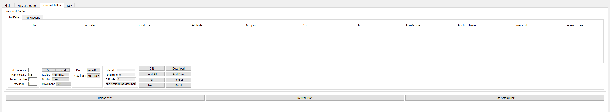

## Introduction

This example, which can run on both Windows and Linux Onboard Embedded Systems (OES), is aimed at helping you understand and operate the basic flight procedures and segments which include:

* Activation
* Obtain/Release Flight Control
* Take Off 
* Landing 
* Go Home 
* Movement Control
* Gimbal Control
* Camera Control
* Virtual RC (VRC) Control
* Waypoint Mission Control
* Hotpoint Mission Control
* Follow Me Mission Control

Developers can operate flight with this example via the GUI interaction interface of QT.

 > The Qt example has recently undergone a number of changes. Try it out! Here's an example:
 > Old Waypoint interface:
 > 
 > New Waypoint interface: 
 > 

## Setup

### 1. Hardware

The [Hardware Setup](../../../development-workflow/hardware-setup.html) guide illustrates setting up your OES of choice. Make sure your setup matches that in the document before proceeding further. 

### 2. Software

#### Toolchain:

**1. Windows:**

To build a Windows app, the following tools are needed:

* Qt Ver: QT 5.6 or later
* Compiler Ver: MinGW 4.9.2 or later; MSVC2013 or later

Qt can be downloaded and installed from <a href="https://www.qt.io/" target="_blank">Qt website</a>.

**2. Linux:**

To build a Linux app, the following tools are needed:

* Qt Ver: QT 5.2.1 or later
* Compiler Ver: gcc/g++ 4.8.1

If using Manifold, you can follow these steps to install Qt from the command line. The setup should be similar for any other ubuntu-based OES.

```
sudo apt-get update
sudo apt-get install qtcreator 
```

Now you have qt5.2.1 without webkit package and serialport driver package

` sudo apt-get install libqt5webkit5 `

Now you only need a serialport driver

```
sudo apt-get install libudev-dev
git clone git://code.qt.io/qt/qtserialport.git
cd qtserialport
git checkout origin/old/5.2
cd .. 
mkdir qtserialport-build 
cd qtserialport-build 
qmake ../qtserialport/qtserialport.pro 
make 
sudo make install
```
Now you have a serialport driver from version 5.2. However we need some components from Qt 5.3 to make the sample work.

Continue and build the 5.3 version's source code.

```
 cd ../qtserialport/
 git checkout origin/5.3
 cd ../qtserialport-build/
 make
```

In this step the compile may fail. Ignore it and continue finishing the following steps.

```
sudo make install
make
```

At this time, the build will succeed.

` sudo make install `

Now you can use the PureQT example.

` sudo qtcreator `

Default serialport name is ttyTHS1

#### Compilation

1. Open `onboardSDK.pro` located under the directory `...\onboardsdk\sample\PureQT\onboardSDK\`.
2. Select a proper compiler mentioned above and click the button *"Configure Project"* to proceed.
3. Click the  hammer icon in the left corner on the bottom of the Qt creator IDE to compile the sample. 

#### Using Debugging 

Before "debugging" is able to start, there is a step "Setup Debugger" that needs to be done. 
Please refer to the <a href="http://doc.qt.io/qtcreator/creator-debugging.html" target="_blank">Qt debugging technical document</a> for setting up debuggers and installing debugging tools.
For example, if you configure MS Visual Studio C/C++ compiler for Qt, you may need to install <a href="https://developer.microsoft.com/en-us/windows/hardware/windows-driver-kit" target="_blank">Debugging Tools for Windows 10 (WinDbg)</a>.

#### Using the Simulator

1. Connect your M100/A3/N3 to a PC through USB.
2. Open up DJI Assistant 2. Click on the DJI M100 (or A3/N3) button. If this button doesn't show up, try disconnecting and reconnecting the USB.
3. Click on the Simulator tab, and then click on the 'Open' button. A separate window should pop up in a few seconds.
4. In the main window, click on 'Start Emulating'.

## Activation

Click the green triangle icon in the left corner on the bottom of the Qt creator IDE to run the sample.

At this time, you need to power up M100/A3/N3 and RC unit /mobile device, and start to run "DJI Go" app.

Before you can execute any flight commands, an initialization and activation process via the GUI ("Core API" Tab Panel under "Flight" page) needs to be done as follows:

* Starting from OSDK 3.2.1, you no longer need to choose your drone version through a drop-down box. The 'Version' button queries the drone and automatically sets the correct version.
* Enter (can copy and paste) the APP ID in the the corresponding edit box
* Enter (can copy and paste) the Key in the the corresponding edit box
* Select COM port (e.g. COM1, COM2) in the pull-down edit box, which is connected to M100/A3/N3
* Enter the baudrate (Note: the 'baudrate' needs to be consistent with the setting in the DJI Assistant2 software)
* Click the button "COM* closed" and check the API status box in the far left message panel to see if the COM port is opened successully
* Click the button "Version" (Starting from OSDK 3.2.1)
* Click the button "Activate"

Figure 1 below shows the UI.


Figure 1 Initialization and activation

At this point, the communication between the N1 flight controller of M100 (or A3/N3 flight controller) and your OES (PC for this case) has been established.

## Operation

We stronly recommend you run this example in the simulator first, then carefully move to the real flight test.

Overall, the following operations can be performed:

* You can see the flight control simulations on screen if you are using the DJI PC simulator. Otherwise, real flight happens.
* You can see the actual 'gimbal and camera' movement.
* You can see the image/video you capture from you Mobile Device.
* You can start a groundstation task.

Figure 2 below shows the procedure of flight with the virtual RC.


Figrue 2: Flight with VRC

Figure 3 below shows the procedure of flight with different missions.


Figure 3: Flight with different Missions
