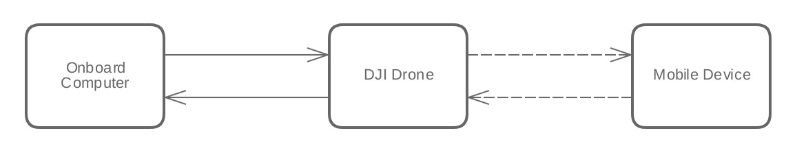

## Intro

The purpose of this document is to give an overview of the 'Data Transparent Transmission' between an onboard computer and an Mobile Device. The rest of this document is organized as followed:

* Problem Motivation
* 2 Usage Scenarios (with sample code snippet)

Please be aware that the current upstream(Mobile to onboard computer) bandwidth is around _1KB/s_ while the downstream (Onboard to Mobile Device) bandwidth is around _8KB/s_.

### Problem Motivation

DJI provides two types of APIs for developers to create their own applications: Mobile API and Onboard API. Mobile API allows developers to monitor and control the UAV from a mobile device running iOS or Android with the remote controller connected. Onboard API allows developers to monitor and control the UAV from any system directly connected to the UAV through a serial(UART) port interface.

Mobile API can be used without any other devices and allows developers to monitor the flight status easily. However, this configuration has some obvious limitations such as: a relatively low computing power, limited wireless bandwidth and unacceptable time latency for real-time or complex control operations.

Onboard API is implemented through the onboard computer which is mounted on the UAV. Communication with the UAV is done directly through the serial port. It provides sufficient computing power and stability for developers to run complex and demanding applications. Since the onboard computer is mounted directly on the UAV, developers are not able to monitor the flight status from their programs easily. If program crashes, developers will have to manually control the UAV with the remote controller and the valuable debugging log data during the run is hard to retrive.

'Data Transparent Transmission' is developed to combine the benefits of these two APIs by establishing a connection between an Mobile Device and an onboard computer. Via the 'Data Transparent Transmission', developers are able to send data from their Mobile Device to onboard computer to control over the program while receiving computing results, log data, flight status and external sensor data etc.

In short, Data Transparent Transmission serves as a linkage between Mobile API and Onboard API, granting developers a better flexibility in creating their own flight APPs.

## Usage Scenario 1 - downstream from Onboard Computer to Mobile Device

The CMD set and ID used here is compatible with the Onboard SDK OPEN protocol as follows:

    CMD set: 0x00
    CMD ID: 0xFE

|Data Type|Offset(byte)|Size(byte)|Description|
|---------|------|----|-----------|
|CMD Val|0|0~100|User Data|
|ACK Val|---|---| N/A|

The following code snippet shows you how to receive the data on different mobile platforms including iOS and Android.

- iOS

Please implement the following delegate method of DJIFlightControllerDelegate:

~~~objc
- (void)flightController:(DJIFlightController *_Nonnull)fc didReceiveDataFromOnboardSDKDevice:(NSData *_Nonnull)data;
~~~

For more details, please check **DJIFlightController.h** file in the iOS SDK.

- Android

Please implement the `setOnboardSDKDeviceDataCallback` callback function as shown below:

~~~java
Aircraft mAircraft = (Aircraft)DJISDKManager.getInstance().getProduct();
FlightController mFlightController = mAircraft.getFlightController();
mFlightController.setOnboardSDKDeviceDataCallback(new FlightController.OnboardSDKDeviceDataCallback() {
    @Override
    public void onReceive(byte[] bytes) {

    }
});
~~~

For more details, please check the **FlightController** class in the Android SDK.

## Usage Scenario 2 - upstream from Mobile Device to Onboard Computer

The following SDK interface can help you understand how to communicate with Onboard SDK Device on different mobile platforms including iOS and Android.

- iOS

Please use the following method of DJIFlightController:

~~~objc
- (void)sendDataToOnboardSDKDevice:(NSData *_Nonnull)data withCompletion:(DJICompletionBlock)completion;
~~~

For more details, please check **DJIFlightController.h** file in the iOS SDK.

- Android

Please implement the `sendDataToOnboardSDKDevice` method of DJIFlightController as shown below:

~~~java
Aircraft mAircraft = (Aircraft)DJISDKManager.getInstance().getProduct();
FlightController mFlightController = mAircraft.getFlightController();
mFlightController.sendDataToOnboardSDKDevice(data, new CommonCallbacks.CompletionCallback() {
    @Override
    public void onResult(DJIError error) {

    }
});
~~~

For more details, please check the **FlightController** class in the Android SDK.

The onboard computer can receive the data sent from the Mobile Device by means of a CMD from Autopilot with the CMD Set, ID and Val to be:

    CMD Set: 0x02
    CMD ID: 0x02

|Data Type|Offset(byte)|Size(byte)|Description|
|---------|------|----|-----------|
|CMD Val|0|1~100|User Data|
|ACK Val|---|---|N/A|
