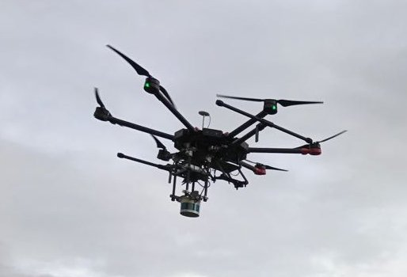
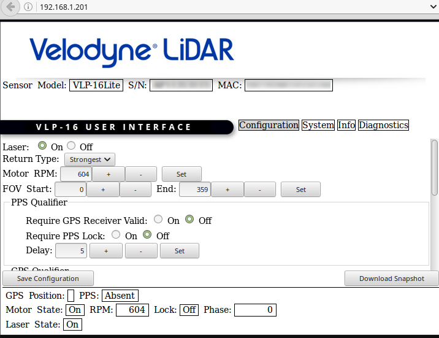

## Introduction

The objective of the LiDAR-based collision avoidance package [beta] is to help enhance the safety during both precision mission and manual flying. Previously we have used LiDAR as a sensor for data collection. This module uses LiDAR as a sensor for perception. This is the first beta release of this module and we are seeking your feedback and suggestions for improvements.  The operator must maintain sole responsibility for the safe operation of the vehicle while using this module.

## Hardware and Software Setup

### Hardware setup

The system for collision avoidance consists of the following components:

1. Velodyne Puck LITE or VLP-16 LiDAR
2. Onboard embedded system (OES): Intel NUC with i5 processer, 256G SSD and 8G RAM
3. Power adapters to power the LiDAR and the OES from the drones main power source
4. Customized mounting rack for the LiDAR and the OES

The overall weight of the above system is around 1.77 kg, so we choose the DJI Matrice 600 as the platform. The rack is designed such that the field of view (FOV) of the VLP-16 is not blocked by the body of the M600. The VLP-16 is mounted upside down, with the power cable pointing to the right side of the M600.

The VLP-16 needs to be configured from its network interface as shown is the figure below:

### Software setup

The collision avoidance software is developed and tested on the following software environment:

1. Ubuntu 16.04
2. ROS Kinetic full installation
3. Velodyne driver for ROS
3. DJI Onboard SDK
4. DJI Onboard SDK ROS package
5. DJI collision avoidance package (binary)

The collision avoidance module can be used in conjunction with precision mission planning or used during manual piloted flying. The software setup procedures differ for these two cases as outlined in the workflow section below.

##### Collision Avoidance with Precision Missions

First follow software setup instructions in [Precision Mission](../missionplan/README.html#setup) to get the sample built with trajectory and collision avoidance support.

Passing the `-DUSE_COLLISION_AVOIDANCE=ON` parameter to CMake while building the Linux sample will place collision avoidance binaries in the `build/bin/dji-ros-collision-avoidance` directory.

Next, build the `velodyne` ROS package:

       1. cd path-to-catkin-workspace/src
       2. git clone https://github.com/dji-sdk/velodyne.git
       3. cd ..
       4. catkin_make
       5. source devel/setup.bash

Finally, source the collision avoidance install-space: 

       6. cd path-to-Linux-sample-build-directory
       7. cd bin/
       8. source dji-ros-collision-avoidance/install-1604/setup.bash --extend

Don't forget the `--extend` option - if you do not use it, the source command will override your previously sourced ROS workspace.

##### Collision Avoidance with Manual Flight in Onboard-SDK-ROS

Follow the steps at the [ROS](../../github-platform-docs/ROS/README.html#setup) page to build the `DJI_OnboardSDK_ROS` package with the `-DUSE_COLLISION_AVOIDANCE=ON` parameter. This will place the collision avoidance binary in `path_to_catkin_workspace/dji-ros-collision-avoidance`

Next, build the `velodyne` ROS package as above and add the `--extend` flag while sourcing `devel/setup.bash` if you had the velodyne package in a different catkin workspace than the one with Onboard SDK ROS.

Finally, source the collision avoidance install-space as above (make sure you `cd` to `path_to_catkin_workspace/dji-ros-collision-avoidance` in step 1).

## Workflow

### Use with precision mission

The collision avoidance module can be started automatically with the precision trajectory following mission. To execute a precision mission with collision avoidance support, run the linux sample executable in mobile mode (`-mobile`). Obtain Control in the Core Functions tab. Then from the `advanced` tab in the mobile app, hit the `Go` button under the `Precision Trajectory` section with the 'Collision Avoidance` switch on, as shown below. After the M600 takes off, the collision avoidance module will be started and the drone will hover/pause if there are unexpected obstacles in the direction of motion. The precision mission will resume when the obstacle has cleared. If the obstacle cannot be removed, the user will have to abort the mission with manual control. Hit Release control in the Core Functions tab to get full manual control of the aircraft. 

### Use with manual piloted flying

The collision avoidance module can also be started to assist the pilot during manual flying. To start the collision avoidance for manual flight, first start the ROS nodes `dji_sdk` and `dji_sdk_client` following the instructions in [ROS documentation](../../github-platform-docs/ROS/README.html#examples), and enter the mobile mode. Then, take off manually or using the mobile command. After the drone is in the air, hit the `Go` button under section `Collision Avoidance` in the `Advanced` tab, and the drone will enter collision avoidance manual flight mode. 

In collision avoidance manual flight mode, the user stick inputs are be remapped to velocity commands. To ensure safety, we scaled the maximum velocities such that the maximum `X` and `Y` velocities are scaled to `3 m/s`, the maximum `Z` velocity is scaled to `2 m/s`, and the maximum yaw rate is scaled to `45 deg/s`.

## Under the hood

The collision avoidance module is developed as a ROS package named `dji_collision_avoidance`. This package consists of the following ROS nodes

### `dji_occupancy_grid_node`
This node creates occupancy grid from the LiDAR point cloud.
- Subscribed topics:
  1. `/velodyne_points`: published by the `velodyne_pointcloud` package
  2. `/tf`

- Published topics:
  1. `/dji_collision_avoidance/octomap_binary`: the occupancy grid for collision checking
  2. `/dji_collision_avoidance/occupied_cells_vis_array`: markers of the occupancy grid for visualization by `rviz`

### `dji_collision_detection_node`
When the drone is moving, this node checks if there is a potential collision in the current direction of motion to determine if the drone needs to hover/pause. When the drone is paused, it continuously checks if the commanded flight direction might lead to a collision to determine if the drone can resume.

- Subscribed topics:
  1. `/dji_sdk/velocity`
  2. `/dji_sdk/rc_channels`
  3. `/dji_collision_avoidance/octomap_binary`

- Published topics:
  1. `/collision_info_msg`

### `drone_tf`
- Subscribed topics:
  1. `/dji_sdk/attitude_quaternion`

- Published topics:
  1. `/tf`

### `manual_fly`
- Subscribed topics:
  1. `/dji_sdk/velocity`
  2. `/dji_sdk/rc_channels`
  3. `/dji_sdk/global_position`
  4. `/collision_info_msg`

Advanced developers can look at `from_Linux_sample.launch` and `from_DJI_ros_client.launch` located in `install/lib/dji_collision_avoidance/launch`, which are the launch files used by the precision mission and the manual fly, respectively. The launch files contain the nodes that are needed in each case.

### Limitations

- This is a beta release and may contain errors or bugs. Use at your own risk.

- Currently the collision avoidance module will only stop and hover when moving towards obstacles. It will not move away from an approaching dynamic obstacle.

- Simultaneous localization and mapping (SLAM) is not used. The collision avoidnace module only usese the instantaneous point cloud information from the LiDAR to build an occupancy map and attempts to avoid a collision in a short-time-decay occupancy map.

- This module requires high quality vehicle velocity information to work. In the M600 setup, this means that good GPS reception is required.

- Plan the mission with conservative velocity, e.g., `5 m/s` and be prepared to switch to `P` mode to take over manual control. 

- This module is not designed to detect hanging wires or other small objects reliably. 

- ***The operator is solely responsible for the safe operation and avoidance of obsticles at all times while using this module.***
