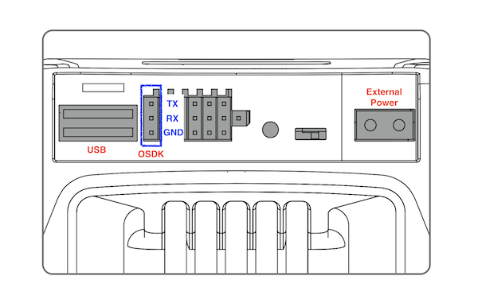

* Connect UART port for OSDK communication
* Connect USB port for [Advanced Sensing](../guides/component-guide-advanced-sensing-stereo-camera.html)  feature or configuration tool (Optional)
* Connect external power supply for OES or onboard sensors (Optional)
  * The voltage is not regulated and ranges from 18V to 26V with current of 2A
  * To turn on/off the power of this port, please use the configuration tool located inside `utility/bin/`. This configuration persists through power cycles. Please choose the right executable depending on your processor. Example usage to turn on power is shown below.

````
./M210ConfigTool --usb-port /dev/ttyACM0 --config-file UserConfig.txt --power-supply on
````

* Calibrate the vision positioning system for optimal performance. <a href="https://www.youtube.com/watch?v=mYSqz7R5zwI" target="_blank">[Video Link]</a>




  
