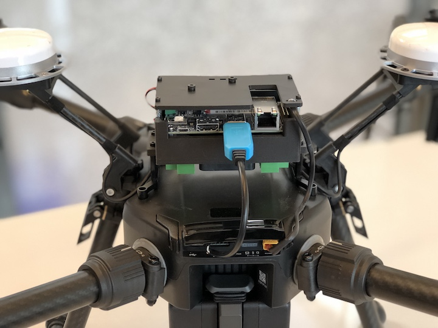
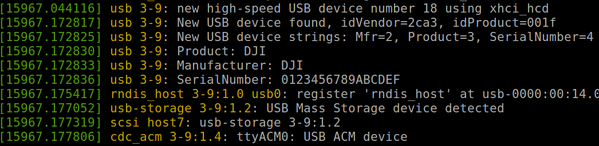

## Mount an Onboard Computer on M210

An example of how to mount a NVIDIA Jetson TX2 on a M210 is shown in the picture below.

Depending on where the onboard computer is mounted, 
please be aware that the magnetometer interference and 
upward infrared occlusion could happen. To disable upward 
infrared obstacle avoidance, please use DJI Go 4 --> Top 
right option --> Main Controller Setting --> Upward Obstacle Avoidance.



After the physically mounting, developers need to make proper connections between the onboard computer and the M210 following the [Hardware Setup](../development-workflow/hardware-setup.html).

## Software Dependencies for Advanced Sensing

The [Advanced Sensing](../guides/component-guide-advanced-sensing-stereo-camera.html) features and the utility to configure the aircraft require additional drivers and libraries to work with OSDK. In order to use them, please make sure the following dependencies are installed.

#### 1. LibUSB

The [Stereo Images](../guides/component-guide-advanced-sensing-stereo-camera.html) feature 
relies on [libUSB](https://github.com/libusb/libusb) to receive image data 
from the aircraft via USB. The recommended version is 1.0.17 and above. Please install libusb with the following command
```
sudo apt-get install libusb-1.0-0-dev
```

In addition to libUSB, an udev file is required to allow your system to obtain permission and to identify DJI USB port. 

1. Create a udev file called `DJIDevice.rules` inside `/etc/udev/rules.d/`
2. Add `SUBSYSTEM=="usb", ATTRS{idVendor}=="2ca3", MODE="0666"` to this file
3. Reboot your computer

#### 2. USB Abstract Control Model (ACM) Driver

OSDK supports a configuration tool in executable form to allow developers to turn on/off simulation and external power supply and to enable flight when USB is connected to the aircraft. This tool communicates with M210 via USB. In order to use it, please make sure your onboard computer has ACM driver installed. An example of system message from `dmesg` command in terminal is shown below.



#### 3. FFmpeg

The Camera Stream feature of the Advanced Sensing depends on the [FFmpeg](http://www.ffmpeg.org) library. Please install FFmpeg with the following command
```
sudo apt-get install libavcodec-dev libswresample-dev
```

#### OpenCV (Recommend for running the samples)

The [stereo image samples](../sample-doc/advanced-sensing-stereo-images.html) and the [camera stream samples](../sample-doc/advanced-sensing-camera-stream.html) use OpenCV to visualize images. Without OpenCV, these samples will just print some message to screen. To get the most from the samples, please install OpenCV with the following command.
```
sudo apt-get install libopencv-dev
```

