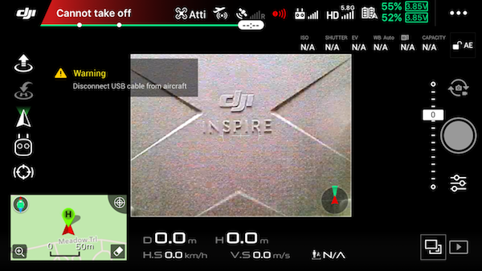

DJI flight controller has a safety feature to prevent users from accidentally taking off the aircraft while developing their applications. Unless in simulation, the flight controller does not allow the aircraft to arm the motors when USB is connected. An example of the warning message is shown in the below picture. 

The [Advanced Sensing](../guides/component-guide-advanced-sensing-stereo-camera.html) feature on M210 contradicts this safety feature since it requires USB to receive image data. A configuration tool located inside `utility/bin/` is provided to disable it. This configuration requires the OSDK to be activated and does not persist through power cycles and is therefore good practice to configure it before each flight. Please choose the right executable depending on your processor. Example usage is shown below.
````
./M210ConfigTool --usb-port /dev/ttyACM0 --config-file UserConfig.txt --usb-connected-flight on
````



