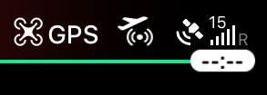
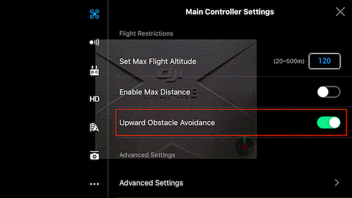
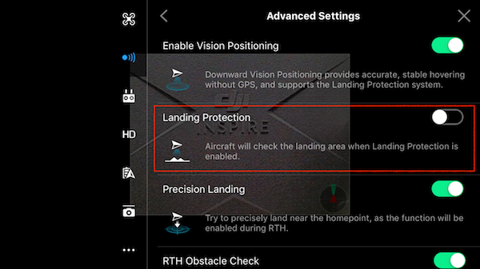
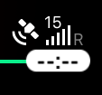
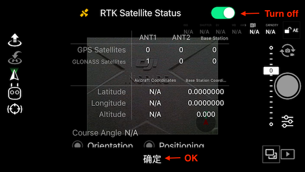

## Configuration Tool to Enable Simulation

The [Advanced Sensing](../guides/component-guide-advanced-sensing-stereo-camera.html) 
feature and DJI Assistant both use USB to communicate with the aircraft. 
Developers using Advanced Sensing might not be able to turn on/off 
simulation at the same time. A configuration tool in executable form 
located inside `utility/bin/` is provided to turn on/off simulation 
programmatically. Please choose the right executable depending on your 
processor. Example usage is shown below.
````
./M210ConfigTool --usb-port /dev/ttyACM0 --config-file UserConfig.txt --simulation on --latitude 37.422083 --longitude -122.137390
````

Indicator of simulation status can be checked from DJI GO 4 
App and the LED lights at the tail of the aircraft. 
GPS is always visible in simulation and developers can 
see the flight mode changes from DJI Go 4 App, as shown 
below. Another indicator is that the LED lights will keep 
flashing for roughly 3 seconds when simulation is turned on.  



## Interference between Obstacle Avoidance Sensors and Simulation

With the new vision positioning system and upward infrared obstacle avoidance 
features supported on M210, extra care is required in simulation. 
When simulation is enabled, the upward infrared obstacle avoidance feature is 
still activated and is interacting with the real world. Developers can utilize 
this feature to test their applications or disable them inside DJI Go 4 App, 
as shown in below screenshots. The same situation applies to the landing 
protection feature. Note that these two configurations do not persist 
through power cycles.






## Running mission without RTK reception

Launching a mission on a M210 RTK via Onboard SDK without RTK reception requires extra
steps. Mission will not start without RTK reception, 
developers need to either get RTK reception or turn off RTK via DJI GO 4 App.
To disable RTK, click on the satellite icon in the main page of DJI Go 4 App,



A window with RTK information will show up. Turn it off and press "OK".


