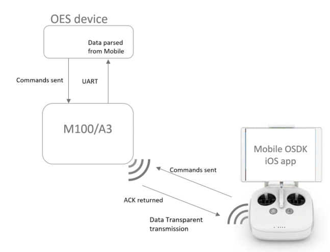

## Introduction

The Mobile Onboard SDK communication uses the Data Transparent Transmission protocol. As mentioned in the [Data Transparent Transmission](../introduction/data-transparent-transmission.html) section, the Data Transparent Transmission was developed to combine the benefits of Mobile and Onboard SDK APIs by establishing a connection between a Mobile Device and an OES. Via the Data Transparent Transmission, developers are able to send data from their Mobile Device to OES to control over the program while receiving computing results, log data, flight status and external sensor data etc. The iOS app along with the parser allows the user to run pre-existing functions supported on the respective platforms. 

Basic architecture of the Mobile Onboard SDK communication is as shown below: 

## Linux

You can enable mobile command input by running './onboardsdk mobile'. The support commands are: 

* Obtain Control
* Release Control 
* Take Off 
* Landing 
* Arm
* Disarm 
* Go Home
* Draw Square Demo 
* Waypoint Test 

Linux supports ACK returned from the Flight Controller. ACK returned will be displayed on the Mobile app. 

## ROS

You can enable mobile command input by choosing number 37 on the list. This will allow you to send commands from the Mobile device. The supported commands are: 

* Obtain Control
* Release Control 
* Take Off 
* Landing 
* Get SDK Version
* Arm
* Disarm 
* Go Home
* Take Photo 
* Start Video
* Stop Video 
* Draw Circle Demo 
* Draw Square Demo 
* Gimbal Control Demo 
* Attitude Control Demo 
* Virtual RC Test 

ROS does not supports ACK returned from the Flight Controller. This will be supported in a future release. 

## iOS Mobile Onboard SDK app 

The iOS app can be side loaded to your phone using Xcode on a Macintosh system. Below are the list of instructions to side load the MOS app to your iOS device. 

- Create Mobile app on the DJI developer website. You will need the Bundle ID and Key to be entered in the Xcode project. 
- Login using your Apple ID and download Xcode from the App store. 
- Launch Xcode and setup your Apple ID in the preferences. 
- Download source for iOS app from ... 
- Launch the MOS.xcodeproj 
- In the project settings change bundle ID to the one registered on the DJI developer portal
- Go to the Communicator Manager class and set registration ID from the DJI developer portal. 
- Hit Run and let Xcode fix any issues that show up. 
- The app can now be launched on your iOS device. 

