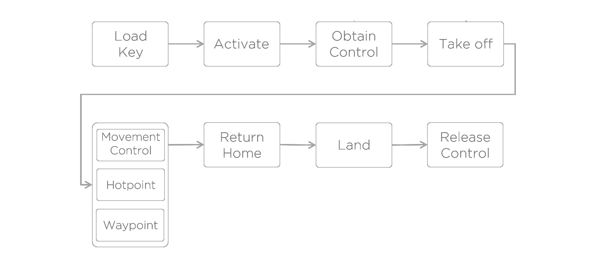

> This guide is for users who want to go beyond the functionality or interfaces offered by the samples. If you haven't seen the samples first, please do so now. Samples can be found under *Platform Guides* on your left.

## Introduction
This guide helps users understand Onboard SDK programming paradigms and correct usage of the APIs provided by the DJI Onboard SDK library. The guide walks through the two asynchronous programming paradigms that are supported by the SDK, and provides information about DJI Onboard SDK workflow. 

All structures and functions are declared in `DJI_API.h`, `DJI_Type.h` and `DJICommonType.h`. For more details, please refer to the source code - Doxygen documentation for the API is also provided.

## Software Components

##### Serial Device Driver  
Since the Onboard SDK communicates with the Flight Controller on the aircraft entirely via serial communication, it is necessary to have an efficient serial device driver that implements I/O, memory locking/unlocking and ways for the serial channel to talk to or interrupt other threads in the program.

We provide implementations of serial drivers in our Qt sample, in the ROS sample and a generic Linux platform device driver in the `platform` folder, used by the new (3.1.8) Linux sample.

##### Threading/Interrupts

The serial communication described above must always run - and we usually want to execute other processes in the foreground while I/O goes on. To make this happen, the preferred method is to spawn a read thread, and let the main flow of the program continue in the main thread. In order to allow inter-thread communication, a method of signaling also needs to be implemented, or the main thread must continuously poll for changes from the read thread.   

We provide threading implementations for all our x86 and ARM-based samples. For embedded systems where threading is not an option, an interrupt-based mechanism must be implemented. We provide one such mechanism as part of the STM32F4 sample.

##### Application-Layer API calls

This is the part of the system where functionality for controlling the drone is implemented. In the core Onboard SDK library, we provide a number of APIs that provide interfaces for all functionality made available through the [Open Protocol](../introduction/index.html). The sample programs provided execute combinations and compositions of the library API calls together with some logic.

## Programming Paradigms

The core of the Onboard API is a command (CMD)-acknowledgement(ACK) communication for executing actions; the OES sends CMD packets to the Flight Controller containing information about the action it is requesting. The flight controller, in return, replies with an ACK packet confirming or rejecting the CMD. SDK-side code must therefore implement some mechanism of relaying this ACK information back to the user or the CMD-sending function, so that the caller can take further action based on ths ACK response. 

The Onboard SDK supports two ways of doing this, described below. 

#### Asynchronous Programming - Callback Mechanism

For true asynchronous programming, the SDK needs to allow for a mechanism for the user to execute code upon receiving ACKs from the aircraft indepdendent of the main flow of execution. The Onboard SDK provides this through **callback functions**.

Upon receiving the ACK from the aircraft, the SDK's `read` function calls the user-provided callback function. The user is also allowed to supply some data (`UserData`, implemented as a `void*`), which is passed as an argument to the user callback. The user callback has access to the ACK and can implement logic based on the ACK. With `UserData`, the user can also pass any additional information to the callback that the callback may act on depending on the ACK parsing logic.   

**Example:** Activation function in QT sample 

1. Declare and define the callback function in your user code.  

    ```c
    static void activationCallback(CoreAPI* api, Header* protocolHeader, UserData userData);
    ```
    Callback functions must have the same function prototype as above. Use `UserData` to send `void*` data and then cast it to appropriate datatypes in your callback function. 

2. Pass the callback function when you call activate.
    ```c
    api->activate(&activateData, DJIonboardSDK::activationCallback, this);
    ```
    Here, we call the overloaded `activate` function that takes in a user-specified callback and some user-provided data as the second and third arguments. The prototype for all API functions can be found in [DJI_API.h](https://github.com/dji-sdk/Onboard-SDK/blob/3.1/lib/inc/DJI_API.h).  

3. The meaning of ACK return values(result) is explained for each command in the [Flight ACK Codes](../introduction/index.html#CMD-Val-ACK-Val) document.

>Note: Callbacks, in the current implementation, are executed on the read thread. Do not execute large pieces of code in callbacks; reading the serial port is prevented until the callback finishes.

#### Synchronous Programming - Blocking API Calls

The SDK provides a clean way to implement blocking API calls through its signaling-based thread synchronization. Blocking calls are very convenient because a blocking call only returns after the CMD-ACK round trip is done. When the blocking call returns, users are assured that the command has executed, and the ACK is available in user code as the blocking call's return value. As a result, users do not need to implement callbacks to take decisions or execute code based on ACKs.

Blocking calls are great for maintaining a linear flow of execution. They are also free from the issues arising executing heavy code in callbacks. 

**Example:** Take Control function in new(3.1.8) Linux sample

1. Call the blocking overload for activate.

    ```c
    unsigned short takeControlAck = api->setControl(true, 1);
    ```

    This function prototype takes in a timeout as the second parameter - this is to prevent the blocking funtion from blocking execution indefinitely if the ACK is not received - when there is a packet corruption, for example.

2. Parse the returned ACK according to the [Flight ACK Codes](../introduction/index.html#CMD-Val-ACK-Val) document.

    ```c
    switch (takeControlAck)
    {
      case ACK_SETCONTROL_NEED_MODE_F:
        std::cout << "Failed to obtain control.\nYour RC mode switch is not in mode F. (Is the RC connected and paired?)" << std::endl;
        takeControlData.status = -1;
        return takeControlData;
        break;
      case ACK_SETCONTROL_OBTAIN_SUCCESS:
        std::cout << "Obtained control successfully."<< std::endl;
        break;
      case ACK_SETCONTROL_OBTAIN_RUNNING:
        std::cout << "Obtain control running.."<< std::endl;
        takeControl(api);
        break;
      case ACK_SETCONTROL_IOC:
        std::cout << "The aircraft is in IOC mode. Cannot obtain control.\nGo to DJI GO and stop all intelligent flight modes before trying this." << std::endl;
        takeControlData.status = -1;
        return takeControlData;
        break;
      default:
        {
          std::cout << "Error in setControl API function." << std::endl;
        }
        break;
    }
    ```

    The enums for the cases above are defined in the SDK.


## Onboard SDK Programming Workflow

When calling APIs, developers should make sure that the sequence of events follows this chart:



## Receiving Flight Data

The above workflow talks about the *sending* side of user code; another important part is reading the aircraft's flight data. A full list of all the data that can be received is available on the SDK tab of DJI Assistant 2.

The aircraft will always send this data at the frequencies set here (or set through the Onboard SDK's `setBroadcastFreq()` API call) over the serial port.

To save this flight data, developers need to declare correct structs. The [DJI_Type.h](https://github.com/dji-sdk/Onboard-SDK/blob/3.1/lib/inc/DJI_Type.h) file contains sample structs for correctly accepting all kinds of broadcast data. 

This is the BroadcastData struct definition in DJI_Type.h:

```c
typedef struct BroadcastData
{
    unsigned short dataFlag;
    TimeStampData timeStamp;
    QuaternionData q;
    CommonData a;
    VelocityData v;
    CommonData w;
    PossitionData pos;
    MagnetData mag;
    RadioData rc;
    GimbalData gimbal;
    FlightStatus status;
    BatteryData battery;
    CtrlInfoData ctrlInfo;

    //! @note these variables are not send from FMU,
    //! just a record for user.
    uint8_t controlStatus;
    uint8_t activation;
} BroadcastData;
```

**Example:** Get quaternion data:  

1. Declare quaternion struction

    ```c
    typedef struct QuaternionData
    {
        float32_t q0;
        float32_t q1;
        float32_t q2;
        float32_t q3;
    } QuaternionData;

    QuaternionData q;
    ```


2. Get the quaternion

    ```c
    q = flight->getQuaternion()
    ```


## Movement Control


We recommend developers to send their Movement Control commands at 50Hz frequency. Developers can implement that by `usleep(20000)`、`ros::Duration(1/50)` or other ways which depend on the development environment.

For Movement Control, specific meanings of arguments are decided by the control mode byte. For more info about Movement Control, please refer to [Control mode byte part in Appendix](../appendix/index.html#Control-Mode-Byte).

We recommend developers to use `HORI_POS` mode for horizontal movement. More details are shown in [Position-Control(HORI_POS)](#position-control-hori-pos) in this document. In this mode, speed and attitude are controlled by autopilot, thus developers do not need to worry about that.
    
Please note that certain conditions are required for some control modes to be functional:

* Only when the GPS signal is good (health\_flag >=3)，horizontal position control (HORI_POS) related control modes can be used.
* Only when GPS signal is good (health\_flag >=3)，or when Gudiance system is working properly with Autopilot，horizontal velocity control(HORI_VEL)related control modes can be used.

```c
FlightData data;
data.flag = flightFlag;
data.x = flightx;
data.y = flighty;
data.z = flightz;
data.yaw = flightyaw;
flight->setFlight(&data);
```


## GPS to North-East Coordinate
Convert GPS to North-East-Down Coordinate. (GPS in radian，North-East Coordinate in meter)
For example, `origin_longti` and `origin_lati` , as the longitude and latitude of original position，are decided by developers and the position of UAV taking off is recommended to be the original position. `longti` and `lati` are longitude and latitude of UAV's current posistion. `x` and `y` are offset to the original position in the North and the East directions. The unit of offset is meter.

~~~c
#define C_EARTH (double) 6378137.0
/* From GPS to Ground */
{
    double dlati = lati-origin_lati;
    double dlongti= longti-origin_longti;

    double x = dlati * C_EARTH;
    double y = dlongti * C_EARTH * cos(lati / 2.0 + origin_lati / 2.0);
}
~~~

## Quaternion to RPY

Convert quaternion to roll, pitch and yaw in radian in body coordinate.

~~~c
    api_quaternion_data_t q;
    DJI_Pro_Get_Quaternion(&q);

    float roll  = atan2(2.0 * (q.q3 * q.q2 + q.q0 * q.q1) , 1.0 - 2.0 * (q.q1 * q.q1 + q.q2 * q.q2));
    float pitch = asin(2.0 * (q.q2 * q.q0 - q.q3 * q.q1));
    float yaw   = atan2(2.0 * (q.q3 * q.q0 + q.q1 * q.q2) , - 1.0 + 2.0 * (q.q0 * q.q0 + q.q1 * q.q1));
~~~

## Position Control(HORI_POS)

The input horizatal arguments are the offset between current position and target position, when `HORI_POS` is the mode of horizontal movement control. The unit of offset is meter.

For example, in ground frame, `target` is target position and `current` is UAV's current position. The coordinates of these positions are caculated by GPS, Guidance or other sensors. In most cases, GPS is the correct way to make this work.

Because, for the autopilot, the maximum frequency of receiving data is 50Hz, the frequency of calculating offset should be over 50Hz to ensure the closed-loop control is vaild.  

~~~c
void update_offset()
{
    offset_x = target_x - current_x;
    offset_y = target_y - current_y;
}

/* Command thread */

FlightData data;
data.flag = 0x90;
data.x = offset_x;
data.y = offset_y;
data.z = target_z;
data.yaw = target_yaw;
flight->setFlight(&data);

~~~


## Should I build my program from scratch?

In most cases, the answer is no. We provide sample programs for a wide variety of platforms - [Linux](../github-platform-docs/Linux/README.html), [ROS](../github-platform-docs/ROS/README.html), [Windows](../github-platform-docs/PureQT/README.html) and [STM32F4](../github-platform-docs/STM32/README.html). These samples effectively implement application-layer constructs on top of the Onboard SDK library in a platform-specific manner. The samples are a great starting point, and allow you to go straight to implementing your own functionality rather than spending time perfecting serial communciation, threading and asynchronocity.

Use this guide to build your own programs if you absolutely cannot work with the samples provided by DJI. The ROS and new Linux sample (3.1.8) in particular are designed to be extensible - you can put your own functionality directly into the framework of these samples.  
