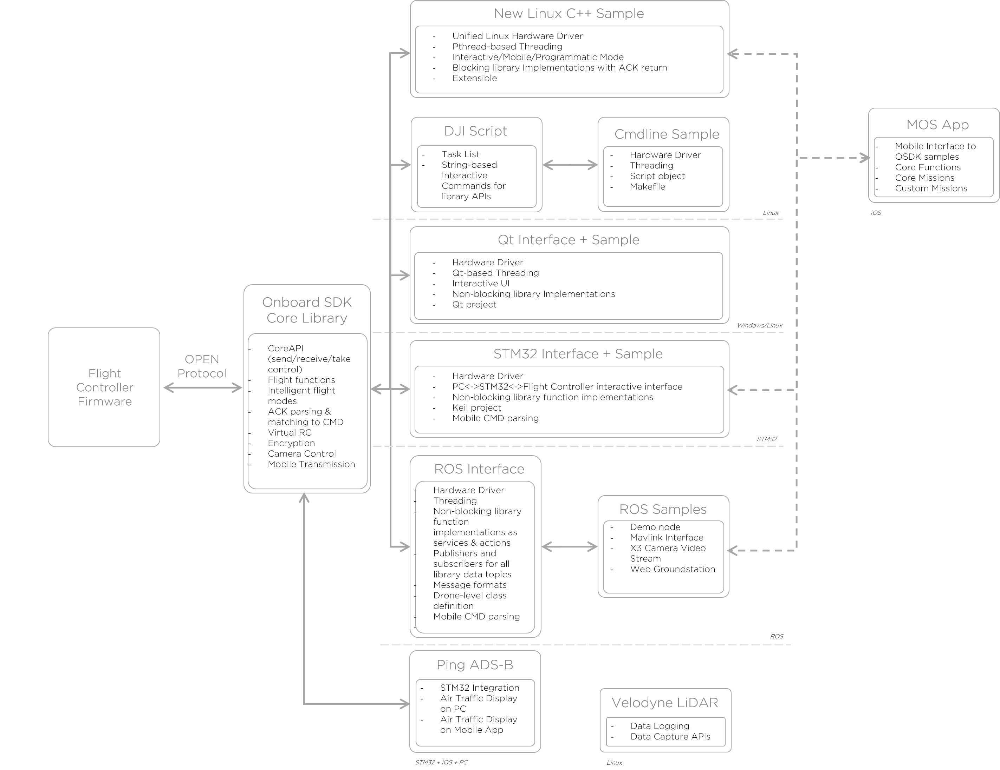

## Introduction

Onboard SDK offers many features for building powerful, robust applications on top of DJI drones. It can get a little overwhelming to explore all the features at once - this document guides you through the typical usage patterns for Onboard SDK and familiarizes you with some conventions.

*Note: If you haven't read the [Quick Start](../quick-start/index.html) guide yet, please do so first.*

## What are the parts of the Onboard SDK? 

This diagram provides a high-level overview of the different components of the onboard SDK.

## CMake library build structure

If you need more detail on the architecture of the various functions implemented in the onboard SDK, there is a [more detailed diagram](../appendix/index.html#detailed-architecture) available in the Appendix.  

## Choosing the Right Platform

### 1. Custom Applications on Linux/Windows

The core of the Onboard SDK is the SDK library - a fully featured API for communicating with the flight controller through the OPEN protocol. 

As a developer, you can write applications with zero overhead by using the DJI API as a starting point. The Onboard SDK provides three sample applications built using the DJI API, two for a Linux target (GUI-based sample built using Qt and C++ sample built using CMake) or for a Windows target (GUI-based sample built using Qt). Do note that only the C++ Linux sample app is designed to be extended. The QT sample is no longer being maintained and will be obsolete in the next few releases. 

**Use When:**
- Your application has a specific focus and you want the least possible overhead in implementation 
- Your application needs to run on a constrained computation/memory budget
- You are integrating your application into a larger codebase

**Do not use if:**
- You would rather have communication and reliability handled by an abstraction layer

### 2. High-Level Applications on ROS/Linux

Because many of our users would prefer having an interface which takes care of itself for low-level tasks, we also offer a ROS implementation with feature parity. ROS is a flexible communication middleware with excellent community support. The ROS flavor of Onboard SDK publishes all the drone data to a set of topics using standardized message formats. Integrating the DJI Onboard SDK into larger ROS projects is extremely straightforward. 

**Use When:**
- You are familiar with ROS and want to take advantage of existing ROS packages
- You want a high-level implementation that requires very little housekeeping
- Your Onboard Embedded System (OES) is not the only computer in your project

**Do not use if:**
- You do not want ROS overhead in your application
- You are concerned about latency and frequency of data transmission
- You are running the application on a low-power OES 

### 3. Applications on Embedded Systems

DJI's Onboard SDK also provides an implementation for the [STM32F407 Discovery](http://www.st.com/content/st_com/en/products/evaluation-tools/product-evaluation-tools/mcu-eval-tools/stm32-mcu-eval-tools/stm32-mcu-discovery-kits/stm32f4discovery.html), a low-cost, powerful embedded system suitable for real-time applications. This implementation has feature parity with the Linux version as well, and is an excellent choice for constrained implementations. The current implementation builds using the Keil toolchain.

**Use When:**
- You need to have direct, low-level access to system components for your project
- You are interested in leveraging the real-time nature of MCUs such as the STM32
- You are operating on a highly constrained memory/processing budget

**Do not use if:**
- You plan to have additional processing (e.g. computer vision) in your application
- You don't want to worry about registers and counters
- Your application doesn't demand the use of an MCU over a conventional single board computer 

## Levels of Abstraction

**Core API:**
The CoreAPI is a lower-level communication library that implements the functionalities of the [Open Protocol](index.html). All samples except the Linux C++ sample directly implements the CoreAPIs. The CoreAPI is not thread-safe. If you're implementing your own sample on top of the CoreAPI, code must be managed to prevent race-conditions, memory corruption etc. 

**Wrapper API:**
A new, higher-level OSDK Wrapper API allows users to call better encapsulated, more intuitive functions for accomplishing common larger tasks rather than using multiple lower-level CoreAPI calls for accomplishing the same thing. 
The C++ Linux sample makes use of the Wrapper API in order to implement the features. 

Starting from 3.1.9, we build the Core API (djiosdk-core) and Wrapper API libraries (djiosdk-wrapper) that you can link against depending on your needs. Refer to the CMake architecture for more information.

## Should I build my program from scratch?

In most cases, the answer is no. We provide sample programs for a wide variety of platforms - [Linux](../github-platform-docs/Linux/README.html), [ROS](../github-platform-docs/ROS/README.html), [Windows](../github-platform-docs/PureQT/README.html) and [STM32F4](../github-platform-docs/STM32/README.html). These samples effectively implement application-layer constructs on top of the Onboard SDK library in a platform-specific manner. The samples are a great starting point, and allow you to go straight to implementing your own functionality rather than spending time perfecting serial communciation, threading and asynchronocity.

Use this guide to build your own programs if you absolutely cannot work with the samples provided by DJI. The ROS and new Linux sample (3.1.8) in particular are designed to be extensible - you can put your own functionality directly into the framework of these samples.  

## Next Steps

At this point, you probably know what platform you want to work on. Review the [Things to Know](things-to-know.html) document and the newly-revamped [Programming Guide](../application-development-guides/programming-guide.md) before you head over to the [official github repository](https://github.com/dji-sdk/Onboard-SDK)!
