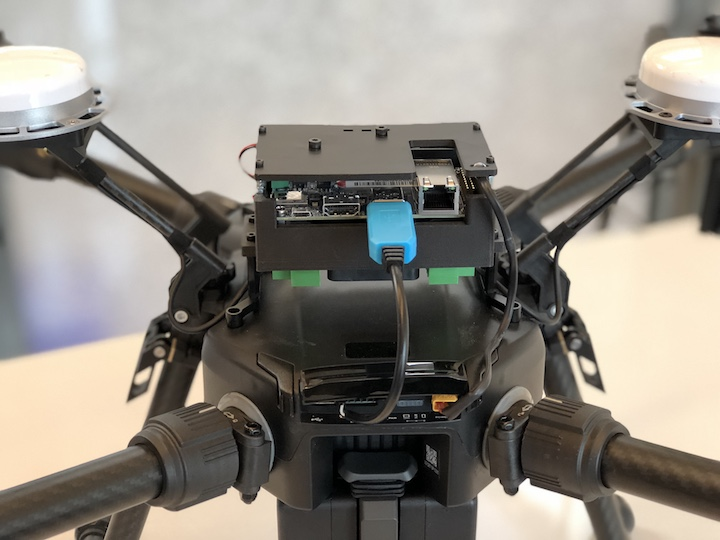
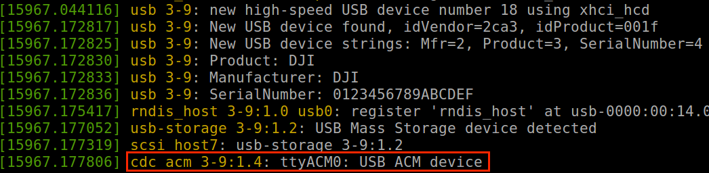

## Mount an Onboard Computer on M210

An example of how to mount a NVIDIA Jetson TX2 on a M210 is shown in below picture. 

Depending on where the onboard computer is mounted, 
please be aware that the magnetometer interference and 
upward infrared occlusion could happen. To disable upward 
infrared obstacle avoidance, please use DJI Go 4 --> Top 
right option --> Main Controller Setting --> Upward Obstacle Avoidance.

## Driver Dependency 

The [Advanced Sensing](../guides/component-guide-advanced-sensing-stereo-camera.html) feature 
and the utility tool to configure the aircraft require additional drivers 
to work with OSDK. If developers would like to enable them, please make 
sure below drivers are installed.

#### LibUSB

The [Advanced Sensing](../guides/component-guide-advanced-sensing-stereo-camera.html) feature 
relies on [libUSB](https://github.com/libusb/libusb) to receive image data 
from the aircraft via USB. Please make sure libUSB is installed 
if you would like to enable this feature. The recommended version is 1.0.17 and above.

In addition to libUSB, an udev file is required to allow your system to obtain permission and to identify DJI USB port. 

1. Create a udev file called `DJIDevice.rules` inside `/etc/udev/rules.d/`
2. Add `SUBSYSTEM=="usb", ATTRS{idVendor}=="2ca3", MODE="0666"` to this file
3. Reboot your computer

#### USB Abstract Control Model (ACM) Driver

OSDK supports a configuration tool in executable form to allow developers to turn on/off simulation and external power supply and to enable flight when USB is connected to the aircraft. This tool communicates with M210 via USB. In order to use it, please make sure your onboard computer has ACM driver installed. An example of system message from `dmesg` command in terminal is shown below.

#### OpenCV

The [Advanced Sensing](../sample-doc/advanced-sensing-stereo-images.html) sample uses OpenCV to visualize stereo images. The CMakeList.txt in this sample detects if OpenCV is installed in the system. If yes, the sample callback functions will display the images.
