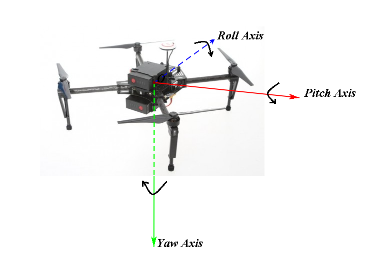
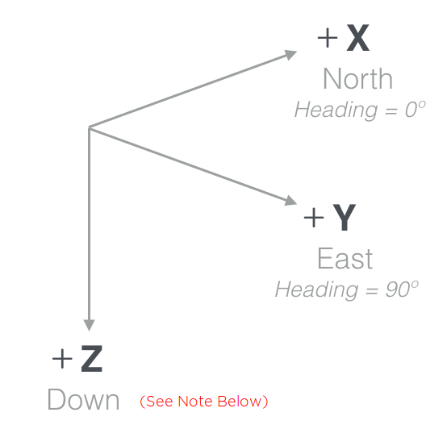

#Phyical definitions

## Frames of Reference

Description of aircraft movement is dependent on the location and orientation of coordinate axes that make up a coordinate system (or frame of reference). Many coordinate systems exist, but the two used in the DJI Onboard SDK are relative to the aircraft body (body frame), and relative to the ground (world frame).

### 1. Body Frame

  

Aircraft translation in positive X, Y and Z is therefore defined in the Body Coordinate System as forward, right and downward translation respectively.

Aircraft rotation is also described with these same axes using the coordinate right hand rule to define the direction of positive rotation.

If the aircraft rotates around the Pitch axis (Y axis) it will move in the X axis direction. Moreover, if the Pitch angle is positive, the direction will be backwards, or in the negative X axis. Care must therefore be taken when using roll, pitch and yaw to move an aircraft.

### 2. Ground Frame

  + North - x axis
  + East - y axis
  + Down - z axis*

A popular ground or world coordinate system used for aircraft aligns the positive X, Y and Z axes with the directions of North, East and down. This convention is called North-East-Down or NED. In this convention, X and Y are then consistent with the right hand rule and normal navigation heading angles. A heading angle of 0° will point toward the North, and +90° toward the East.

The origin for a NED coordinate system is usually a point in the world frame (like take-off location).

> **Note:** *To alleviate this issue of the unnatural downward-pointing positive Z, we adjust the direction of vertical control in order to make the height or vertical velocity to be positive upwards. In other words, giving a positive velocity will make the UAV ascend. This adjustment does not affect the directions and the orders of the other two axis. We are not defining a left-handed co-ordinate system; the actual computations on the flight controller happen in an NED frame.*

#Data Broadcast

#Data subscription

# Topics

all telemetries data stucture are organized by a templete structure TypeMap

## QUATERNION

We use the Hamilton Convention for the order of quaternions. That means our quaternion data structure will be of the form [q0, q1, q2, q3] where q0 is the scalar part.

If you are unfamiliar with quaternions, this [CH Robotics page](http://www.chrobotics.com/library/understanding-quaternions) is a pretty good introduction.

## ACCELERATION GROUND

unit is m/s2

this acceleration is fusioned in ground frame without ground gravity

## ACCELERATION BODY

unit is m/s2

this acceleration is fusioned in body frame without ground gravity

## ACCELERATION RAW

unit is G

this is the raw data measured by the acceleration sensor, it followed:

F + G = ma

where F is the measured force vector, G is gravity, m is mass of the object, a is acceleration.

because the MEMS sensor measured value is in unit G, so it has been divided the mass arleady.

## VELOCITY

unit is m/s

in ground frame

the health bit is to show wheather current Flight controller have the velocity observation or not.

## PALSTANCE FUSIONED

## PALSTANCE RAW

## ALTITUDE FUSIONED

## ALTITUDE BAROMETER

## HEIGHT HOMEPOOINT

## HEIGHT FUSION

## IMU GPS

## GPS DATE

a integer indicating a GMT+8 date(yyyymmdd.E.g.20150205 = February 5th,2015)	day	uint32_t

## GPS TIME

a integer indicating a GMT+8 time in a 24-hour clock(hhmmss.E.g.90209 = 09:02:09)	second	uint32_t

## GPS POSITION

## GPS VELOCITY

## GPS DETAILS

## RTK POSITION

## RTK VELOCITY

## RTK YAW

## RTK POSITION INFO

## RTK YAW INFO

## COMPASS

## RC

## GIMBAL ANGLES

## GIMBAL STATUS

## STATUS FLIGHT

## STATUS DISPLAYMODE

## STATUS LANDINGGEAR

## STATUS_MOTOR START ERROR

## BATTERY INFO

## CONTROL DEVICE

## HARD SYNC
