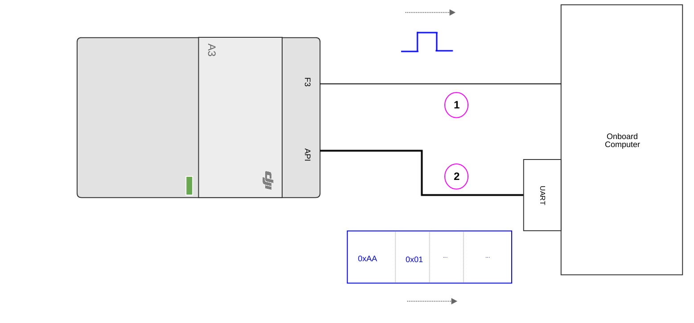
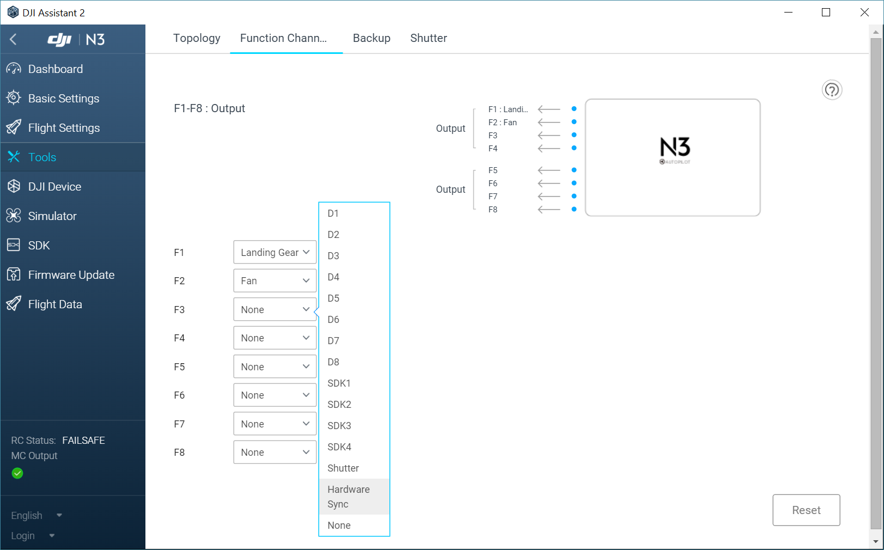
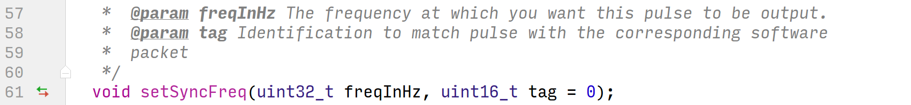
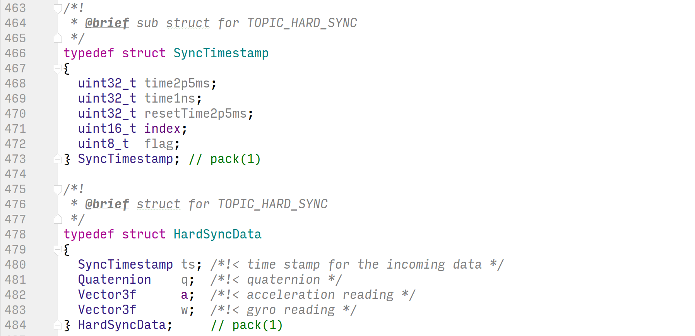

## Introduction

Hardware synchronization, an exclusive Onboard SDK 3.3 feature, offers users the ability to accurately synchronize external sensing and compute with DJI vehicles/flight controllers.

Hardware sync provides users with a digital timing signal from a hardware output line, along with a software packet that timestamps the digital signal in the aircraft/FC's clock reference. What's more, the software packet also includes time-aligned IMU data for use with external fusion algorithms.

## Why Hardware Clock Sync?

The goal of hardware synchronization is to offer users a means to accurately synchronize the free-running clock used by DJI flight controllers/aircraft with the clock on users' onboard computer or sensors.

An example use case - developers can use the data from sensors on board DJI aircraft/flight controllers to accurately fuse with external sensors that accept a sync line, such as cameras. Another example is using it with sensors that have their own clock (such as GPS) - you can use an Onboard Computer (OC) to convert the DJI device clock as well as the sensor clock to the same reference (the OC's reference) and align the sensor data.

## Principles of Operation

The central principal of operation for hardware sync can be followed in this diagram:

 1. A digital pulse is generated from the sending device, say the A3, and sent out on a hardware line (1) in the diagram.
 2. At the same time, the sending device timestamps this pulse in its own reference frame. Let's call this **(t0A3)**.
 3. The sending device sends out this timestamp in a software packet (2) in the picture.
 4. The receiving device, say an Onboard Computer (OC), receives the pulse on the line at some time in its own reference frame. Let's call this **(t0OC)**
 5. The receiving device receives the software packet at some later time, dictated by the latency of the UART, the scheduling of the OC and the timing on which the software packet is sent.
 6. Now, since the hardware pulse travels almost at the speed of light, we can safely assume that **(t0A3) = (t0OC)**. Note that this is strictly valid only for OCs which have a hardware interrupt on a digital input line; for other cases you must add in the operating system's latency due to scheduling and buffering.
 7. On the receiving device, we have both timestamps **(t0A3)** and **(t0OC)**, and we can now use this relation to successfully convert any time  **(tA3)** to an equivalent time  **(tOC)** in the receiving device's timebase using the relation

       
 <b>(tOC) = (t0OC) + (tA3) - (t0A3) </b>

## Onboard SDK Hardware Sync Implementation

To use the hardware signal, developers must first set a function channel (F1-F8) to output hardware sync signal through DJI Assistant 2 as shown here:

This step ensures that when we call the APIs that trigger hardware sync, we have a channel through which the aircraft/FC can output the sync line. Connect this sync line to your OC or external sensor.

To trigger the hardware sync, we use the Hardware Sync Start API

This API takes in a hardware sync signal frequency and a tag - this tag will be attached to each software packet that corresponds to a hardware pulse.

Users can subscribe to `TOPIC_HARD_SYNC` using the Subscription telemetry to receive software packets corresponding to the hardware pulses; the incoming data looks like this:

Let's examine the `SyncTimeStamp` struct in some more detail:

- `time2p5ms`: This field returns clock time in multiples of 2.5ms. Since the sync timer is running at 400Hz, this field will increment in integer steps.
- `time1ns`: This field contains a nanosecond time offset from the 2.5ms pulse. Use the formula below to calculate timestamp in nanoseconds.

 <b> time_ns = (time1ns % 2500000) + (time2p5ms * 2.5 * 106) </b>
 

- `resetTime2p5ms`: This field returns clock time in multiple of 2.5ms *elapsed since the hardware sync started*.
- `index`: This is the `tag` field you filled out when using the `setSyncFreq` API above; use it to identify the packets that have sync data. This is useful when you call the `setSyncFreq` API with `freqInHz = 0`, so you get a single pulse that can be uniquely identified with a `tag` - allowing you to create your own pulse train with uniquely identifiable pulses.
- `flag`: This is `true` when the packet corresponds to a hardware pulse and `false` otherwise. This is useful because you can request the software packet to be sent at a **higher frequency that the hardware line**.

The timestamp is split up into these two fields (`time2p5ms` and `time1ns`) for maintaining high resolution of the timestamp.

This gives us some more context in examining the `HardSyncData` struct:

- `ts`: A `SyncTimeStamp` struct as described above
- `q`, `a`, `w` : IMU data (`a` and `w` raw, `q` fused) timestamped at high resolution.

Thus this sensor data can be fused with external sensors with high precision and at high frequency.