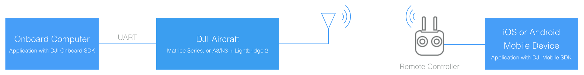

## Introduction

The Mobile SDK allows developers to monitor and control the UAV from a mobile device running iOS or Android when connected to a remote controller. The Onboard SDK allows developers to monitor and control the UAV from an onboard computer directly connected to the UAV through a serial (UART) interface.

Sometimes it is useful combine the flexibility of the Mobile SDK with the real time versatility of the Onboard SDK. Both the Onboard and Mobile SDKs have APIs that allow custom data to be sent between the onboard computer and the mobile device. The existing Lightbridge wireless link between the remote controller and aircraft is used to transport this information.
 
The upstream (mobile device to onboard computer) bandwidth is approximately _1KB/s_ while the downstream (onboard computer to mobile device) bandwidth is approximately _8KB/s_

## Uses

Data exchange between a Mobile SDK application and an Onboard SDK application is useful for whenever information or commands need to be transferred between the ground and the onboard computer. Some example scenarios include:

* Onboard computer shares processed third party sensor information with the mobile device
* Operator using a mobile device sends real-time commands to onboard computer
* High level mission planning performed on mobile device, and onboard computer performs low level execution

## Sample 

As a way to demonstrate how to implement the Mobile to Onboard Communication APIs, a [sample](./../sample-doc/msdk-comm.html) is provided that allows an iOS application to send commands to the onboard computer to then execute on the aircraft.
 

