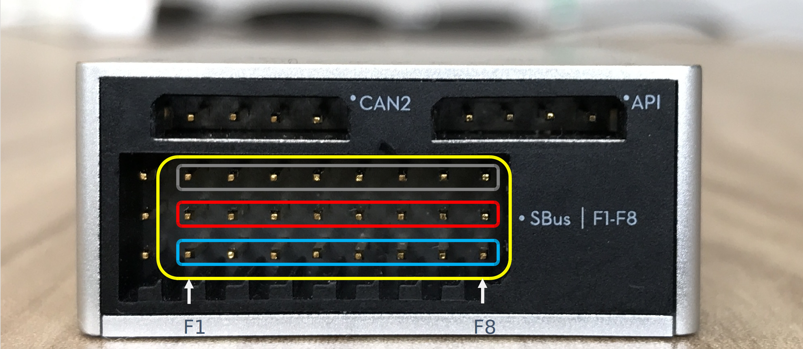

## Introduction

The Multi Function IO feature of the A3 and N3 Flight Controller supports reading and writing PWM signals, Analog to Digital Conversion and General Purpose Input Output. These new features are being introduced
  in order to avoid having to arrange additional circuitry or micro-controllers for the mentioned low level functionalities.

##### NOTE: Multi-Function IO feature not supported in Matrice 100.
 
### PWM

Pulse Width Modulation allows the control of power supplied to electrical devices such as motors or LEDs. Pulse Width Modulation allows us to vary how much time the signal is high in an analog fashion. 
 
 The A3 and N3 Flight Controller supports sending PWM signals. PWM signals can be written to a user defined pin to control the brightness of an LED, the speed of a motor etc. 

### Analog to Digital Converter 

An Analog to Digital Converter allows conversion of analog signal such as voltage or current to a digital number proportional to the input. 
The A3 and N3 Flight Controller supports reading Analog signals and converting to Digital data.  

### GPIO 

General Purpose Input Output pins are digital control lines to read and write data. 
The A3 and N3 Flight Controller supports configuring multiple pins to have GPIO functionality. 

## Onboard SDK MFIO 

The image below shows the pins that are available for MFIO functionality.
 
* Pins F1-F8 (vertical pins from left to right) can be configured for MFIO functionality. 
* Pins with a red box around them are Voltage pins. 
* Pins with a blue box around them are Signal pins. 
* Pins with a gray box around them are Ground pins. 
* F1-F4 can be configured to be Input pins
* F5-F8 can be configured to be Input or Output pins

 

## DJI Assistant 2 MFIO Configuration

In DJI Assistant 2's Tools->Function Channels tab, we can map a hardware channel to an MFIO channel; to do so, click on any of F3-F8 and select `SDK1-SDK8`. Note that in the source code, we refer to the MFIO channels from `MFIO::CHANNEL_0` to `MFIO::CHANNEL_7`, though they map to `SDK1` to `SDK8`.

