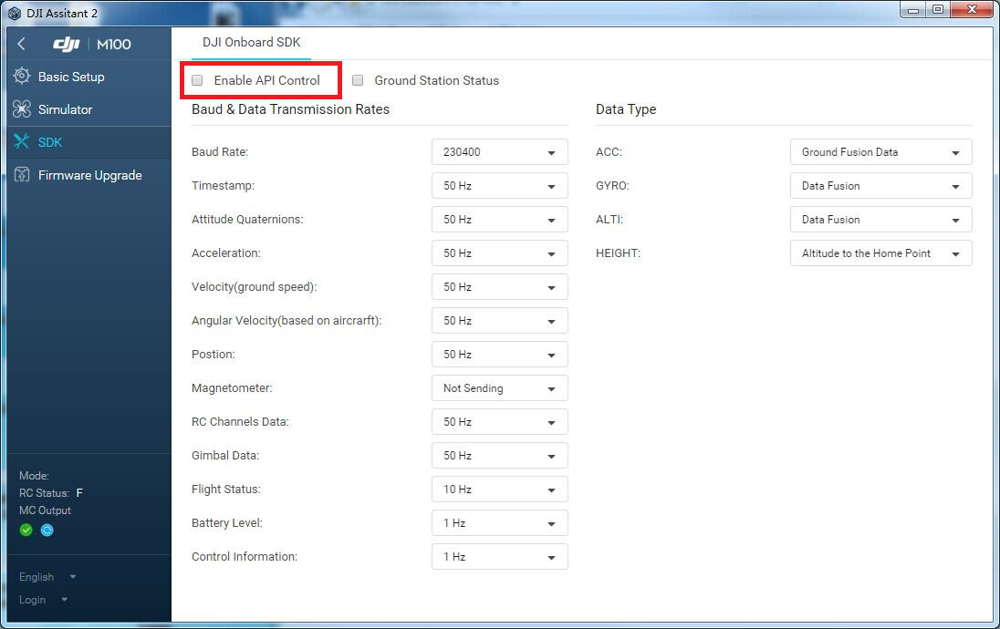

> New Major Release! Onboard SDK 3.3 is a full redesign of the DJI OSDK. Please read the docs for the best developer experience!

## Getting Started with the Onboard SDK

The DJI Onboard SDK (OSDK) allows you to build powerful, automated drone applications for supported DJI vehicles (<a href="http://www.dji.com/product/matrice100" target="_blank">Matrice 100</a>, <a href="http://www.dji.com/product/matrice600" target="_blank">Matrice 600</a> or <a href="http://www.dji.com/matrice-200-series" target="_blank">Matrice 210/210-RTK</a>) or flight controllers (<a href="http://www.dji.com/product/a3" target="_blank">A3</a> or <a href="http://www.dji.com/product/n3" target="_blank">N3</a>).

This document helps you get started with the various aspects of building OSDK applications.

## Get Started Immediately

Developers can get started immediately by following the steps to [run a sample application](../quick-start/quick-start.html). If you haven't been here before, please read the rest of this document.

## Introduction

This section introduces and compares the products compatible with the DJI OSDK, and outlines the SDK itself.

- [Hardware Support](../hardware-setup/index.html)
- [Onboard SDK Introduction](onboard-sdk-introduction.html)
- [OSDK Architectural Overview](architecture-guide.html)

## Concepts to Understand

DJI Products use technologies that might not be fully familiar to software developers. See the concepts page to understand more about the technologies to take full advantage of the capablities of DJI aircraft or flight controllers.
- [Flight Control Concepts](things-to-know.html)

## Hardware Setup
- If you are using an M100, M210 or M600 vehicle, you should assemble and familiarize yourself with flying the vehicle before attempting to proceed with OSDK development.
- If you are using an A3/N3 flight controller with Lightbridge 2 and your own vehicle, then you should familiarize yourself with flying your vehicle before attempting to proceed with OSDK development.
- Generically, you will be working with one of the setups in the following diagram:

#### Connecting Your Onboard Embedded System (OES)

   - If you are using one of our supported platforms, we provide detailed instructions in our [Hardware Setup Guide](../hardware-setup/index.html).

   - The [Hardware Setup Guide](../hardware-setup/index.html) also lists the pin diagram for the API port on the [M100](../hardware-setup/index.html#M100-UART-Connector), the [A3/N3/M600](../hardware-setup/index.html#A3-UART-Connector) and the [M210](@todo) so that you may build your own cable compatible with your OES.

   - A3 flight controller can be accessed on the M600 (or M600 Pro) by pulling off the top-cover.

   - You can power your OES from your own battery or if you are using an M100/M600/M210, you can pull power from the vehicle bus. See your aircraft manual for details.

   - Secure your OES to the vehicle near the center of mass. Ensure that the total vehicle weight is within the maximum takeoff weight specificed for your vehicle.

## Software Setup

### 1. Download the SDK and Required Tools

- <a href="https://github.com/dji-sdk/Onboard-SDK" target="_blank">Download</a> the onboard SDK repository from Github
- <a href="https://www.dji.com/product/matrice600/info#downloads" target="_blank">Download</a> the DJI PC Assistant 2 software for Windows/Mac
- <a href="http://www.dji.com/product/goapp" target="_blank">Download</a> the DJI GO App to your mobile device

### 2. Update Firmware

- Connect your computer to the Micro-USB port on the M100/600 or A3/N3. For the M210, use the USB-A to USB-A cable provided with the aircraft.
- Update your aircraft/flight controller with the latest released firmware. Please visit the [Compatibility Matrix](../appendix/versioning.html) to find out which SDK version your firmware supports.

### 3. Enable Flight Controller API control

- With your aircraft/flight controller connected to your PC/Mac, launch DJI Assistant 2 and check the box marked `Enable API Control` on the `SDK` page.

### 4. Onboard SDK Application Registration

- You must register as a developer with DJI and create an OSDK application ID and Key pair. Please go to <a href="https://developer.dji.com/register/" target="_blank">https://developer.dji.com/register/</a> to complete registration.

### 5. Flight Platform Activation

Each new vehicle or flight controller must be activated with the DJI server on first SDK use to enable communication with your application.

- We provide APIs for activation.
- All samples implement activation, so if you are trying out a sample app it will automatically activate.

## Run a sample!

We provide a number of sample applications designed to show a realistic implementation of a certain functionality. Samples include:

- [Flight Control](@todo)
- [Telemetry](@todo)
- [GPS Missions](@todo)
- [Camera/Gimbal control](@todo)
- [Mobile SDK communication](@todo)
- [Multi Function I/O](@todo)

Samples have implementations as standalone Linux apps, ROS nodes, and STM32 samples.

## Safety

Please comply with local regulations during the development of your application. Please refer to <a href="http://flysafe.dji.com/" target="_blank">http://flysafe.dji.com/</a> for more information. ***The operator must maintain sole responsibility for the safe operation of the vehicle, including maintaining the ability to take manual control of the vehicle at all times to maintain safety in the event of a malfunction of any aspect of the Onboard SDK modules.***

## Next Steps

Now that you are setup and communicating with a DJI flight control system, we would encourage you to explore our platform guides and reference documentation to help jumpstart your development. We would recommend reading our [Architecture Guide](../introduction/architecture-guide.html) next. The revamped [Programming Guide](../application-development-guides/programming-guide) is a good place to visit once you have some familiarity with the examples and want to know more about the internals.

Also, take a look at our revamped [FAQ](../appendix/FAQ.html) for some answers to common questions. After that, feel free to contact us with any issues.

### Reference Documents

- [Release Notes for Onboard SDK 3.2.2](../appendix/releaseNotes.html)
     >Note: v3.2.2 of the Onboard SDK was released on 14 Mar 17 and fixes the M600/A3 VERT_POS movement control issue.

- Revamped [FAQ](../appendix/FAQ.html)

- [OPEN Protocol](../introduction/index.html) & [Appendix](../appendix/index.html)

- [Data Transparent Transmission](../introduction/data-transparent-transmission.html)

- [Programming Guide](../application-development-guides/programming-guide.html)

- [Ground Station Protocol](../introduction/ground-station-protocol.html)

- [Virtual RC](../introduction/virtual-rc-protocol.html)

- [Ground Station Programming Guide](../application-development-guides/ground-station-programming-guide.html)

- [EULA](http://developer.dji.com/policies/eula/)
