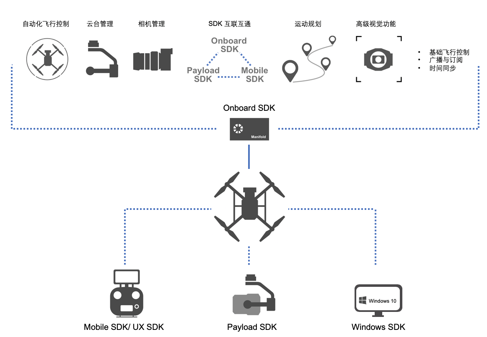

> **说明:** 本系列文档介绍OSDK V4.0.0 的功能，以及使用OSDK V4.0.0 开发应用程序的步骤和方法，若您仍使用OSDK V3.9.0 开发应用程序，请下载[OSDK V3.9.0]() 的文档。

OSDK 是一个用于开发无人机应用程序的开发工具包，基于OSDK 开发的应用程序能够运行在机载计算机上（如Manifold 2），开发者通过调用OSDK 中指定的接口能够获取无人机上的各类数据，经开发者设计的软件逻辑和算法框架，执行相应的计算和处理，生成对应的控制指令控制无人机执行相应的动作，实现如**自动化飞行**、**负载控制**和**视频图像分析**等功能。
        

      

## 主要优势
* **兼容广泛的软硬件平台**    
使用OSDK 开发的应用程序能够运行在主流的嵌入式硬件平台上，如STM32等，也可运行在主流的嵌入式操作系统和软件架构中，如Linux、ROS及RTOS，开发者按照[跨平台移植](../quickstart/porting.html)中的步骤执行所需的工作后，即可在不同版本的软硬件平台上运行基于OSDK 开发的应用程序。

* **满足复杂的控制需要**     
通过调用OSDK 开放的接口，即可使无人机按照指定的控制逻辑在极端环境中实现自主飞行、负载控制及图像感知等应用功能。

* **支持丰富的拓展方案**     
OSDK 提供了丰富的接口，方便开发者使用第三方应用程序和算法框架，使用图像识别、自主巡航及SLAM 等技术开发出专业的应用软件，此外，还方便开发者接入第三方传感器、相机或检测设备，采集所需的数据信息，满足用户个性化的应用功能和控制需求。

## 典型功能

* <a href="../tutorial/gimbal-manager.html"><b>云台管理</b></a>
* <a href="../tutorial/camera-manager.html"><b>相机管理</b></a>
* <a href="../tutorial/SDK-mop.html"><b>数据通信</b></a>
* <a href="../tutorial/motion-planning.html"><b>运动规划</b></a>
* <a href="../tutorial/advanced-sensing.html"><b>高级视觉</b></a>

## 应用场景
基于OSDK 开发的应用程序，一方面能够控制无人机执行复杂的飞行任务，如自主飞行，另一方面利用开发者开发的负载设备、无人机上的感知摄像头和算法框架，实现物体识别、自主避障以及云端协同等高级应用。

#### [飞行平台(查看详情)](https://www.dji.com/cn/products/compare-m200-series?site=brandsite&from=nav)
DJI 的无人机凝结了DJI 可靠的控制技术和先进的应用算法，能够广泛兼容第三方开发平台，搭载开发者所需使用的负载设备和计算平台，帮助开发者顺利且高效地完成所需实现的任务。

#### [计算平台(查看详情)](https://www.dji.com/cn/manifold-2)
为帮助开发者控制DJI 的无人机自动执行飞行任务，实时且高效地处理无人机和负载设备在飞行时产生的数据信息，DJI 提供了高性能机载计算机Manifold 2：      
* Manifold 2-G：搭载NVIDIA Jetson TX2，SATA-SSD 为128GB，适用于人工智能、物体识别及运动分析等领域。    
* Manifold 2-C：搭载 Intel Core i7-8550U，SATA-SSD为256GB，适用于高性能数据处理、机器控制及移动站等应用。   

## 免责说明
在使用OSDK 开发的应用程序前，请先查阅飞行地所在区域的法律和规定，**因使用OSDK 而引发的安全问题或法律纠纷均与DJI 无关，DJI 不承担一切因使用OSDK 而导致的任何法律风险和责任**。
