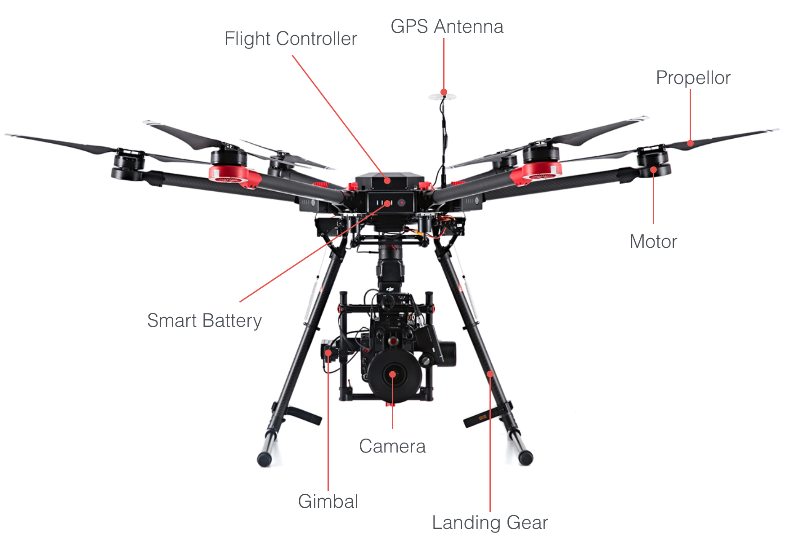
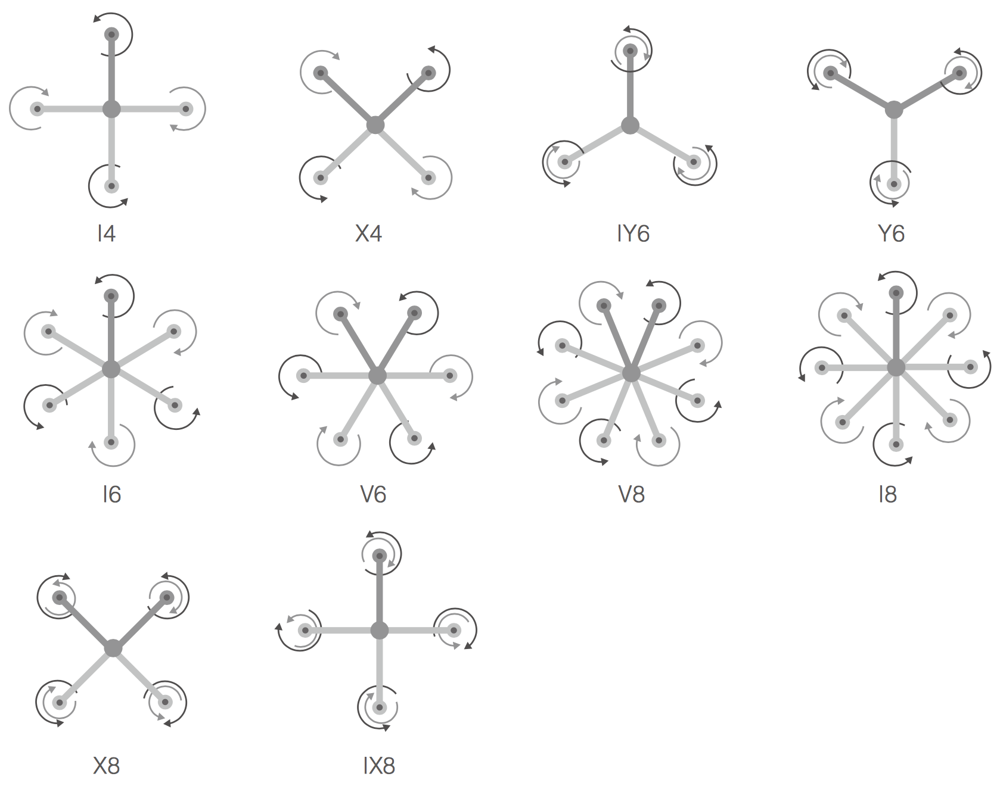

DJI produces small, highly capable, remotely controlled aircraft, cameras and stabilizers perfect for both consumer and commercial applications. The products are very accessible being easy to use and affordable, and have a quality and feature set unmatched in the industry.

This introduction summarizes the products that are compatible with the Onboard SDK. High level descriptions of the products and main components, and detailed comparisons between products are provided to help the developer choose which product is best for the application they are working on.

## Product Categories

### Aircraft

DJI has a range of multi-rotor aircraft that can be automated with the Onboard SDK including Matrice 600 Pro, Matrice 600, Matrice 210, Matrice 100. The aircraft provide a range of features, performance, size and price. Specific metrics developers and users should be aware of when they consider an aircraft include:

* Flight time
* Size and weight
* Camera specifications (image quality and movement control)
* Swappable cameras
* Obstacle avoidance
* Customizable payloads
* Maximum service ceiling
* Available accessories
* Remote controller features
* Support for Onboard SDK

### Stand-Alone Flight Controllers

N3, A3 and A3 Pro flight control modules are stand-alone components that can be automated with the Onboard SDK. All flight control modules include:

* Flight computer
* Inertial measurement unit (IMU) including compass, gyroscope, barometer, accelerometer
* GPS

These flight control modules allow developers to build fully custom aircraft that have DJI's stable and reliable flight control systems. 

To create an aircraft, these flight controllers can be combined with:

* DJI (Flamewheel series, S series) or third party airframes
* DJI (Lightbridge 2) or third party wireless communication links
* DJI Cameras (see [table](#supported_products) below), and/or third party cameras
* Third party batteries

The A3 and A3 Pro flight controllers are also used in the M600 and M600 Pro products respectively. It should be noted however, that the firmware for the A3 and A3 Pro will be different to that used in the M600 and M600 Pro.

### Cameras

DJI provides a number of gimbal mounted cameras that can be swapped between aircraft or used in conjunction with DJI's flight controllers and wireless links. Cameras that are compatible with M100, M210, M210-RTK, M600, M600 Pro, A3, A3 Pro and N3 are detailed in this [table](#supported_products)

## Components

Before doing a detailed product comparison it is useful to understand the components of a product and their function.

All products comprise component modules that provide an important feature or function. An introduction to typical components is below with more details in the [Component Guide](../guides/component-guide-flight-control.html).

#### Propulsion

Motor mounted propellors provide vertical thrust. The vertical thrust can be adjusted at each motor to allow the aircraft to hover, rotate, ascend, descend or fly horizontally.

#### Sensors

DJI aircraft have a large number of sensors including accelerometers, gyroscopes, compasses, barometers, ultrasonic sensors, cameras and satellite positioning systems. These sensors are used to determine the current and predict the future state of the aircraft and the environment around it.

#### Flight Controller

The Flight Controller is an aircraft's main controller that couples control information from the pilot with sensor information to adjust the thrust at each propellor and fly the aircraft as desired.

#### Camera

The camera can record image and video data locally.

#### Gimbal

The gimbal holds the camera and can rotate it around three axes. The rotation can be used to both control the direction the camera points, and provide rotational stabilization when the aircraft is not horizontal. The gimbal is mounted on a damped plate for Matrice 100 and on a specialized gimbal mount for Matrice 600, Matrice 210 and Matrice 600 Pro to stabilize lateral vibrations and rotational movement.

#### Smart Battery

Smart batteries provide the energy required to run the system. Together with the flight controller, the smart battery can estimate remaining flight time and provide warnings when low battery thresholds are crossed. Batteries are easily swapped between flights, extending product use considerably.

#### Remote Controller

The remote controller provides control sticks, buttons, and wheels that give control of the aircraft flight, camera and gimbal. The remote controller maintains a wireless link with the aircraft with some products having up to a 7km range in ideal environments. 

#### Onboard Computer

An external onboard computer can be mounted on the aircraft, and using the Onboard SDK and a direct serial (UART) connection to the flight controller, provide automation of flight.

#### Mobile Device

An Android or iOS device can be connected to the remote controller through either USB or WiFi to give an augmented flight experience showing the live camera feed, and showing aircraft state information. Using the DJI Onboard SDK along with DJI Mobile SDK, the mobile device can also be used to control the aircraft.

## Supported Products

Below is a table listing the aircraft, handheld cameras and stand-alone components supported by the DJI Onboard SDK.

<html><table class="table-product-accessories">
  <thead>
    <tr>
      <th colspan="4">Products and Accessories</th>
    </tr>
    <tr>
      <th>Category</th>
      <th>Product</th>
      <th>Cameras</th>
      <th>SDK Supported Accessories</th>
    </tr>
  </thead>
  <tbody>
    <tr>
      <td rowspan="5">Aircraft</th>
      <td>Matrice 100</td>
      <td>X3, X5, X5R, XT, Z3, Z30</td>        
      <td> N1 Video Encoder </td>
    </tr>
    <tr>
      <td>Matrice 210</td>
      <td>X4S, X5S, XT, Z30</td>        
      <td> Upward gimbal, Third-party sensors </td>
    </tr>
    <tr>
      <td>Matrice 210 RTK</td>
      <td>X4S, X5S, XT, Z30</td>        
      <td> Upward gimbal, Third-party sensors </td>
    </tr>
    <tr>
      <td>Matrice 600</td>
      <td>X3, X5, X5R, XT, Z3, Z30</td>        
      <td> DRTK, Ronin MX </td>
    </tr>
    <tr>
      <td>Matrice 600 Pro</td>
      <td>X3, X5, X5R, XT, Z3, Z30</td>        
      <td> DRTK, Ronin MX </td>
    </tr>
    <tr>
      <td rowspan="3">Flight Controllers</th>
      <td>N3</td>
      <td> X3, X5, X5R, XT, Z3, Z30 </td>        
      <td> Lightbridge 2, Ronin MX </td>
    </tr>
    <tr>
      <td> A3</td>
      <td> X3, X5, X5R, XT, Z3, Z30 </td>        
      <td> Lightbridge 2, DRTK, Ronin MX </td>
    </tr>
    <tr>
      <td> A3 Pro</td>
      <td> X3, X5, X5R, XT, Z3, Z30 </td>        
      <td> Lightbridge 2, DRTK, Ronin MX </td>
    </tr>
  </tbody>
</table></html>

## Aircraft Comparison

Aircraft comparison can be difficult due to the large selection of products, features and functionality. Three summarized aircraft comparison tables are below to introduce the differences in aircraft and features.

<html><table class="table-aircraft-comparison">
<thead><tr><th colspan="9">Aircraft Comparison: <b>Aircraft</th></tr></thead>
<tbody>
<tr>
<th width = 20%>
Product
</th>
<th width = 10%>
Max Flight Time min
</th>
<th>
Max Speed m/s
</th>
<th>
Max Ascent Speed m/s
</th>
<th>
Max Descent Speed m/s
</th>
<th>
Max Service Ceiling m
</th>
<th>
Propellors
</th>
<th width = 10%>
Mass g
</th>
<th width = 15%>
Max dimension Without propellors mm
</th>
</tr>
<tr>
<td>Matrice 100</td><td>19-40*</td><td>22</td><td>5</td><td>4</td><td>4500</td><td>4</td><td>2355 
With TB47 Battery
</td><td>650</td></tr>
<tr>
<td>Matrice 210</td><td>13-38*</td><td>23</td><td>5</td><td>3</td><td>3000</td><td>4</td><td>4420 
With TB50 Battery
</td><td>643</td></tr>
<tr>
<td>Matrice 210 RTK</td><td>13-32*</td><td>23</td><td>5</td><td>3</td><td>3000</td><td>4</td><td>4420 
With TB50 Battery
</td><td>643</td></tr>
<tr>
<td>Matrice 600</td><td>18-40*</td><td>18</td><td>5</td><td>3</td><td>2500</td><td>6</td><td>9100 
With 6x TB47 Batteries
</td><td>1133</td></tr>
<tr>
<td>Matrice 600 Professional</td><td>18-40*</td><td>18</td><td>5</td><td>3</td><td>2500</td><td>6</td><td>9500 
With 6x TB47S Batteries
</td><td>1133</td></tr>
</tbody></table></html>

<html><table class="table-aircraft-comparison">
<thead><tr><th colspan="9">Aircraft Comparison: <b>Features</th></tr></thead>
<tbody>
<tr>
<th width = 20%>
Product
</th>
<th>
Camera
</th>
<th>
FPV Camera
</th>
<th>
Wireless Range US / EU km
</th>
<th>
Batteries
</th>
<th>
Landing Gear
</th>
<th>
Custom Payload g
</th>
<th>
Compatible Accessories
</th>
</tr>
<tr>
<td>Matrice 100</td><td>X3, Z3, X5, X5R, XT, Z30</td><td>-</td><td>5 / 3.1</td><td>1-2</td><td>Fixed</td><td>1000</td><td>Guidance, Manifold, Focus</td></tr>
<tr>
<td>Matrice 210</td><td>X4S, X5S, XT, Z30</td><td>YES</td><td>5 / 3.1</td><td>1-2</td><td>Fixed</td><td>2300</td><td>Manifold, Focus, Third-party Sensors</td></tr>
<tr>
<td>Matrice 210 RTK</td><td>X4S, X5S, XT, Z30</td><td>YES</td><td>5 / 3.1</td><td>1-2</td><td>Fixed</td><td>1720</td><td>Manifold, Focus, Third-party Sensors</td></tr>
<tr>
<td>Matrice 600</td><td>X3, Z3, X5, X5R, XT, Custom with Ronin MX</td><td>-</td><td>5 / 3.1</td><td>6</td><td>Moveable</td><td>6000</td><td>Manifold, DRTK, Ronin MX</td></tr>
<tr>
<td>Matrice 600 Professional</td><td>X3, Z3, X5, X5R, XT, Custom with Ronin MX, Z30</td><td>-</td><td>5 / 3.1</td><td>6</td><td>Moveable</td><td>6000</td><td>Manifold, DRTK, Ronin MX</td></tr>
</tbody></table></html>

Detailed specifications are listed on each product's webpage **specs** section at <a href="http://www.dji.com" target="_blank">www.dji.com</a>.

<html><table class="table-aircraft-comparison">
<thead><tr><th colspan="9">Aircraft Comparison: <b>Vision System and Missions</th></tr></thead>
<tbody>
<tr>
<th width = 20%>
Product
</th>
<th>
Obstacle Avoidance
</th>
<th>
Infrared Sensing
</th>
<th>
Vision Positioning
</th>
<th>
Waypoint
</th>
<th>
Hotpoint
</th>
<th>
Follow Me
</th>
<th>
ActiveTrack
</th>
<th>
Tap Fly
</th>
</tr>
<tr>
<td>Matrice 100</td><td>With Guidance</td><td>-</td><td>With Guidance</td><td>Yes</td><td>Yes</td><td>Yes</td><td>-</td><td>-</td></tr>
<tr>
<td>Matrice 210</td><td>True</td><td>True</td><td>True</td><td>Yes</td><td>Yes</td><td>Yes</td><td>Yes</td><td>Yes</td></tr>
<tr>
<td>Matrice 210 RTK</td><td>True</td><td>True</td><td>True</td><td>Yes</td><td>Yes</td><td>Yes</td><td>Yes</td><td>Yes</td></tr>
<tr>
<td>Matrice 600</td><td>-</td><td>-</td><td>-</td><td>Yes</td><td>Yes</td><td>Yes</td><td>-</td><td>-</td></tr>
<tr>
<td>Matrice 600 Professional</td><td>-</td><td>-</td><td>-</td><td>Yes</td><td>Yes</td><td>Yes</td><td>-</td><td>-</td></tr>
</tbody></table></html>

### Flight Time

Product flight time is determined by total aircraft mass and the available stored (battery) energy on the aircraft. The available energy is determined by the number of batteries, the battery energy density and the maximum mass the propulsion system can support.

#### Battery Energy Density

DJI provides two series of batteries for the Inspire and Matrice product lines. The TB47 series is the default 99 Wh battery that comes with all aircraft. The TB48 series is a 130 Wh battery. While the TB48 battery has a 10-15% higher energy density, it is less practical as batteries >100 Wh often have transport restrictions.

Using a battery with a higher energy density will always translate to longer flight time if all else is kept constant. However, as the TB48 battery is a little heavier than the TB47 battery, it is important to remember that its use will restrict the maximum custom payload. This is particularly noticeable on the Matrice series of products when using more than one battery.

#### Using More Batteries

Increasing the number of batteries on a product will:

* Increase the available energy for flight (increasing flight time)
* Increase the aircraft mass and therefore:
     * Decrease flight time
     * Decrease the allowable additional payload

#### Flight Time Comparison

To help understand the potential functionality and flight time of different aircraft configurations, a detailed summary of payload and flight times is below:

<html><table class="table-flight-time" id="t03">
 <thead>
  <tr>
    <th colspan="9">Payload & Flight Time</th>
  </tr>
  <tr>
    <td width=20%>Product</td>
    <td width=10%>Camera</td>
    <td width=10%>Battery Configuration</td>
    <td width=10%>Aircraft Mass</td>
    <td width=10%>Battery Mass</td>
    <td width=10%>Camera Mass</td>
    <td width=10%>Payload</td>
    <td width=10%>Take-off Mass</td>
    <td width=10%>Max Flight Time (Approx.)</td>
  </tr>
  <tr>
    <td></td>
    <td></td>
    <td></td>
    <td>
grams
</td>
    <td>
grams
</td>
    <td>
grams
</td>
    <td>
grams
</td>
    <td>
grams
</td>
    <td>
min
</td>
  </tr>
 </thead>
 <tbody>
  <tr>
    <td rowspan="11">
    Matrice 100
    
Max Take-off Mass: 3600g Compatible with XT, X3, X5, X5R, Guidance, Manifold

    </td>
    <td align= "center">-</td>
    <td>TB47D</td>        
    <td>1755</td>        
    <td>600</td>        
    <td>0</td>        
    <td>0</td>        
    <td>2355</td>        
    <td>22</td>        
  </tr>
  <tr>
    <td align= "center">-</td>
    <td>TB47D</td>        
    <td>1755</td>        
    <td>600</td>        
    <td>0</td>        
    <td>500</td>        
    <td>2855</td>        
    <td>17</td>
  </tr>
  <tr>
    <td align= "center">-</td>
    <td>TB47D</td>        
    <td>1755</td>        
    <td>600</td>        
    <td>0</td>        
    <td>1000</td>        
    <td>3355</td>        
    <td>13</td>
  </tr>
  <tr>
    <td align= "center">-</td>
    <td>TB48D</td>        
    <td>1755</td>        
    <td>676</td>        
    <td>0</td>        
    <td>0</td>        
    <td>2431</td>        
    <td>28</td>
  </tr>
  <tr>
    <td align= "center">-</td>
    <td>TB48D</td>        
    <td>1755</td>        
    <td>676</td>        
    <td>0</td>        
    <td>500</td>        
    <td>2931</td>        
    <td>20</td>
  </tr>
  <tr>
    <td align= "center">-</td>
    <td>TB48D</td>        
    <td>1755</td>        
    <td>676</td>        
    <td>0</td>        
    <td>1000</td>        
    <td>3431</td>        
    <td>16</td>
  </tr>
  <tr>
    <td align= "center">-</td>
    <td>2x TB47D</td>        
    <td>1915</td>        
    <td>1200</td>        
    <td>0</td>        
    <td>0</td>        
    <td>3115</td>        
    <td>33</td>
  </tr>
  <tr>
    <td align= "center">-</td>
    <td>2x TB48D</td>        
    <td>1915</td>        
    <td>1352</td>        
    <td>0</td>        
    <td>0</td>        
    <td>3267</td>        
    <td>40</td>
  </tr>
  <tr>
    <td>X3</td>
    <td>TB47D</td>        
    <td>1755</td>        
    <td>600</td>        
    <td>247</td>        
    <td>0</td>        
    <td>2602</td>        
    <td>19</td>
  </tr>
  <tr>
    <td>X3</td>
    <td>TB48D</td>        
    <td>1755</td>        
    <td>676</td>        
    <td>247</td>        
    <td>0</td>        
    <td>2678</td>        
    <td>23</td>
  </tr>
  <tr>
    <td>X3</td>
    <td>2x TB48D</td>        
    <td>1915</td>        
    <td>1352</td>        
    <td>247</td>        
    <td>0</td>        
    <td>3514</td>        
    <td>33</td>
  </tr>
  <tr>
    <td rowspan="12">
    Matrice 210
    
Max Take-off Mass: 6140g Compatible with XT, X3, X5, X5R, Z30 Manifold

    </td>
    <td align= "center">-</td>
    <td>2x TB50</td>        
    <td>2770</td>        
    <td>1030</td>        
    <td>0</td>        
    <td>0</td>        
    <td>3800</td>        
    <td>27</td>        
  </tr>
  <tr>
    <td align= "center">X4S</td>
    <td>2x TB50</td>        
    <td>2770</td>        
    <td>1030</td>        
    <td>250</td>        
    <td>0</td>        
    <td>4050</td>        
    <td>23</td>
  </tr>
  <tr>
    <td align= "center">X5S</td>
    <td>2x TB50</td>        
    <td>2770</td>        
    <td>1030</td>        
    <td>460</td>        
    <td>0</td>        
    <td>4260</td>        
    <td>22</td>
  </tr>
  <tr>
    <td align= "center">Z30</td>
    <td>2x TB50</td>        
    <td>2770</td>        
    <td>1030</td>        
    <td>550</td>        
    <td>0</td>        
    <td>4350</td>        
    <td>22</td>
  </tr>
  </tr>
    <tr>
    <td align= "center">Z30+XT</td>
    <td>2x TB50</td>        
    <td>2770</td>        
    <td>1030</td>        
    <td>820</td>        
    <td>0</td>        
    <td>4620</td>        
    <td>20</td>
  </tr>
    <tr>
    <td align= "center">Z30+X5S</td>
    <td>2x TB50</td>        
    <td>2770</td>        
    <td>1030</td>        
    <td>1150</td>        
    <td>0</td>        
    <td>4950</td>        
    <td>17</td>
  </tr>
    <tr>
    <td align= "center">-</td>
    <td>2x TB55</td>        
    <td>2770</td>        
    <td>1770</td>        
    <td>0</td>        
    <td>0</td>        
    <td>4540</td>        
    <td>38</td>        
  </tr>
  <tr>
    <td align= "center">X4S</td>
    <td>2x TB55</td>        
    <td>2770</td>        
    <td>1770</td>        
    <td>250</td>        
    <td>0</td>        
    <td>4790</td>        
    <td>35</td>
  </tr>
  <tr>
    <td align= "center">X5S</td>
    <td>2x TB55</td>        
    <td>2770</td>        
    <td>1770</td>        
    <td>460</td>        
    <td>0</td>        
    <td>5000</td>        
    <td>33</td>
  </tr>
  <tr>
    <td align= "center">Z30</td>
    <td>2x TB55</td>        
    <td>2770</td>        
    <td>1770</td>        
    <td>550</td>        
    <td>0</td>        
    <td>5090</td>        
    <td>32</td>
  </tr>
  </tr>
    <tr>
    <td align= "center">Z30+XT</td>
    <td>2x TB55</td>        
    <td>2770</td>        
    <td>1770</td>        
    <td>820</td>        
    <td>0</td>        
    <td>5360</td>        
    <td>28</td>
  </tr>
    <tr>
    <td align= "center">Z30+X5S</td>
    <td>2x TB55</td>        
    <td>2770</td>        
    <td>1770</td>        
    <td>1150</td>        
    <td>0</td>        
    <td>5690</td>        
    <td>26</td>
  </tr>
  <tr>
    <td rowspan="4">
    Matrice 600
    
Max Take-off Mass: 15100g Compatible with XT, X3, X5, X5R, Guidance, Ronin MX, DRTK, Manifold

    </td>
    <td align= "center">-</td>
    <td>6x TB47S</td>        
    <td>5530</td>        
    <td>3570</td>        
    <td>0</td>        
    <td>0</td>        
    <td>9100</td>        
    <td>35</td>        
  </tr>
  <tr>
    <td align= "center">-</td>
    <td>6x TB47S</td>        
    <td>5530</td>        
    <td>3570</td>        
    <td>0</td>        
    <td>6000</td>        
    <td>15100</td>        
    <td>16</td>
  </tr>
  <tr>
    <td align= "center">-</td>
    <td>6x TB48S</td>        
    <td>5530</td>        
    <td>4080</td>        
    <td>0</td>        
    <td>0</td>        
    <td>9610</td>        
    <td>40</td>
  </tr>
  <tr>
    <td align= "center">-</td>
    <td>6x TB48S</td>        
    <td>5530</td>        
    <td>4080</td>        
    <td>0</td>        
    <td>5500</td>        
    <td>15110</td>        
    <td>18</td>
  </tr>
 </tbody>
</table></html>

## Flight Controller Comparison

There are three flight controller options available:

* **N3**: A consumer grade flight controller with single redundant IMU
* **A3**: A commercial grade flight controller
* **A3 Pro**: A commercial grade flight controller with 2 redundant IMUs and GPS antennas.

All three flight controllers can be used on a range of airframe configurations:

The table below details the differences between the flight controller options.

<html><table class="table-aircraft-comparison">
<thead><tr><th colspan="9">Flight Controller Comparison: <b>Flight Controller System</th></tr></thead>
<tbody style="text-align:center;">

<tr>
<th width = 20%>
Flight Controller
</th>
<th>
N3
</th>
<th>
A3
</th>
<th>
A3 Pro
</th>
</tr>
<tr >
<td>IMU</td>
<td>2</td>
<td>1</td>
<td>3</td>
</tr>
<tr >
<td>IMU Quality</td>
<td>Consumer</td>
<td>Industrial</td>
<td>Industrial</td>
</tr>
<tr>
<td>GPS Antenna</td>
<td>1x Square ceramic antennas</td>
<td>1x Dual-feed circular patch antennas</td>
<td>3x Dual-feed circular patch antennas</td>
</tr>
<tr>
<td>GPS Noise Immunity</td>
<td>Moderate</td>
<td>High</td>
<td>High</td>
</tr>
<tr>
<td>Redundancy Upgrade Options</td>
<td>1x A3 Upgrade Kit 1xIMU, 1xGPS</td>
<td>2x A3 Upgrade Kit 2xIMU, 2xGPS Equivalent to A3 Pro</td>
<td>-</td>
</tr>

<tr>
<td>DRTK Support</td>
<td>No</td>
<td>Yes</td>
<td>Yes</td>
</tr>
<tr>
<td>Power Consumption W</td>
<td>4.8</td>
<td>8</td>
<td>16</td>
</tr>
<tr>
<td>PMU Output</td>
<td>2A @ 9V</td>
<td>3A @ 9V</td>
<td>3A @ 9V</td>
</tr>
<tr>
<td>Weight g</td>
<td>132</td>
<td>186</td>
<td>386</td>
</tr>
</tbody>
</table>
</html>

## Camera Comparison

DJI provides several camera configurations. For the Inspire and Matrice lines of products, cameras can be interchanged (Zenmuse X3, X5, X5R, Z3, XT, Z30).  The [Products and Accessories](#supported-products) table at the top of the page details the combinations of camera and aircraft compatibility.

The Zenmuse XT is a thermal camera. It's specifications are difficult to compare directly to other cameras, however it is included in the comparison for it's mass for payload calculation. More details on the specifications of the Zenmuse XT can be found <a href="http://www.dji.com/product/zenmuse-xt/info#specs" target="_blank"> here </a>.

<html><table class="table-aircraft-comparison">
<thead><tr><th colspan="9">Camera Comparison: <b>Sensor</th></tr></thead>
<tbody>
<tr>
<th width = 20%>
Product
</th>
<th>
Sensor Size
</th>
<th>
Image Pixels Megapixels
</th>
<th>
Max Video Resolution
</th>
<th>
ISO
</th>
<th>
Mechanical Shutter
</th>
<th>
Shutter Speed s
</th>
</tr>
<tr>
<td>Zenmuse X3</td><td>1/2.3"</td><td>12</td><td>4K</td><td>100-1600</td><td>-</td><td>8-1/8000</td></tr>
<tr>
<td>Zenmuse X4S</td><td>1"</td><td>20</td><td>4K</td><td>100-12800</td><td>Yes</td><td>Mechanical 8-1/2000 Electronic 1/2000-1/8000</td></tr>
<tr>
<td>Zenmuse X5</td><td>4/3"</td><td>16</td><td>4K</td><td>100-25600</td><td>-</td><td>8-1/8000</td></tr>
<tr>
<td>Zenmuse X5R</td><td>4/3"</td><td>16</td><td>4K</td><td>100-25600</td><td>-</td><td>8-1/8000</td></tr>
<tr>
<td>Zenmuse X5S</td><td>4/3"</td><td>20.8</td><td>5.2K</td><td>100-25600</td><td>-</td><td>8-1/8000</td></tr>
<tr>
<td>Zenmuse XT</td><td>NA</td><td>0.32 
Depending on Model
</td><td>640 x 512 
Depending on Model
</td><td>NA</td><td>-</td><td>NA</td></tr>
<tr>
<td>Zenmuse Z3</td><td>1/2.3"</td><td>12</td><td>4K</td><td>100-1600</td><td>-</td><td>8-1/8000</td></tr>
<tr>
<td>Zenmuse Z30</td><td>1/2.3"</td><td>2.13</td><td>1080p</td><td>1600</td><td>-</td><td>1-1/6000</td></tr>
</tbody></table></html>

<html><table class="table-aircraft-comparison">
<thead><tr><th colspan="9">Camera Comparison: <b>Lens</th></tr></thead>
<tbody>
<tr>
<th width = 20%>
Product
</th>
<th>
Swappable Lens
</th>
<th>
FOV degrees
</th>
<th>
Focal Length
</th>
<th>
Aperture
</th>
<th>
Focus m
</th>
</tr>
<tr>
<td>Zenmuse X3</td><td>-</td><td>94</td><td>20</td><td>f/2.8</td><td>&#8734</td></tr>
<tr>
<td>Zenmuse X4S</td><td>-</td><td>84</td><td>24</td><td>f/2.8-f/11</td><td>1-&#8734</td></tr>
<tr>
<td>Zenmuse X5</td><td>Yes</td><td>72 
Standard Lens
</td><td>30 
Standard Lens
</td><td>f/1.7 - f/16 
Standard Lens
</td><td>0.2 - &#8734</td></tr>
<tr>
<td>Zenmuse X5R</td><td>Yes</td><td>72 
Standard Lens
</td><td>30 
Standard Lens
</td><td>f/1.7 - f/16 
Standard Lens
</td><td>0.2 - &#8734</td></tr>
<tr>
<td>Zenmuse X5S</td><td>Yes</td><td>72 
Standard Lens
</td><td>30 
Standard Lens
</td><td>f/1.7 - f/16 
Standard Lens
</td><td>0.2 - &#8734</td></tr>
<tr>
<td>Zenmuse XT</td><td>-</td><td>13-90 
Depending on Lens
</td><td>NA</td><td>f/1.25 - f/1.4 
Fixed - Value Depends on Lens
</td><td>NA</td></tr>
<tr>
<td>Zenmuse Z3</td><td>-</td><td>92-35</td><td>22-77</td><td>f/2.8 - f/5.2</td><td>0.5 - &#8734</td></tr>
<tr>
<td>Zenmuse Z30</td><td>-</td><td>63.7-2.3</td><td>22-77</td><td>f/1.6 (Wide) - f/4.7 (Tele)</td><td>0.1 - &#8734 (Wide) 1.2 to &#8734 (Tele)</td></tr>
</tbody></table></html>

<html><table class="table-aircraft-comparison">
<thead><tr><th colspan="9">Camera Comparison: <b>Gimbal, Media and Mass</th></tr></thead>
<tbody>
<tr>
<th width = 20%>
Product
</th>
<th>
Controllable Gimbal Pan degrees
</th>
<th>
Stabilization
</th>
<th>
Controllable Gimbal Tilt degrees
</th>
<th>
Storage Media
</th>
<th>
Mass With Gimbal g
</th>
</tr>
<tr>
<td>Zenmuse X3</td><td>+/- 320</td><td>roll, pitch, yaw</td><td>-90 to 30</td><td>Micro SD</td><td>247</td></tr>
<tr>
<td>Zenmuse X4S</td><td>+/- 320</td><td>roll, pitch, yaw</td><td>-90 to 30</td><td>CineSSD and SD on aircraft</td><td>253</td></tr>
<tr>
<td>Zenmuse X5</td><td>+/- 320</td><td>roll, pitch, yaw</td><td>-90 to 30</td><td>Micro SD</td><td>526</td></tr>
<tr>
<td>Zenmuse X5R</td><td>+/- 320</td><td>roll, pitch, yaw</td><td>-90 to 30</td><td>Micro SD, SSD</td><td>583</td></tr>
<tr>
<td>Zenmuse X5S</td><td>+/- 320</td><td>roll, pitch, yaw</td><td>-90 to 30</td><td>CineSSD and SD on aircraft</td><td>461</td></tr>
<tr>
<td>Zenmuse XT</td><td>+/- 320</td><td>roll, pitch, yaw</td><td>-90 to 30</td><td>Micro SD</td><td>270</td></tr>
<tr>
<td>Zenmuse Z3</td><td>+/- 320</td><td>roll, pitch, yaw</td><td>-90 to 30</td><td>Micro SD</td><td>262</td></tr>
<tr>
<td>Zenmuse Z30</td><td>+/- 320</td><td>roll, pitch, yaw</td><td>-90 to 30</td><td>Micro SD</td><td>556</td></tr>
</tbody></table></html>

## Remote Controller Comparison

Remote controllers will differ in:

* How they connect to a mobile device
* What wireless technology they use to connect with the aircraft
* Whether they have GPS built-in
* If they can output secondary video
* If they can be used in a dual configuration (one flys the aircraft while the other controls the gimbal and camera)

Remote Controllers that use WiFi to connect to the mobile device will act as a WiFi access point and will need to be joined.

<html><table class="table-aircraft-comparison">
<thead><tr><th colspan="9"><b>Remote Controller Comparison</th></tr></thead>
<tbody>
<tr>
<th width = 20%>
Product
</th>
<th>
Remote Controller
</th>
<th>
Connectivity to Mobile Device
</th>
<th>
Connectivity to Aircraft
</th>
<th>
Supports Dual RC
</th>
<th>
Built-in GPS
</th>
<th>
Secondary Video Output
</th>
<th>
Flight Mode Switch To use SDK
</th>
</tr>
<tr>
<td>Matrice 100</td><td>Required</td><td>USB</td><td>Lightbridge</td><td>Yes</td><td>Yes</td><td>Mini HDMI</td><td>F</td></tr>
<tr>
<td>Matrice 210</td><td>Required</td><td>USB</td><td>Lightbridge</td><td>Yes</td><td>Yes</td><td>HDMI</td><td>Any</td></tr>
<tr>
<td>Matrice 210 RTK</td><td>Required</td><td>USB</td><td>Lightbridge</td><td>Yes</td><td>Yes</td><td>HDMI</td><td>Any</td></tr>
<tr>
<td>Matrice 600</td><td>Required</td><td>USB</td><td>Lightbridge</td><td>Yes</td><td>Yes</td><td>Mini HDMI, SDI</td><td>Any</td></tr>
<tr>
<td>Matrice 600 Professional</td><td>Required</td><td>USB</td><td>Lightbridge</td><td>Yes</td><td>Yes</td><td>Mini HDMI, SDI</td><td>Any</td></tr>
</tbody></table></html>
