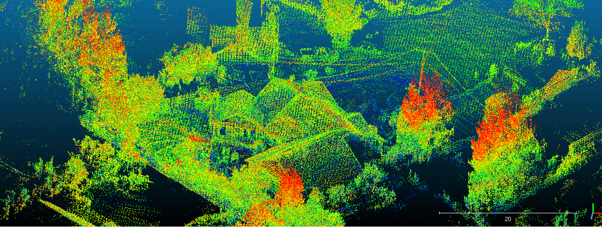
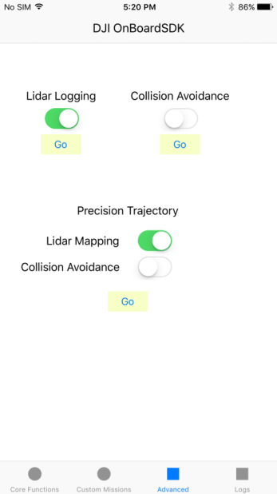
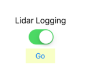
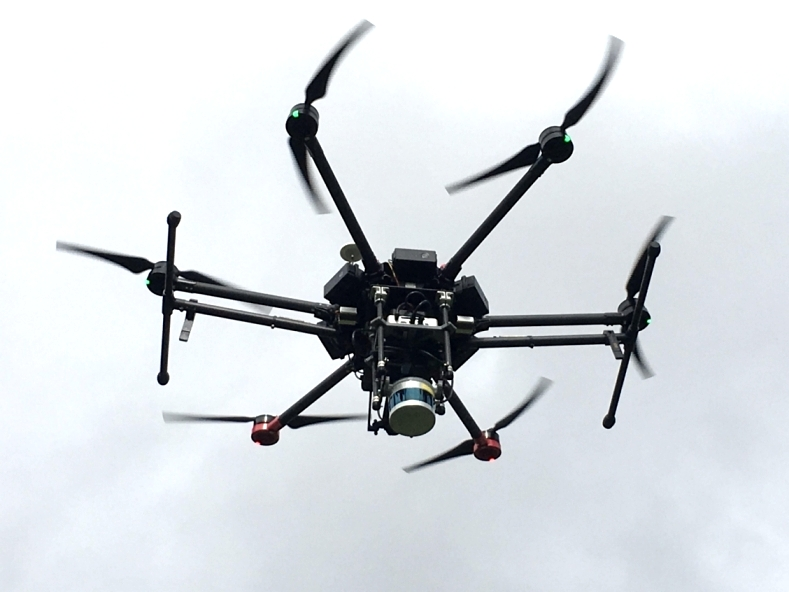

## Introduction

The LiDAR Mapping package of the Onboard SDK enables users to build a 3-D map of the environment by making use of the pre-existing open source [LOAM package](http://wiki.ros.org/loam_velodyne)
and the [Velodyne PUCK Lite](http://velodynelidar.com/vlp-16-lite.html) LiDAR sensor. The [LOAM package](http://wiki.ros.org/loam_velodyne) makes use of a scan matching algorithm to 
build the map. We make use of the LOAM package without IMU sensor data. 
 
In addition to this, a **pointcloud2las** library has been developed to enable users to generate maps in an industry standard **LAS** file format. 
 
Mapping can be enabled as a part of a Precision Trajectory mission or can be run independently. The [Mobile OnboardSDK iOS app](https://github.com/dji-sdk/Mobile-OSDK-iOS-App) enables users to start or stop Mapping via Precision Trajectory or independently.
  
We are excited to see the different ways the LiDAR Mapping package will be put to use by our users! 


*Aerial Map generated with DJI Matrice 600, Velodyne PUCK Lite running LOAM package and pointcloud2las library.* 

### Features

* 3-D mapping integrated as a part of the Precision Trajectory library automatically starts mapping at the start of the spiral and stops mapping
at the end of the spiral by enabling this feature in the mobile app. 
* 3-D mapping can be started and stopped independently during manual fly with the press of a button through the MOS mobile app.
* Automatically logs data in LAS file format by initializing the pointcloud_las library. 
* Can be used in conjunction with [Collision avoidance].
* Tested with the DJI Matrice 600. 

### Limitations

* Maps generated are not georeferenced. 
* Large angular velocity or linear acceleration may result in scan registration failures and map distortions. 
* Lack of rich features in the environemnt being scanned may also result in scan registration failures and map distortions.
* For additional limitations of the LOAM Mapping algorithm, please refer to the [LOAM project](https://github.com/laboshinl/loam_velodyne). 

## Software setup

### LiDAR Mapping enabled from Precision Missions
 
 In order to use the LiDAR Mapping package with Precision Missions:
 
  1. Download the source code for the [LOAM package](https://github.com/laboshinl/loam_velodyne) and the [Velodyne package](https://github.com/dji-sdk/velodyne.git)
  
  2. Source the packages using the `--extend` option. 
  
  3. After downloading the [DJI OnboardSDK package](https://github.com/dji-sdk/Onboard-SDK.git), the Linux sample must be compiled with the options
     ```
      -DUSE_PRECISION_MISSIONS=ON -DUSE_POINTCLOUD2LAS=ON
     ```
  4. Source the pointcloud2las setup.bash file
    
     ```
     source build/bin/dji-ros-pointcloud2las/setup.bash --extend
     ```
  5. Lidar Mapping can be enabled in Precision Missions using the tab below in the OSDK-Mobile iOS app.     
   
    
   
   ### LiDAR Mapping enabled Manually
   
 You can run the LiDAR Mapping package manually via the **OnboardSDK-Linux** sample or the **OnboardSDK-ROS** package. 
   
  **Running LiDAR Mapping via OnboardSDK-Linux**
  
  1. LiDAR Mapping can be manually started by first following steps 1, 2,3 and 4 under **LiDAR Mapping enabled from Precision Missions**. 
  
  2. Use the button below in the MOS app to enable and disable LiDAR mapping. 
  
   
   
  **Running LiDAR Mapping via OnboardSDK-ROS**
  
  1. Download the source code for the [LOAM package](https://github.com/laboshinl/loam_velodyne) and the [Velodyne package](https://github.com/dji-sdk/velodyne.git)
  
  2. Download and build the [OnboardSDK-ROS package](https://github.com/dji-sdk/Onboard-SDK-ROS.git)
  
  3. **catkin_make** using the option 
     ```
     -DUSE_POINTCLOUD2LAS=ON
     ```
  4. Source pointcloud2las setup.bash file 
      ```
      source catkin_ws/dji-ros-pointcloud2las/setup.bash --extend
      ```
  5. Use the button below in the OSDK-Mobile iOS app to enable and disable LiDAR mapping. 
        
    
    
  ## Hardware setup
  
 Our hardware is powered by an [x86 system](https://zareason.com/shop/Zini-1660.html), 
  and a [Velodyne PUCK Lite](http://velodynelidar.com/vlp-16-lite.html). We make use of a custom designed mounting system for the Matrice 600.   
     
  
   &nbsp;&nbsp;&nbsp;&nbsp;&nbsp;&nbsp;&nbsp;&nbsp;&nbsp;*The figure shows the setup in-flight.* 
  
  ***If you have interest in acquiring a ready-to-fly customized Lidar mapping solution, please [contact us](http://enterprise.dji.com/contact-us).***


  
      
     
    
    
 
  
    


 
