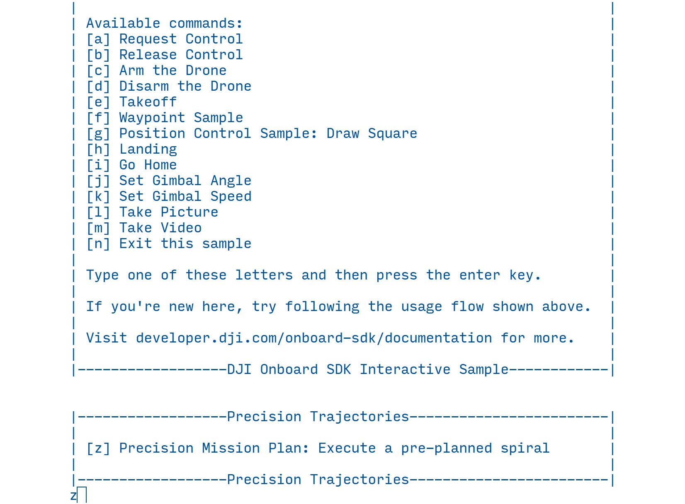
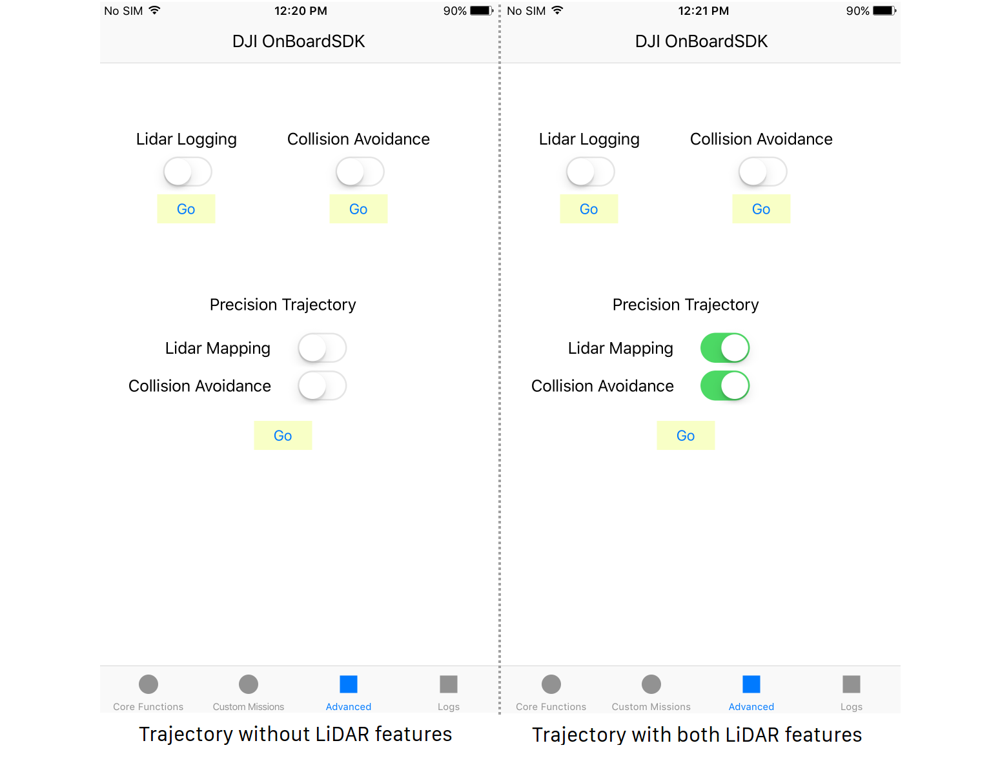
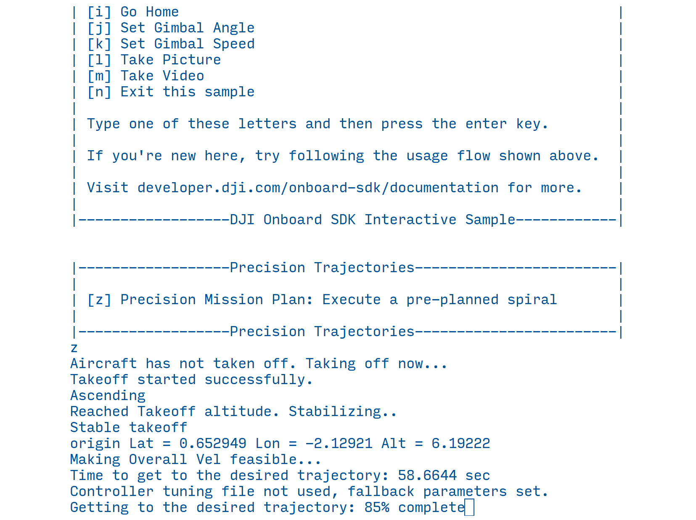

## Introduction

With the Onboard SDK Precision Missions suite, DJI developers can now fly complex, precise missions with intriguing shapes such as spirals tailor-made for infrastructure inspection, residential surveying and construction monitoring.   

For inspection applications like powerlines, towers and buildings, the ability to visualize and plan a smooth, precise trajectory that fully covers the points of interest on your structure can be the difference between actionable data and merely beautiful footage.

Release 3.2 of the Onboard SDK provides an improved, more robust version (v1.0.2) of this library that now supports plug-and-play LiDAR integration for collision avoidance and mapping.

### Features

* Trajectory following library that can autonomously execute preplanned smooth spiral trajectories
* SketchUp plugin to visualize trajectories, import 3D CAD models and geolocate the scene
* Configurable speed, start/end radii and pitch for the spiral
* Configurable GPS location for the spiral - plan one spiral for multiple similar structures 
* Start your drone from anywhere - real-time path planning to get to the trajectory's GPS location 
* Integration with DJI Assistant 2 to visualize simulations of the drone following the trajectory in the SketchUp scene
* **New for OSDK 3.2**: Progress bar for the trajectory
* **New for OSDK 3.2**: Full M600 support, and custom vehicle configuration support - tune the controller gains for your aircraft with our JSON interface.
* **New for OSDK 3.2**: If you have LiDAR on your system, simply check a box on the MOS app to enable 360&deg; FOV collision avoidance, pause and real-time replanning for the mission!
* **New for OSDK 3.2**: If you have LiDAR on your system, simply check a box on the MOS app to enable 3D Mapping of the infrastructure under inspection!

## Software Setup

Starting with OSDK 3.2.0, Precision Missions is offered as a standalone component that lives in its own repo; this adds flexibility for users who may or may not choose to use this feature. You do not need to download it separately - follow step 1 below.  

1. Follow the out-of-source build steps in the Linux sample, passing `-DUSE_PRECISION_MISSIONS=ON` at the command line to get CMake to link the sample against the library. No additional configuration is required.
2. Run the executable with `-interactive` or `-mobile` as the first argument. Read through the next few steps for available options, and see [example usage](#real-world-usage-examples).
3. For the trajectory following function, you need to supply a second argument, which is the path to a json file containing trajectory parameters. This path is relative to the location from where you are running the program. By default, the CMake scripts will download the example spiral JSON to
    ```
    Onboard-SDK/build/PrecisionMissions-prefix/src/PrecisionMissions/precision-missions-1.0.2/data/params/spiral.json
    ```
   
   If using the simulator, you need to start the simulation *before* you start the Linux sample; make sure the GPS location in simulation is close to the co-ordinates in your JSON.
   
4. You can generate this json file using the SketchUp plugin as described in the next section.
5. **New for OSDK 3.2**: You can optionally supply a JSON file that contains position controller gains. Use this if your weight distribution and propulsion setup differs dramatically from the provided pre-tuned gain files (M100, M600, M600 + Velodyne Puck LITE + 500gm x86 Computer). 

    To use this feature, simply pass in the filepath to your JSON file as a third command-line argument. Example files are provided in 
    ```
    Onboard-SDK/build/PrecisionMissions-prefix/src/PrecisionMissions/precision-missions-1.0.2/data/tuning
    ```
   **Use this feature with *extreme* caution**; incorrect gains can crash your aircraft. Do not deviate much from the provided gains as far as possible. If you do not supply a file, M600 gains will automatically be applied to A3/N3-based systems and M100 gains will be applied for M100 systems.
      
#### Real-world Usage Examples

These use cases show a few of the many combinations of build/run you can do as per your needs.

1. Compile with precision trajectories
   <pre>
   <b>user@user-pc:~/Onboard-SDK/build$</b> cmake .. -DUSE_PRECISION_MISSIONS=ON
   <b>user@user-pc:~/Onboard-SDK/build$</b> make djiosdk-linux-sample
   </pre>

1. Compile with precision trajectories, LiDAR Mapping (See [here](../lidarmapping/lidar-mapping.html#lidar-mapping-enabled-from-precision-missions) for more steps you need to do to make it work) and Collision Avoidance ((See [here](../collision-avoidance/collision-avoidance.html#collision-avoidance-with-precision-missions)  for more steps you need to do to make it work)
   <pre>
   <b>user@user-pc:~/Onboard-SDK/build$</b> cmake .. -DUSE_PRECISION_MISSIONS=ON -DUSE_POINTCLOUD2LAS=ON -DUSE_COLLISION_AVOIDANCE=ON
   <b>user@user-pc:~/Onboard-SDK/build$</b> make djiosdk-linux-sample
   </pre>
    
2. Run the example spiral
   <pre>
   <b>user@user-pc:~/Onboard-SDK/build$</b> cd bin
   <b>user@user-pc:~/Onboard-SDK/build/bin$</b> ./djiosdk-linux-sample 
                                         -interactive 
                                         ../PrecisionMissions-prefix/src/PrecisionMissions/precision-missions-1.0.2/data/params/spiral.json
   </pre>
3. Run the example spiral with M600/Velodyne gains
   <pre>
   <b>user@user-pc:~/Onboard-SDK/build$</b> cd bin
   <b>user@user-pc:~/Onboard-SDK/build/bin$</b> ./djiosdk-linux-sample 
                                         -interactive 
                                         ../PrecisionMissions-prefix/src/PrecisionMissions/precision-missions-1.0.2/data/params/spiral.json 
                                         ../PrecisionMissions-prefix/src/PrecisionMissions/precision-missions-1.0.2/data/tuning/M600_LiDAR_tuning.json
       
   </pre>

## Workflow

The workflow for using this suite consists of two parts - planning a mission using the DJI Trajectory SketchUp plugin, and supplying the planned mission to the library for execution.

#### 1. Planning a Mission

* Head to the documentation on the [DJI Trajectory SketchUp Plugin](./sketchup.html) to learn how to plan a mission.
* Once you have satisfactorily geolocated and planned a spiral mission, export the json file with the encoded parameters.
* Copy the json to your OES.

#### 2. Simulate the Mission 

* Supply the json you exported above as an argument to the synchronous Linux sample and run the trajectory in simulation. 
* You can view the drone simulation as part of SketchUp too - Make sure Assistant 2 is running on the same machine as SketchUp. Using the plugin's `Simulator Connect` feature, you can match up the simulation to the planned trajectory. 
* In simulation, set up the drone's home position close to the planned trajectory - as you would in real life.
* To run the sample interactively, you can press `[z]` to run the trajectory following for the json supplied at command line. It is recommended to execute a takeoff command prior to executing a mission. If the aircraft is not in the air, it will takeoff now. 

* To run it on mobile, you can go to the new `Advanced` tab and choose what components you want enabled in the lower part of the screen. It is recommended to execute a takeoff command prior to executing a mission. If the aircraft is not in the air, it will takeoff now.
 

* To integrate this functionality into your own code, take a look at the includes and the linking in the `CMakeLists.txt` in the `sample/Linux/Blocking` directory as well as the `osdk-wrapper` directory.  
    The calls you will need to make can be seen in the `LinuxInteractive.cpp` or the `LinuxMobile.cpp` files; these include initialization of various variables at the start of the sample and a few function calls inside of the interactive/mobile spin.

  On running the trajectory follower, you should see feedback about the library's current state/intent:
  

   You will also see the percentage progress indicator on the last line as the aircraft traverses the trajectory.

#### 3. Fly the mission

* The simulation should give you an idea of the ramp-up curve the drone will execute to reach the spiral, depending on where the take-off point is. Plan to leave that space, and the space around it, empty during your real flight
* You are ready to fly your mission! Take a look at the warnings, caveats and known behavior before you fly outdoors.

## Description of Functionality

* This library uses advanced vehicle control algorithms in local NED-frame coordinates. 
* The parameters of the trajectories are inspected for feasibility. If found to be infeasible, the library suggests a velocity that will make the trajectory feasible. Based on feedback from the beta, we have set maximum spiral velocity at 3m/s and maximum entry curve velocity at 5m/s.
* The library also plans an entry trajectory from where the drone is currently located to the start location of the spiral in real-time. This allows you to start the drone at any location close to the spiral.
* You can optionally have the drone take pictures at predefined intervals of time. 
* You can also optionally have the drone record video from the start of the spiral to the end. 
* With OSDK 3.2, you can have the drone enable LiDAR collision avoidance for the full mission. Collision avoidance will cause the trajectory to pause when a collision is detected in the path of the trajectory, and a new path to re-join the trajectory will be computed once the obstacle is removed.
* With OSDK 3.2, you can also have the drone create a 3D LiDAR map from the start of the spiral to the end.

#### Warnings and Caveats

* **Leave plenty of open space in all directions in the area between your current location and the planned spiral.** The entry trajectory is planned in real time to provide the smoothest entry into the trajectory such that the entire spiral is executed at constant velocity. This means the entry curve might go wider that you expect in the area leading up to the spiral. The farther you are from the planned spiral, the wider the entry curve - this is to ensure a smooth 'slingshot' maneuver to enter the spiral. This behavior might change in an upcoming release. 
* **Use the gain tuning with caution - in particular, do NOT modify the *thrust scaling* for M100/M600 based setups.** The operator must assume sole responsibility for the safe operation of the vehicle.
* **Collision Avoidance with Precision Missions is in beta**. See the [limitations](../collision-avoidance/collision-avoidance.html) of the collision avoidance features for more. The operator must assume sole responsibility for the safe operation of the vehicle.

#### Some Notes on Behavior

* The drone will not execute missions that start below 2m AGL. If you request a lower height, it will automatically change it to 2m.
* MSL altitude is not supported through the mission planning interface and has not been adequately tested. The suite is designed to prefer MSL heights over AGL heights, which will be enabled once we add MSL heights to the planning software; we ask that you do not change the MSL value (-9999) in the json file and instead only plan missions using height above takeoff point.
* Staying within the velocity limits might still lead to infeasible trajectories depending on how far away the spiral is from the current location. Tweak the spiral velocity and radii to make it feasible.
* The start angle parameter does not rotate the spiral to the desired angle; it merely enters the first loop of a 0&deg; spiral at the position corresponding to the specified start angle.
* Always, if there are any suspicions that the drone might crash, switch out of F mode ([P mode for A3 FW > 1.5.0.0, N3](../../appendix/releaseNotes.html#Notes-for-using-Onboard-SDK-with-the-new-a3-v1-5-0-0-fw)) and the drone will stop following.

### Safety Cases Handled

* If the requested z-trajectory goes below 0.5m at any point in the ramp-up, the drone will stop executing the trajectory.
* If the actual drone z-position goes below 0.5m at any point in the ramp-up, the drone will stop executing the trajectory.
* If the commanded attitude is greater than 50&deg; in roll/pitch, the drone will stop executing the trajectory
* If the commanded attitude is greater than 35&deg; in roll/pitch for an extended period of time, the drone will stop executing the trajectory.


*If you have interest in acquiring a ready-to-fly customized Precision Missions solution, please [contact us](http://enterprise.dji.com/contact-us).*
