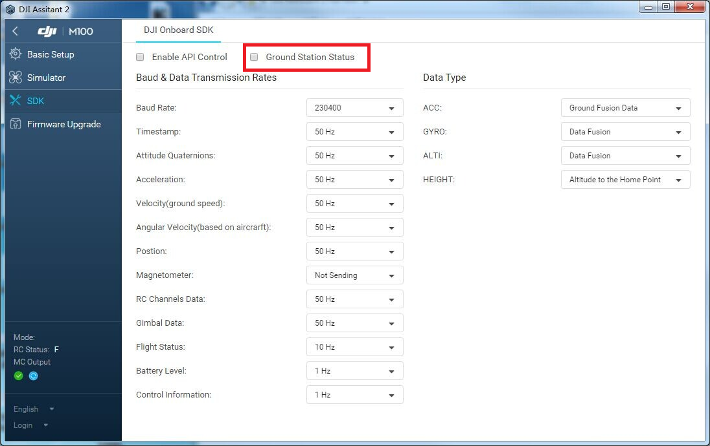

This part is about Groundstation related functions(Waypoint, Hotpoint and Follow Me), which has been introduced briefly in the [OPEN Protocol](../introduction/index.html#CMD-Set-0x03-Ground-Station-CMD-Set).

For the detailed function logic, please refer to the [Ground Station Programming Guide](../application-development-guides/ground-station-programming-guide.html).

## Command Set and Command Id

<table>
    <tr>
        <th>CMD Set</th>
        <th>CMD Group</th>
        <th>CMD ID</th>
        <th>Description</th>
    </tr>
    <tr>
        <td rowspan="20">0x03</td>
        <td rowspan="8">Waypoint</td>
        <td>0x10</td>
        <td>upload waypoint mission settings</td>
    </tr>
    <tr>
        <td>0x11</td>
        <td>upload waypoint data</td>
    </tr>
    <tr>
        <td>0x12</td>
        <td>start/stop waypoint mission</td>
    </tr>
    <tr>
        <td>0x13</td>
        <td>pause/resume waypoint mission</td>
    </tr>
    <tr>
        <td>0x14</td>
        <td>read waypoint init status (available in upcoming 3.2 release)</td>
    </tr>
    <tr>
        <td>0x15</td>
        <td>read single waypoint status (available in upcoming 3.2 release)</td>
    </tr>
    <tr>
        <td>0x16</td>
        <td>set waypoint mission idle velocity</td>
    </tr>
    <tr>
        <td>0x17</td>
        <td>get waypoint mission idle velocity</td>
    </tr>
    <tr>
        <td rowspan="8">Hotpoint</td>
        <td>0x20 </td>
        <td>upload hotpoint data and start the mission</td>
    </tr>
    <tr>
        <td>0x21</td>
        <td>stop hotpoint mission</td>
    </tr>
    <tr>
        <td>0x22</td>
        <td>pause/resume hotpoint mission</td>
    </tr>
    <tr>
        <td>0x23</td>
        <td>set hotpoint mission idle velocity</td>
    </tr>
    <tr>
        <td>0x24</td>
        <td>set hotpoint mission radius</td>
    </tr>
    <tr>
        <td>0x25</td>
        <td>reset yaw of hotpoint mission</td>
    </tr>
    <tr>
        <td>0x26</td>
        <td>read hotpoint info from flight controller</td>
    </tr>
    <tr>
        <td>0x27</td>
        <td>enable auto-radius mode (not available)</td>
    </tr>
    <tr>
        <td rowspan="4">Follow me</td>
        <td>0x30</td>
        <td>upload follow me data and start the mission</td>
    </tr>
    <tr>
        <td>0x31</td>
        <td>stop follow me mission</td>
    </tr>
    <tr>
        <td>0x32</td>
        <td>pause/resume follow me mission</td>
    </tr>
    <tr>
        <td>0x33</td>
        <td>update target position</td>
    </tr>
    <tr>
        <td>0x02</td>
        <td>Mission Status Push Info</td>
        <td>0x03</td>
        <td>current mission status</td>
    </tr>
    <tr>
        <td>0x02</td>
        <td>Waypoint Mission Event Push Info</td>
        <td>0x04</td>
        <td>mission event</td>
    </tr>
</table>


## Data Structure

**Note:** All reserved bytes in ground station structs should be set as 0, otherwise your commands may fail.

---

### 0x03, 0x10: Upload Waypoint Mission Settings

Request:

```c
typedef struct {

    uint8_t indexNumber;    //Total number of waypoints
    float32_t maxVelocity;  //Maximum speed joystick input(2~15m)
    float32_t idleVelocity; //Cruising Speed (without joystick input, no more than vel_cmd_range)
    uint8_t finishAction;   //Action on finish
                            //0: no action
                            //1: return to home
                            //2: auto landing
                            //3: return to point 0
                            //4: infinite mode， no exit
    uint8_t executiveTimes;//Function execution times
                            //1: once
                            //2: twice
    uint8_t yawMode;        //Yaw mode
                            //0: auto mode(point to next waypoint)
                            //1: lock as an initial value
                            //2: controlled by RC
                            //3: use waypoint's yaw(tgt_yaw)
    uint8_t traceMode;      //Trace mode
                            //0: point to point, after reaching the target waypoint hover, complete waypoints 
                            //action (if any), then fly to the next waypoint
                            //1: Coordinated turn mode, smooth transition between waypoints, no waypoints task
    uint8_t RCLostAction;   //Action on rc lost
                            //0: exit waypoint and failsafe
                            //1: continue the waypoint
    uint8_t gimbalPitch;    //Gimbal pitch mode
                            //0: free mode, no control on gimbal
                            //1: auto mode, Smooth transition between waypoints
    float64_t latitude;     //Focus latitude (radian)
    float64_t longtitude;   //Focus longitude (radian)
    float32_t altitude;     //Focus altitude (relative takeoff point height)
    uint8_t reserved[16];   //Reserved, must be set to 0
    
} WayPointInitData;
```

ACK: `uint8_t`

**Note:** The ACK of task upload is always 0. Developers should check the task parameter by themselves, otherwise error code 0xEA will appear when trying to upload waypoints' data.

### 0x03, 0x11: Upload Waypoint Data

Request:

```c
typedef struct {

    uint8_t index;                //Index to be uploaded
    float64_t latitude;           //Latitude (radian)
    float64_t longitude;          //Longitude (radian)
    float32_t altitude;           //Altitude (relative altitude from takeoff point)
    float32_t damping;            //Bend length (effective coordinated turn mode only)
    int16_t yaw;                  //Yaw (degree)
    int16_t gimbalPitch;          //Gimbal pitch
    uint8_t turnMode;             //Turn mode
                                  //0: clockwise
                                  //1: counter-clockwise
    uint8_t reserved[8];          //Reserved
    uint8_t hasAction;            //Action flag
                                  //0: no action
                                  //1: has action
    uint16_t actionTimeLimit;     //Action time limit
    uint8_t actionNumber : 4;     //Total number of actions
    uint8_t actionReapeat : 4;    //Total running times
    uint8_t commandList[16];      //Command list
    uint16_t commandParameter[16];//Command parameters

} WayPointData;
```

ACK:

```c
typedef struct{

    uint8_t ack;
    uint8_t index;
    WayPointData data;

} WayPointDataACK;
```

There are totally six kinds of actions as follows, which should be set in `commandList`.


|Commands|Commands value|Command param|Description|
|----|------|--------|----|
|WP_ACTION_STAY|0|Hover time unit: **milli**second|Just hover|
|WP_ACTION_SIMPLE_SHOT|1|N/A|Take a photo|
|WP_ACTION_VIDEO_START|2|N/A|Start record|
|WP_ACTION_VIDEO_STOP|3|N/A|Stop record|
|WP_ACTION_CRAFT_YAW|4|YAW (-180~180)|Adjust the aircraft toward|
|WP_ACTION_GIMBAL_PITCH|5|PITCH|Adjust gimbal pitch 0: head -90: look down|

**Note:** The controller will valid all waypoints' data together after the last one uploaded, which means if there exist at least one invalid waypoint information, the waypoint upload ACK of the last one will be with a error code. 

### 0x03, 0x12: Start/Stop Waypoint Mission

Request:

```c
uint8_t start;//0-> start, 1-> cancel
```

ACK: `uint8_t`

### 0x03, 0x13: Pause/Resume Waypoint Mission

Request:

```c
uint8_t pause;//0-> pause, 1-> resume
```

ACK: `uint8_t`


### 0x03, 0x14: Read Waypoint Init Status (Available in upcoming 3.2 Release)

Request:

`uint8_t` with arbitrary value.

ACK:

```c
typedef struct{

    uint8_t ack;
    WayPointInitData data;

} WayPointInitACK;
```

### 0x03, 0x15: Read Single Waypoint Status (Available in upcoming 3.2 Release)

Request:

```c
uint8_t index;
```

ACK:

```c
typedef struct{

    uint8_t ack;
    uint8_t index;
    WayPointData data;

} WayPointDataACK;
```

### 0x03, 0x16: Set Idle Velocity

Request:

```c
float32_t idleVeloctity;
```

ACK:

```c
typedef struct{

    uint8_t ack;
    float32_t idleVelocity;

} WayPointVelocityACK;
```

### 0x03, 0x17: Get Idle Velocity

Request:

`uint8_t` with arbitrary value

ACK:

```c
typedef struct{

    uint8_t ack;
    float32_t idleVelocity;

} WayPointVelocityACK;

```


### 0x03, 0x20: Upload And Start Hotpoint Mission

Request:

```c
typedef struct{

    uint8_t version;     //Reserved, kept as 0
    float64_t latitude;  //Latitude (radian)
    float64_t longitude; //Longitude (radian)
    float64_t altitude;  //Altitude (relative altitude from takeoff point
    float64_t radius;    //Radius (5m~500m)
    float32_t yawRate;   //Angle rate (0~30°/s)
    uint8_t clockwise;   // 0->fly in counter-clockwise direction, 1->clockwise direction
    uint8_t startPoint;  //Start point position
                         //0: north to the hot point
                         //1: south to the hot point
                         //2: west to the hot point
                         //3: east to the hot point
                         //4: from current position to nearest point on the hot point
    uint8_t yawMode;     //Yaw mode
                         //0: point to velocity direction
                         //1: face inside
                         //2: face ouside
                         //3: controlled by RC
                         //4: same as the starting yaw
    uint8_t reserved[11];//Reserved

} HotPointData;
```

ACK:

```c
typedef struct{

    uint8_t ack;
    float32_t maxRadius;

} HotPointStartACK;
```

### 0x03, 0x21: Stop Hotpoint Mission

Request:

`uint8_t` with arbitrary value

ACK: `uint8_t`

### 0x03, 0x22: Pause Hotpoint Mission

Request:

```c
uint8_t pause; //0->pause, 1->resume
```

ACK: `uint8_t`

### 0x03, 0x23: Set Hotpoint Idle Velocity


```c
typedef struct{

   uint8_t clockwise;
   float32_t yawRate;

} YawRate;
```

ACK: `uint8_t`

### 0x03, 0x24: Set Hotpoint Radius

Request:

```c
float32_t radius;
```

ACK: `uint8_t`

### 0x03, 0x25: Reset Hotpoint Yaw

Requset:

`uint8_t` with arbitrary value

ACK: `uint8_t`

### 0x03, 0x26: Read Hotpoint Task Info From Flight Controller

Request:

`uint8_t` with arbitrary value

ACK:

```c
typedef struct{

    uint8_t ack;
    HotPointData data;

} HotPointReadACK;
```

### 0x03, 0x27：Enable Auto-Radius Mode

Request:

```c
struct hotpoint_auto_radius {
    uint8_t on_off; //1->enable, 0->disable
    int8_t rate;//radius change rate
};
```

ACK: `uint8_t`

### 0x03, 0x30: Upload And Start Follow Me Mission

Request:

```c
typedef struct{

    uint8_t mode;       //Follow mode(reserved), set as 0
    uint8_t yaw;        //Yaw mode
                        //1: point to target
                        //0: controlled by RC
    TargetData target;  //Target
    uint8_t sensitivity;//reserved, set as 0

} FollowData;
```

```c
typedef struct TargetData{

    float64_t latitude; //Initial position latitude (radian)
    float64_t longitude;//Initial position longitude (radian)
    uint16_t height;    //Initial position altitude
    uint16_t angle;     //Reserved

} TargetData;
```

ACK: `uint8_t`

### 0x03, 0x31: Stop Follow Me Mission

Request:

`uint8_t` with arbitrary value

ACK: `uint8_t`

### 0x03, 0x32: Pause/Resume Follow Me Mission

Request:

```c
uint8_t pause; //0->pause, 1->resume
```

ACK: `uint8_t`

### 0x03, 0x33: Update Target Position

Request:
 
```c
typedef struct TargetData{

    float64_t latitude; //Initial position latitude (radian)
    float64_t longitude;//Initial position longitude (radian)
    uint16_t height;    //Initial position altitude
    uint16_t angle;     //Reserved

} TargetData;
```

NO ACK

---

The following CMD SET/ID are not API but broadcast data protocol, by which developers can check the current mission status and events like how flight data works.

Note: Developers should select the `Ground Station Status` checkbox in DJI Assistant.



### 0x02, 0x03 Current Mission Status Push Information 

There are four kinds of mission status with the same struct size.

Developers can separate them by their first bytes, i.e. `mission_type`.

The 'mission_type' is defined with the following enum.

~~~c
typedef enum
{
    NAVI_MODE_ATTI,
    NAVI_MISSION_WAYPOINT,
    NAVI_MISSION_HOTPOINT,
    NAVI_MISSION_FOLLOWME,
    NAVI_MISSION_IOC,
}navi_type;
~~~

waypoint mission push information

```c
typedef struct{
    uint8_t mission_type; //mission type, should be NAVI_MISSION_WAYPOINT
    uint8_t target_waypoint; //current target waypoint index
    uint8_t current_status;//current status
    uint8_t error_notification;//error notification
    uint16_t reserved;//reserved

} cmd_mission_waypoint_status_push_t;
```

hotpoint mission push information

```c
typedef struct{
    uint8_t mission_type;// mission type, should be NAVI_MISSION_HOTPOINT
    uint8_t mission_status;//mission status
                        //0:init
                        //1:running
                        //2:paused
    uint16_t hp_exec_radius; //distance to the hotpoint: cm
    uint8_t reason;
    uint8_t hp_exec_vel;//angular velocity in ground frame, degree * 10
} cmd_mission_hotpoint_status_push_t;
```

follow me mission push information

```c
typedef struct{
    uint8_t mission_type;// mission type, should be NAVI_MISSION_FOLLOWM
    uint8_t reserved_1;
    uint16_t reserved_2;
    uint16_t reserved_3;
}cmd_mission_folowme_status_push_t;
```

the other two status(NAVI_MODE_ATTI & NAVI_MISSION_IOC)

```c
typedef struct{
    uint8_t mission_type;
    uint8_t last_mission_type;
    uint8_t is_broken :1;
    uint8_t reserved_1 :7;
    uint8_t reason;
    uint8_t reserved_2;
    uint8_t reserved_3;
}cmd_mission_default_status_push_t;
```

### 0x02, 0x04 Mission Event Push Information

There are three kinds of waypoint mission events with the same struct size.

Developers can separate them by their first bytes, i.e. `incident_type`.

The 'incident_type' is defined with the following enum.

~~~c
typedef enum
{
    NAVI_UPLOAD_FINISH,
    NAVI_MISSION_FINISH;
    NAVI_MISSION_WP_REACH_POINT,
}incident_type;
~~~

waypoint mission upload event push information

```c
typedef struct{
    uint8_t incident_type;
    uint8_t is_mission_valid;
    uint16_t estimated_run_time;
    uint16_t reserved;
}cmd_mission_wp_upload_incident_t;
```

waypoint mission finish event push information

```c
typedef struct{
    uint8_t incident_type;
    uint8_t repeat;
    uint16_t reserved_1;
    uint16_t reserved_2;
}cmd_mission_wp_finish_incident_t;
```

waypoint reached event push information

```c
typedef struct{
    uint8_t incident_type;
    uint8_t waypoint_index;
    uint8_t current_status;
    uint8_t reserved_1;
    uint8_t reserved_2;
}cmd_mission_wp_reached_incident_t;
```

## ACK Code
<table>
    <tr>
        <th colspan="4">Common ACK</th>
    </tr>
    <tr>
        <td>0x00</td>
        <td>Success</td>
        <td>0xD0</td>
        <td>mode bar not in F</td>
    </tr>
    <tr>
        <td>0xD1</td>
        <td>not in Navi Mode</td>
        <td>0xD2</td>
        <td>IOC enabled</td>
    </tr>
    <tr>
        <td>0xD3</td>
        <td>mission not init</td>
        <td>0xD4</td>
        <td>mission not running</td>
    </tr>
    <tr>
        <td>0xD5</td>
        <td>mission running</td>
        <td>0xD6</td>
        <td>flight duration not satisfied</td>
    </tr>
    <tr>
        <td>0xD7</td>
        <td>mission with higher priority is running</td>
        <td>0xD8</td>
        <td>GPS health not satisfied</td>
    </tr>
    <tr>
        <td>0xD9</td>
        <td>low battery</td>
        <td>0xDA</td>
        <td>drone not in air when init</td>
    </tr>
    <tr>
        <td>0xDB</td>
        <td>invalid mission parameter</td>
        <td>0xDC</td>
        <td>execution condition not satisfied</td>
    </tr>
    <tr>
        <td>0xDD</td>
        <td>mission will fly through no-fly zone</td>
        <td>0xDE</td>
        <td>HOME point not recorded</td>
    </tr>
    <tr>
        <td>0xDF</td>
        <td>drone in no-fly zone</td>
        <td>0xC0</td>
        <td>altitude higher than max</td>
    </tr>
    <tr>
        <td>0xC1</td>
        <td>altitude lower than min</td>
        <td>0xC7</td>
        <td>too far</td>
    </tr>
    <tr>
        <td>0xC8</td>
        <td>drone does not support groundstation functions</td>
        <td>0xC9</td>
        <td>too far from the hotpoint/first waypoint</td>
    </tr>
    <tr>
        <td>0xCA</td>
        <td>drone in beginner mode</td>
        <td>0xF0</td>
        <td>drone is taking off</td>
    </tr>
    <tr>
        <td>0xF1</td>
        <td>drone is landing</td>
        <td>0xF2</td>
        <td>drone is coming back to home</td>
    </tr>
    <tr>
        <td>0xF3</td>
        <td>drone is arming</td>
        <td>0xF4</td>
        <td>invalid command</td>
    </tr>
    <tr>
        <td>0xFF</td>
        <td>unknown command/td>
    </tr>
    <tr>
        <th colspan="4">Follow me ACK</th>
    </tr>
    <tr>
        <td>0xB0</td>
        <td>drone too far from mobile</td>
        <td>0xB1</td>
        <td>disconnect time too long</td>
    </tr>
    <tr>
        <td>0xB2</td>
        <td>gimbal pitch too large</td>
    </tr>
    <tr>
        <th colspan="4">Hotpoint ACK</th>
    </tr>
    <tr>
        <td>0xC2</td>
        <td>invalid radius</td>
        <td>0xC3</td>
        <td>velocity too large</td>
    </tr>
    <tr>
        <td>0xC4</td>
        <td>invalid start point</td>
        <td>0xC5</td>
        <td>invalid yaw mode</td>
    </tr>
    <tr>
        <td>0xC6</td>
        <td>too far to go back to route</td>
        <td>0xA2</td>
        <td>invalid float number</td>
    </tr>
    <tr>
        <td>0xA3</td>
        <td>invalid latitude/longitude</td>
        <td>0xA6</td>
        <td>invalid direction</td>
    </tr>
    <tr>
        <td>0xA9</td>
        <td>hotpoint already paused</td>
        <td>0xAA</td>
        <td>hotpoint not paused</td>
    </tr>
    <tr>
        <th colspan="4">Waypoint ACK</th>
    </tr>
    <tr>
        <td>0xE0</td>
        <td>invalid mission data</td>
        <td>0xE1</td>
        <td>invalid waypoint data</td>
    </tr>
    <tr>
        <td>0xE2</td>
        <td>planned route too long</td>
        <td>0xE3</td>
        <td>flight route too long</td>
    </tr>
    <tr>
        <td>0xE4</td>
        <td>index larger than max number</td>
        <td>0xE5</td>
        <td>neighboring waypoints too close</td>
    </tr>
    <tr>
        <td>0xE6</td>
        <td>neighboring waypoints too far</td>
        <td>0xE7</td>
        <td>damping checking failed</td>
    </tr>
    <tr>
        <td>0xE8</td>
        <td>invalid action parameter</td>
        <td>0xE9</td>
        <td>waypoint upload not finished</td>
    </tr>
    <tr>
        <td>0xEA</td>
        <td>waypoint task not uploaded</td>
        <td>0xEB</td>
        <td>not all waypoint uploaded</td>
    </tr>
    <tr>
        <td>0xEC</td>
        <td>request is running</td>
        <td>0xED</td>
        <td>cannot pause because not running</td>
    </tr>
    <tr>
        <th colspan="4">IOC ACK</th>
    </tr>
    <tr>
        <td>0xA0</td>
        <td>too close to HOME point</td>
        <td>0xA1</td>
        <td>IOC type error</td>
    </tr>
    
</table>
