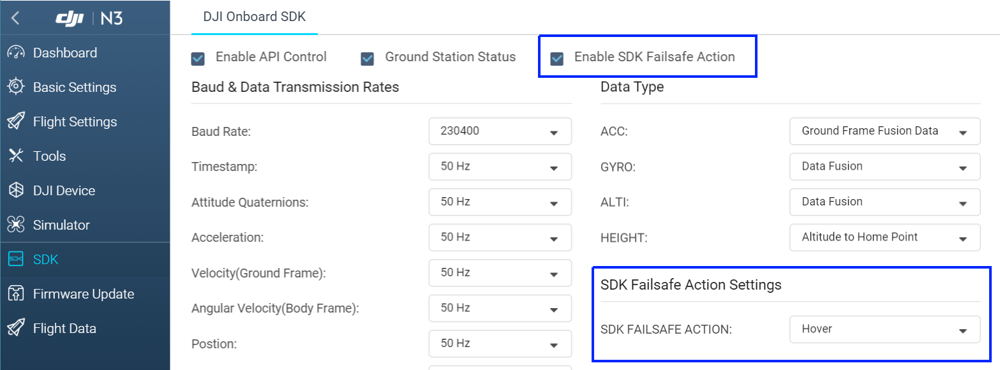

> **说明：** 本系列文档介绍OSDK V4.0.0 的功能，以及使用OSDK V4.0.0 开发应用程序的步骤和方法，若您仍使用OSDK V3.9.0 开发应用程序，请下载[OSDK V3.9.0]() 的文档。

使用OSDK 开发应用程序前，请认真阅读本文档中的内容，更新无人机和遥控器的硬件版本，开启OSDK 控制权限，了解DJI 无人机的控制权限。  

## 固件升级
使用OSDK 开发应用程序时，需先使用**DJI Assistant2** 升级无人机的固件，有关固件版本的详细说明，请参见[版本声明](../appendix/firmware.html)。

## 启用OSDK 控制功能
为使基于OSDK 开发的程序能够与飞行平台间正常通信，请在DJI Assistant2 中启用OSDK API 控制功能，如 图1.开启OSDK 控制功能 所示。

图1.开启OSDK 控制功能 

      

## 控制权限声明
DJI 无人机的飞行控制器能够根据实际的飞行状态和用户的需求，调整受控主体，无人机控制权限的等级由高至低依次为遥控器、基于MSDK 开发的移动端APP 和基于OSDK 开发的应用程序。

#### 遥控器
在DJI 的控制体系中，DJI 遥控器的控制权限最高，可随时获取控制DJI 无人机的控制权。  
开发者在P-定位模式下，可使用OSDK 控制无人机实现自动化飞行：
* 在P 模式下，无人机依靠GNSS 和视觉定位系统避障保障无人机飞行的安全性；
* 在无人机执行任务时，用户使用遥控器能够控制无人机，改变无人机的飞行状态：  
  * 在航点任务中，用户使用操纵杆能控制无人机的飞行速度和偏航角度；   
  * 热点任务：用户使用操纵杆能控制无人机执行任务的速度、飞行半径（执行热点任务）、飞行方向和偏航角度。   

#### 基于MSDK 开发的移动端APP
基于MSDK 开发的移动端APP 连接至DJI 的遥控器后，在P 模式下，可控制无人机执行指定的飞行动作、接收无人机的状态信息及简单的飞行控制，如起飞、降落、相机控制或云台控制。      
* 在P 模式下，使用基于MSDK 开发的移动端APP 向无人机发送控制指令。     
* 当使用基于MSDK 开发的移动端APP 向无人机不再发送控制指令时，遥控器会获得无人机控制权。     
* 基于OSDK 开发的应用程序在控制无人机执行指定的任务时，基于MSDK 开发的移动端APP 可抢占该应用程序对无人机的控制权，优先控制无人机执行指定的动作，确保无人机和用户的安全。     

#### 基于OSDK 开发的应用程序
将运行了基于OSDK 开发的应用程序的机载计算机安装至DJI 的无人机后，用户在指定的模式下可实现对无人机的控制。      
基于OSDK 开发的应用程序控制DJI 无人机的操作步骤如下所示：     
1. 调整飞行模式为P 模式
2. 激活基于OSDK 开发的应用程序    
3. 获取控制DJI 无人机的控制权限    

#### 断连控制
DJI 的无人机在飞行时，若与遥控器或机载计算机断连，将按照如下逻辑执行控制无人机飞行：
* 当用户**仅使用遥控器**控制DJI 的无人机执行飞行任务时，若DJI 的无人机和遥控器信号中断，DJI 的无人机会按照开发者在DJI Pilot 或基于MSDK 开发的移动端APP 上设置的**断连控制策略**执行相应的控制动作。
* 当用户使用遥控器并**接入机载计算机**控制无人机飞行时，无人机将按照机载计算机中的逻辑自动执行飞行任务，如需使用遥控器控制无人机，请先切换档位（随机切换即可）再控制无人机；若机载计算机与DJI 的无人机信号中断，则需开发者指定对应的控制策略，如悬停、降落或返航，请开发者**务必启用安全返航功能**，确保机载计算机与DJI 的无人机在**连接中断**时能按照指定的返航策略安全返航，如图2.启用无人机安全返航功能 所示。

图2.启用无人机安全返航功能 

      

## 模拟与调试
为降低基于OSDK 开发的应用程序因内部故障导致无人机损毁或意外事件的发生，DJI 强烈要求开发者使用**DJI Assistant 2**中的模拟器**模拟**无人机的飞行状态，并根据模拟器中的数据和日志信息**调试**应用程序，降低无人机损毁或意外事件发生的风险，避免不必要的损失。    
* 在使用OSDK 开发应用程序前，请先查阅飞行地所在区域的法律和规定，**因使用OSDK 而引发的安全问题或法律纠纷均与DJI 无关，DJI 不承担一切因使用OSDK 而导致的任何法律风险和责任**。
* 在实际测试或执行飞行任务前，请您先在DJI Assistant 2 中模拟该应用程序。

> **说明：** 使用DJI Assistant 2 模拟应用程序是产生的数据为应用程序模拟时的测试数据，开发者无法在模拟中获取无人机的原始数据。

#### 使用DJI Pilot 
> **说明：** 当Matrice 200 V2 和Matrice 200 系列无人机搭载 记载计算机飞行时，需使用DJI Pilot 模拟基于OSDK 开发的应用程序。

#### 使用DJI Assistant 2
