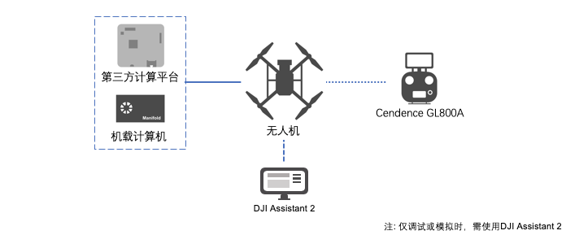
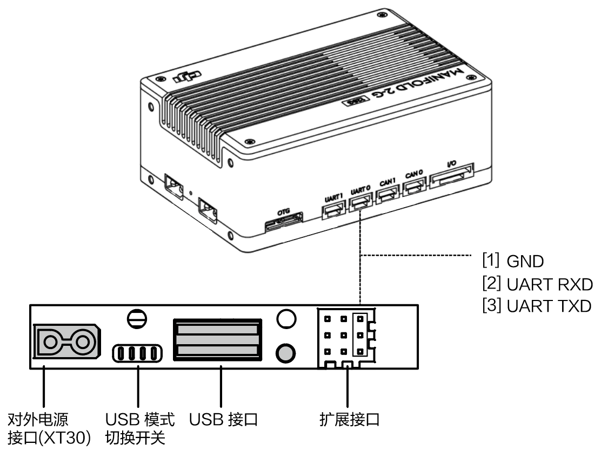
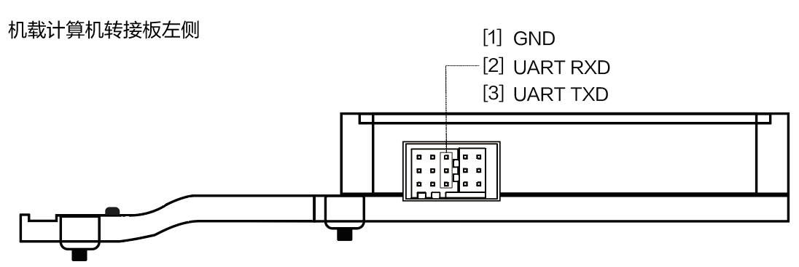
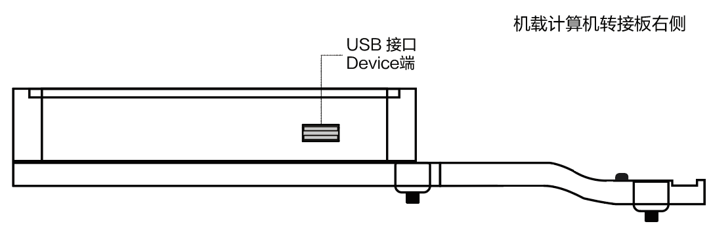
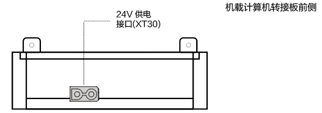
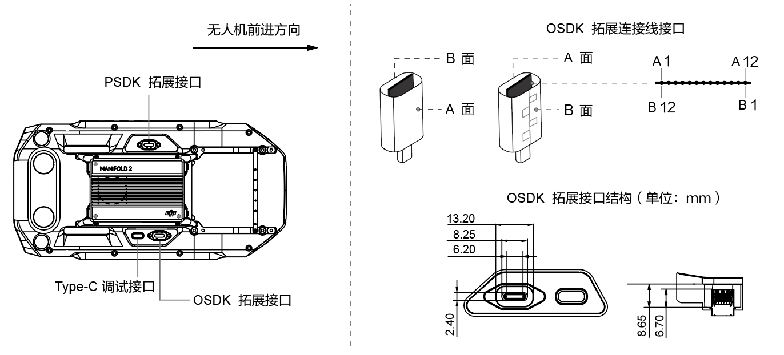

> **说明**
> * 请您务必先参考所购机型的[说明书](https://www.dji.com/cn/products/enterprise?site=brandsite&from=nav#drones)，再将机载计算机或第三方开发平台连接至DJI 的无人机，避免操作不当损毁设备。
> * 本文档图示中的接口为**无人机**的接口，有关机载计算机的接口说明，请参见[妙算 Manifold 2 使用说明](https://dl.djicdn.com/downloads/manifold-2/20190528/Manifold_2_User_Guide_v1.0_CHS.pdf)，有关第三方开发平台的接口说明，请参见所购产品的说明书。 
>* 本文档**未描述的接口将逐步开放**，敬请关注。       

在计算平台Manifold 2 或第三方开发平台上开发应用程序时，请按本文引导连接计算平台和DJI 的无人机或飞控系统，如 图1.设备连接 所示。      

图1.设备连接

      

      

## 使用M210 V2 系列无人机
M210 V2 系列无人机包含M210 V2 和M210 RTK V2 两款型号，有关M210 V2 系列无人机的使用步骤、接口以及接口的详细说明请参见Matrice 210 V2 系列的[用户手册](https://dl.djicdn.com/downloads/m200_v2/20191213/M200_V2_UM_CHS_v1.2_2.pdf)。

> **说明** 
> * 图例所示的引脚标识为无人机尾部**自上到下**的接口，有关机载计算机或第三方硬件平台的接口，请参见所购型号产品的使用说明书。
> * 若开发者所使用的机载计算机（如Manifold 2）和第三方开发平台因较高的电流（峰值电流达到24V/5A）触发了M210 V2 系列无人机的断电保护机制（断电或频繁重启），请**断开电源输出接口（XT30）连接**，在检查并调整机载计算机和第三方开发平台内的电流后，再重新连接电源输出接口。
> * 为确保无人机在携带机载计算机飞行时的安全可靠，建议使用[机载计算机安装支架](https://store.dji.com/cn/product/manifold-2-mounting-bracket)。

#### 接入机载计算机 Manifold 2
将机载计算机Manifold 2 接入M210 V2 系列无人机时，请使用**USB 转TTL 线（FT232BL）和双头USB 线，同时连接机载计算机和Matrice 210 V2 系列无人机**，如图2 将机载计算机接入M210 V2 系列无人机 所示。

图2.将机载计算机接入M210 V2 系列无人机

      

* 连接USB 线：Manifold 2 通过**双头USB 线**与无人机通信。
* 连接串口线：
    * 方法1： 使用Manifold 2 中的串口线连接无人机尾部的拓展接口和Manifold 2 的UART1 接口(Manifold 2 中的设备号为ttyTHS2)；
    * 方法2： 使用USB转串口线连接飞机尾部的拓展接口和Manifold 2 的USB 接口（Manifold 2 中的设备号为ttyUSBn，n为0、1、2.....）。
 * 使用外部电源为Manifold 2 供电时：
   * 为避免干扰无人机的正常工作，请确保机载计算机的电压在18V～26V 间，电流恒定为2A；
   * 在 `utility/bin/` 中设置开启或关闭电源接口（无人机重启后需重新设置电源开关）；
`./M210ConfigTool --usb-port /dev/ttyACM0 --config-file UserConfig.txt --power-supply on` 

> **说明** 
> * M210 V2 系列无人机串口的电压为3.3 V；
> * 如需使用Matrice 210 RTK 实现时间同步功能，请使用线缆将Manifold 2 上的SYNC Line 接口与无人机尾部的PPS 和GND 引脚相连接。

#### 接入第三方开发平台
请根据第三方平台的情况，为M210 V2 系列无人机接入第三方开发平台：
* 连接USB 线：通过**双头USB 线**与无人机通信。
* 连接串口线：
    * 方法1：使用串口线连接无人机尾部的拓展接口和第三方开发平台的UART1 接口；
    * 方法2：使用USB转串口线连接飞机尾部的拓展接口和第三方开发平台的USB 接口。
 * 使用外部电源为第三方开发平台供电时,请确保不会干扰无人机的正常工作。
> **说明** 
> * 请同时使用USB 线和串口线将第三方开发平台接入M210 V2 系列无人机；
> * 请勿违规使用VCC 引脚为第三方开发平台供电，否则可能会损坏无人机或第三方开发平台。

## 使用M300 RTK 无人机

> **说明** 
> * 无人机M300 RTK 与OSDK 转接板串口的电压均为3.3 V；
> * 在Matrice 300 RTK 无人机上安装Manifold 2 或第三方开发平台时，请使用OSDK 转接板；
> * 使用第三方平台为机载计算机时，请避免产生磁场，干扰无人机的正常工作。

为方便开发者将机载计算机Manifold 2 或第三方计算平台固定在M300 RTK 的无人机上，DJI 提供了机载计算机转接板，该转接板提供了XT30 24V 供电接口、OSDK串口以及OSDK USB 2.0 接口，开发者可根据转接板的结构和接口，设计所需使用的机载计算机或其他设备。为避免因使用不当而烧毁转接板或机载计算机等意外事件的发生，请在使用该转接板前，认真阅读如下内容。

#### 机载计算机转接板接口说明

> **说明：** 有关在M300 RTK 无人机上安装机载计算机转接板的说明请参考[机载计算机转接板使用说明书]()。

* OSDK 机载计算机通信接口

图3.OSDK 机载计算机通信接口

      

> **说明**
> * 机载计算机转接板的USB 2.0接口为USB Device端，OSDK 机载计算机为Host端；
> * 使用串口连接线连接机载计算机和机载计算机转接板时，转接板接口的定义与M210 系列无人机尾部接口的定义相同；
> * 开发者可根据实际的使用需要，使用电源线和USB 连接线连接机载计算机和机载计算机转接板。

* OSDK USB2.0 接口Device 端

图4.OSDK USB2.0 接口Device 端

      

* 对外供电接口 24V (XT30)

图5.对外供电接口 24V (XT30)

      

* 转接板连接线接口

图6.转接板连接线接口

      

> **注意：** 将机载计算机转接板接入M300 RTK 的OSDK 拓展接口时，连接线 **带有缝纹一侧的朝向（B面）** 需朝向无人机外部。        

表1.转接板连接线接口

<table>
<tbody>
<tr>
<th>A 面 </th>
<td>A1</td>
<td>A2</td>
<td>A3</td>
<td>A4</td>
<td>A5</td>
<td>A6</td>
<td>A7</td>
<td>A8</td>
<td>A9</td>
<td>A10</td>
<td>A11</td>
<td>A12</td>
</tr>
<tr>
<th>接口名称 </th>
<td>GND</td>
<td>NC</td>
<td>NC</td>
<td>VCC</td>
<td>UART_RX</td>
<td>DP</td>
<td>DM</td>
<td>UART_TX</td>
<td>VCC</td>
<td>PWM0</td>
<td>PWM1</td>
<td>GND</td>
</tr>
<tr>
<th>B 面 </th>
<td>B12</td>
<td>B11</td>
<td>B10</td>
<td>B9</td>
<td>B8</td>
<td>B7</td>
<td>B6</td>
<td>B5</td>
<td>B4</td>
<td>B3</td>
<td>B2</td>
<td>B1</td>
</tr>
<tr>
<th>接口名称 </th>
<td>GND</td>
<td>NC</td>
<td>NC</td>
<td>VCC</td>
<td>ON_DET</td>
<td>RSVD2</td>
<td>RSVD1</td>
<td>SYNC(PPS)</td>
<td>VCC</td>
<td>PWM3</td>
<td>PWM2</td>
<td>GND</td>
</tr>
</table>

##### 接口功能说明：
* 供电接口
    * 如需为机载计算机供电，请使用VCC 引脚
       > **说明** 
       > * 该接口的额定电压为24V 4A，无人机输出的总功率为96w；
       > * 该接口的VCC 引脚在同一网络下，开发者可根据实际的使用需求连接VCC 引脚数量。但为保证无人机能够持续稳定地输出电流，请同时连接4 个VCC 引脚。
    * RSVD1、RSVD2 为预留引脚，RSVD1 引脚**必须**悬空；RSVD2 引脚**必须**为GND
    * 请**务必**使用ON_DET 引脚，且接入ON_DET 引脚的对端**必须**为**GND**
* 数据通信接口
    * 如需使用USB 2.0 的功能，请使用DP 和DM 引脚
    * 如需使用无人机输出的PWM 信号，请使用PWM 引脚
    * 如需通过无人机上的串口，实现机载计算机和无人机间的通信，请使用UART_RX 和UART_TX 引脚
       * UART_RX：该引脚为机载计算机转接板通过连接线**接收无人机输出信号**的引脚，该引脚对应无人机OSDK 拓展接口的信号输出引脚TX
       * UART_TX：该引脚为机载计算机转接板通过连接线**向无人机发送信号**的引脚，对应为无人机OSDK 拓展接口的信号接收引脚RX
* 时间同步：如需使用无人机对外输出的同步信号，实现时间同步功能，请使用SYNC（PPS） 引脚

> **说明：** 接入机载计算机后，请使用DJI Assistant 2 的Onboard SDK 配置界面设置M300 RTK 上OSDK 接口的波特率。