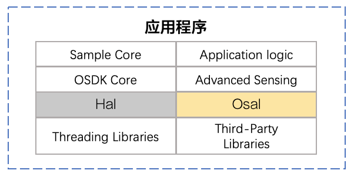
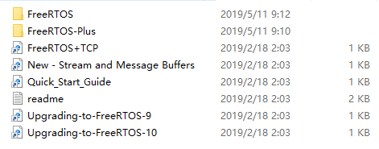
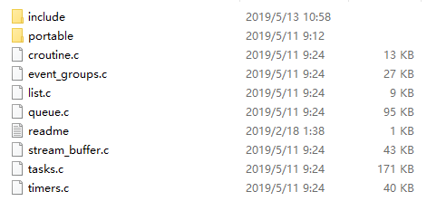
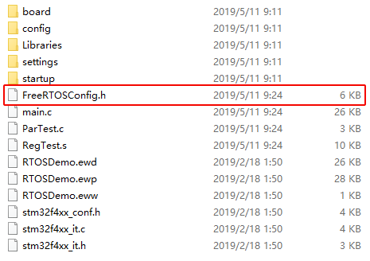
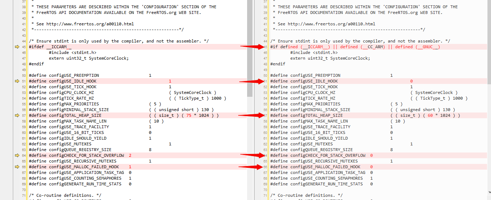

基于OSDK 开发的应用程序能够运行在Linux 和ROS 系统上，为满足开发者在不同的操作系统和开发平台上使用OSDK 开发应用程序，OSDK 提供了Hal 层和Osal 层库。

>**说明：** 本教程提供的[示例代码](https://github.com/dji-sdk/Onboard-SDK)，是以<a href="https://www.stmicroelectronics.com.cn/en/evaluation-tools/stm3241g-eval.html"><b>STM3241G-EVAL</b></a> 开发板为例，介绍将基于OSDK 开发的应用程序移植到FreeRTOS 平台上的步骤。

## 概述
为能使基于OSDK 开发的应用程序移植到不同的软硬件平台，需要通过Hal（Hardware Abstraction Layer，硬件接口层）适配不同的硬件平台，通过Osal（Operating System Abstraction Layer，操作系统抽象层）实现与不同操作系统的兼容，如 图1.代码移植 所示。     
<div>
<div style="text-align: center"><p>图1.代码移植  </p>
</div>
<div style="text-align: center"><p><span>
      </span></p>
</div></div>

> **说明**
> * 使用**OSDK 4.0 及以上**版本，在STM32上开发的应用程序**必须**运行在FreeRTOS上；
> * 使用**OSDK 4.0 以下**版本，在STM32上开发的应用程序**仅能**运行在裸机上。

## 基础概念
### Hal 层
Hal（Hardware Abstraction Layer，硬件接口层）是OSDK 硬件接口抽象层，位于操作系统、应用程序和硬件接口间，开发者需要按照指定接口中的函数原型，实现并将适配Hal 层的函数注册到应用程序中，使基于OSDK 开发的应用程序通过Hal 层直接访问不同计算平台硬件的底层资源，并与无人机通信。

* 不使用高级视觉功能   
不使用高级视觉功能时，机载计算机仅需通过UART 接口与无人机通信。开发者需要按照`OsdkPlatform_RegHalUartHandler()`接口中的函数原型，实现并将适配Hal 层的函数注册到应用程序中。

* 使用高级视觉功能
使用高级视觉功能时，机载计算机需通过USB 接口获取无人机摄像头的图像数据。开发者需要按照`OsdkPlatform_RegHalUSBBulkHandler()`接口中的函数原型，实现并将适配Hal 层的函数注册到应用程序中。

### Osal 层
Osal（Operating System Abstraction Layer，操作系统抽象层）是OSDK 的操作系统抽象层，位于应用程序和操作系统间。开发者需要按照`PsdkPlatform_RegOsalHandler()`接口中的函数原型，实现并将适配Osal 层的函数注册到应用程序中，使基于OSDK 开发的应用程序通过Osal 层直接访问操作系统以及操作系统内核的资源，将应用程序移植到不同的操作系统上。

#### 线程函数
使用线程机制管理应用程序执行相应的任务，开发者需要实现创建线程、销毁线程和线程睡眠的函数。

* 创建线程：

```c
E_OsdkStat (*TaskCreate)(T_OsdkTaskHandle *task, 
                        void *(*taskFunc)(void *), 
                        uint32_t stackSize, void *arg)

```

* 销毁线程：`E_OsdkStat (*TaskDestroy)(T_OsdkTaskHandle task)`
* 线程睡眠：`E_OsdkStat (*TaskSleepMs)(uint32_t timeMs)`

#### 互斥锁
互斥锁是一种用于防止多个线程同时对同一队列、计数器和中断处理程序等公共资源（如共享内存等）执行读写操作的机制，能够有效避免进程死锁或长时间的等待。使用互斥锁机制，需要开发者实现创建互斥锁、销毁互斥锁、互斥锁上锁和互斥锁解锁。

* 创建互斥锁：`E_OsdkStat (*MutexCreate)(T_OsdkMutexHandle *mutex)`  
* 销毁互斥锁：`E_OsdkStat (*MutexDestroy)(T_OsdkMutexHandle mutex)`  
* 互斥锁上锁：`E_OsdkStat (*MutexLock)(T_OsdkMutexHandle mutex)`        
* 互斥锁解锁：`E_OsdkStat (*MutexUnlock)(T_OsdkMutexHandle mutex);`

#### 信号量
信号量是一种用于防止多线程同时操作相同代码段的机制。开发者使用该机制时，需要实现创建信号量、销毁信号量、等待信号量、释放信号量和等待超时信号量函数。

* 创建信号量：`E_OsdkStat (*SemaphoreCreate)(T_OsdkSemHandle *semaphore, uint32_t initValue)`
    >**说明：** 使用该接口时，请设置`initValue`信号量的初始值。

* 销毁信号量：`E_OsdkStat OsdkOsal_SemaphoreDestroy(T_OsdkSemHandle semaphore)`
* 等待信号量：`E_OsdkStat OsdkOsal_SemaphoreWait(T_OsdkSemHandle semaphore);`
   >**说明：** 等待信号量接口等待时间的**最大值**为**32767 ms**。

* 等待超时信号量：`E_OsdkStat OsdkOsal_SemaphoreTimedWait(T_OsdkSemHandle semaphore, uint32_t waitTimeMs)`
* 释放信号量：`E_OsdkStat OsdkOsal_SemaphorePost(T_OsdkSemHandle semaphore)`

#### 时间接口
获取当前系统的时间（ms）：`E_OsdkStat OsdkOsal_GetTimeMs(uint32_t *ms);`

#### 内存管理接口
* 申请内存：`void *OsdkOsal_Malloc(uint32_t size);`
* 释放内存：`void OsdkOsal_Free(void *ptr)`

## 实现跨平台移植
### 1. 跨平台移植模块初始化
创建工程文件后，请先调用如下接口，将硬件平台和操作系统的接口函数注册到基于OSDK 开发的应用程序中，**否则**使用OSDK 开发的应用程序**将无法移植到其他硬件平台和操作系统上**。

```c++
E_OsdkStat OsdkPlatform_RegOsalHandler(const T_OsdkOsalHandler *osalHandler);
/*如无需使用高级视觉功能，请使用如下接口*/
E_OsdkStat OsdkPlatform_RegHalUartHandler(const T_OsdkHalUartHandler *halUartHandler);
/*如需使用高级视觉功能，请使用如下接口*/
E_OsdkStat OsdkPlatform_RegHalUSBBulkHandler(const T_OsdkHalUSBBulkHandler *halUSBBulkHandler);
```

### 2. 引用关键文件
#### Hal 层适配
* Linux / ROS：osdkhal_linux.c  
* STM32F4：osdkhal_stm32.c
#### Osal 层适配
* Linux / ROS：osdkosal_linux.c  
* STM32F4：osdkosal_stm32.c

### 3. 注册跨平台移植模块
#### 注册Hal 层函数
```c++
#ifdef ADVANCED_SENSING
  if(DJI_REG_USB_BULK_HANDLER(&halUSBBulkHandler) != true) {
    throw std::runtime_error("USB Bulk handler register fail");
  };
#endif
```

#### 注册Osal 层函数
```c++
if(DJI_REG_OSAL_HANDLER(&osalHandler) != true) {
  throw std::runtime_error("Osal handler register fail");
}
```

## FreeRTOS 移植    
将基于OSDK 开发的应用程序移植到FreeRTOS 平台上，需要先获取FreeRTOS 的内核源码。

#### 1. 获取移植代码

* 下载并解压缩FreeRTOS 压缩包 [V10.2.1](https://www.freertos.org/a00104.html)，代码解压后主目录如 图2.FreeRTOS 文件列表 所示：
<div>
<div style="text-align: center"><p>图2.FreeRTOS 文件列表  </p>
</div>
<div style="text-align: center"><p><span>
      </span></p>
</div></div>

* 关键文件移植       
  * 移植FreeRTOS 核心代码： 将`/FreeRTOS/Source/`下的所有文件复制到`onboard-sdk/sample/platform/STM32/OnBoardSDK_STM32/OS/FreeRTOS/`目录下。
  <div>
<div style="text-align: center"><p>图3.FreeRTOS 关键文件列表  </p>
</div>
<div style="text-align: center"><p><span>
      </span></p>
</div></div>

  * 移植关键配置文件：将`/FreeRTOS/Demo/CORTEX_M4F_STM32F407ZG-SK/`中的文件`FreeRTOSConfig.h`复制到`onboard-sdk/sample/platform/STM32/OnBoardSDK_STM32/OS/FreeRTOS/include`目录下。

  <div>
<div style="text-align: center"><p>图4.FreeRTOSConfig.h 文件  </p>
</div>
<div style="text-align: center"><p><span>
      </span></p>
</div></div>
  

#### 2. 修改关键配置信息    
修改`FreeRTOSConfig.h` 文件中的关键信息。
  * 将`#ifdef __ICCARM__` 改为 `#if defined (__ICCARM__) || defined (__CC_ARM) || defined (__GNUC__)`     
  * 将`#defined configUSE_IDLE_HOOK    2`改为`#defined configUSE_IDLE_HOOK    2`     
  * 将`#define configTOTAL_HEAP_SIZE     ((size_t)(75*1024))`改为`#define configTOTAL_HEAP_SIZE      ((size_t)(60*1024))`   
  * 将`#define configCHECK_FOR_STACK_OVERFLOW      2`改为`#define configCHECK_FOR_STACK_OVERFLOW      0`    
  * 将`#define configUSE_MALLOC_FAILED_HOOK       1`改为`#define configUSE_MALLOC_FAILED_HOOK       0`    

  <div>
<div style="text-align: center"><p>图5.修改配置对比  </p>
</div>
<div style="text-align: center"><p><span>
      </span></p>
</div></div>

