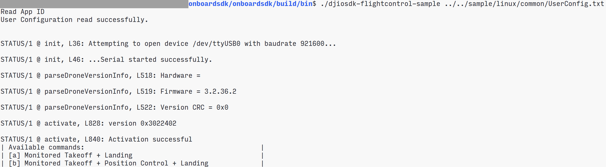

在注册DJI SDK 开发者账号后，请下载OSDK 提供的[示例代码](https://github.com/dji-sdk/Onboard-SDK)并在示例代码中补充应用信息，通过编译、调试和烧录等操作获得示例程序，通过运行示例程序，了解使用OSDK 开发应用程序的方法。

> **提示：** DJI 的示例程序以Linux和FreeRTOS 为操作系统，在Manifold 2 和STM3241G-EVAL 上开发，如需将示例代码移植到其他操作系统或硬件平台上，请参考 [跨平台移植](../QuickStart/porting.html)。   


## 获取示例代码
在 <a href="https://account.dji.com/login?appId=dji_sdk&backUrl=https%3A%2F%2Fdeveloper.dji.com%2Fuser&locale=en_US" target="_blank">注册</a>成为DJI SDK 的开发者后，即可使用DJI OSDK 开发包；获取DJI 提供的[示例代码](https://www.github.com/dji-sdk/Onboard-SDK)后，开发者能够了解使用OSDK 开发应用程序的方法，快速开发出功能完善的出应用程序。     

## 创建应用程序
获取示例代码后，请在[用户中心](https://developer.dji.com/user/apps/#all) 创建应用程序，获取应用ID 和应用秘钥，如图1.填写应用信息 所示。    

<div>
<div style="text-align: center"><p>图1. 填写应用信息</p>
</div>
<div style="text-align: center"><p><span>
      </span></p>
</div></div>

> **注意：** 为提高您的开发效率，请在示例代码中**正确**填写*应用的名称*、*ID*、*Key* 和*用户账号*，否则编译后的示例程序将无法正常运行。   

## 参数设置说明
* 在ROS 平台开发的应用程序通过UART 接口与无人机通信时，波特率应设为921600，否则可能会出现丢包现象。
* 使用Manifold 2-G 上的ttyTHS2与无人机通信时，请将波特率设置为1000000，更多详细信息，请参见Manifold 2[用户指南](https://dl.djicdn.com/downloads/manifold-2/20190528/Manifold_2_User_Guide_v1.0_CHS.pdf)；若您使用USB 转TTL 串口模块与无人机通信，建议选用芯片为FT232 的模块。
     
## 运行Linux 示例代码
建议使用Ubuntu 16.04 为运行Linux 示例代码的操作系统，使用Manifold 2 为运行Linux 示例代码的硬件平台。

>**说明:** Linux 的示例代码以Manifold 2-C 为计算平台，该示例代码也可直接运行在Manifold 2-G 上。     

#### 补充应用信息  
在 `onboard-sdk/sample/platform/linux/common/UserConfig.txt` 文件中填写应用程序的信息：
```c
app_id :                  //开发者的ID
app_key :                 //App Key
device:                   //串口端口号
bauderate :               //串口波特率
acm_port :                //ACM 端口号
```

> **说明：** 仅使用OSDK 4.0 时，需配置`acm_port`，此处默认为`/dev/ttyACM0`。


#### 编译示例代码
##### 1. 确认串口访问权限     
编译示例代码前，请在终端上使用`ls -l /dev/xxx` 命令查看硬件平台串口（UART接口）的访问权限，若访问权限不足，请在终端中使用 `sudo chmod 777 /dev/xxx`命令获取串口设备访问权限。

>**说明：** xxx为串口的名称。

##### 2. 编译示例代码     
进入示例代码的目录：`onboard-sdk`，使用如下命令将示例代码编译为示例程序：     
   1. `mkdir build && cd build`；
   2. `cmake ..` 或 `cmake .. -DADVANCED_SENSING=ON`(使用视觉功能)；
   3. `make`；

#### 执行示例程序    
##### 1. 复制配置文件
将配置文件`UserConfig.txt`拷贝到bin文件中：
`cp ../sample/platform/linux/common/UserConfig.txt bin/
`

##### 2. 输入程序运行命令(如下以运行flightcontrol 示例代码为例)
`./djiosdk-flightcontrol-sample UserConfig.txt UserConfig.txt`

##### 3. 运行示例程序
从键盘中输入B 运行示例程序
<div>
<div style="text-align: center"><p>图2.运行示例程序(Linux) </p>
</div>
<div style="text-align: center"><p><span>
      </span></p>
</div></div>


## 运行ROS 示例代码

#### 编译示例代码

##### 1. 创建ROS 工作空间

```c
  mkdir catkin_ws 
  cd catkin_ws 
  mkdir src 
  cd src 
  catkin_init_workspace
```

使用如上命令创建工作空间后，请将OSDK 示例代码复制在`src`目录下。

##### 2. 编译示例代码
   1. 在`catkin_ws` 目录下，使用`catkin_make` 命令，编译OSDK 示例代码。
   2. 配置当前工作空间`source devel/setup.bash`

#### 执行示例程序

##### 1. 补充应用信息
编辑配置文件`XXXX.launch`，替换应用的ID、Key和波特率等信息。 
   * 配置OSDK 4.0.0 接口的节点：
   `$rosed dji_osdk_ros dji_vehicle_node.launch`
   * 配置OSDK 3.8.0 接口的节点：
   `$rosed dji_osdk_ros dji_sdk_node.launch`
> **说明** 
> * OSDK ROS 4.0 节点配置文件的路径：
   `/path/to/catkin_ws/src/Onboard-SDK-ROS/launch/dji_vehicle_node.launch`
> * OSDK ROS 3.8 节点配置文件的路径：
   `/path/to/catkin_ws/src/Onboard-SDK-ROS/launch/dji_sdk_node.launch`   </br>
> 若使用3.8版本接口的dji_sdk_node，需将`UserConfig.txt`文件放置于指定的路径下：      
> * 若使用`rosrun`命令，`UserConfig.txt`文件需被放置在当前运行目录下;
> * 若使用`roslaunch`命令，`UserConfig.txt`文件需被放置在`/home/{user}/.ros`目录下.

##### 2. 运行ROS 的主节点：
   * OSDK ROS 4.0 
    `roslaunch dji_osdk_ros dji_vehicle_node.launch`
   * OSDK ROS 3.8    
    `roslaunch dji_osdk_ros dji_sdk_node.launch`

##### 3. 运行示例节点
* OSDK ROS 4.0
 打开新的终端窗口，进入`catkin_ws`目录下，使用如下命令配置工作空间(以运行“无人机飞行控制”程序为例)
    ```c
     $source devel/setup.bash
     $rosrun dji_osdk_ros flight_control_node 
     ```
   > **说明：** 如需使用高级视觉功能，请运行`advanced_sensing_node`示例程序。
      
* OSDK ROS 3.8（仅保留service 和 topic）     


## 运行STM32 示例代码

#### 补充应用信息
>**说明：** RTOS 的示例代码以**STM32F407IGH6-EVAL** 开发板为应用程序。

1. 使用Keil 打开位于`sample/platform/STM32/OnBoardSDK_STM32/Project/`目录下的工程文件`OnBoardSDK_STM32.uvprojx`。

2. 在`OnboardSDK_STM32/User/Activate.cpp` 文件中替换应用的名称、ID、Key和用户账号：

```c
void
userActivate()
{
  static char key_buf[65] = "your app_key here";  /*your app_key here*/
  DJI::OSDK::Vehicle::ActivateData user_act_data = {0};
  user_act_data.ID = 0000;    /*your app ID here*/
  user_act_data.encKey = key_buf;
  v->activate(&user_act_data);
}
```

#### 编译示例代码     
1. 使用Keil 打开位于`sample/STM32/OnBoardSDK_STM32/Project/`目录下的工程文件`OnBoardSDK_STM32.uvprojx`。  
2. 在Project 选项卡中，选择Project Target；
3. 在C/C++ 选项卡中选择所需编译的示例代码，`-DXXXX_XXXXX_XXXXX`。

<div>
<div style="text-align: center"><p>图3.编译示例代码 </p>
</div>
<div style="text-align: center"><p><span>
      </span></p>
</div></div>
  
#### 执行示例程序
  * 在`Project` 选项卡中，选择`Build Target`
  * 选择Flash-Download 选项，将编译后的程序**烧录**到第三方开发平台（如STM32F407IGH6-EVAL）中。

>**说明：** 如需调试示例程序，请设置串口调试工具的波特率，USART3 端口的波特率默认为921600；USART2 端口的波特率默认为115200。

## 激活与授权
用户首次使用开发者基于OSDK 开发的应用程序时，应用程序将通过无人机或遥控器获取DJI 的授权许可，以此激活应用程序。
* 激活应用程序：使用DJI Assistant 2  
* 激活故障排查
   * 请对照[设备连接](./device-connection.html) 中的内容正确地连接无人机和第三方开发平台；请确认UART 线的电压为3.3V。
   * 请检查运行了DJI GO 等其他移动端APP 的设备能够正常访问互联网。
   * 请确认已在DJI Assistant 2 中开启 API Control 功能。
   * 请对照[用户中心](https://developer.dji.com/user/apps/#all)应用程序的信息检查代码中应用程序的ID、密钥及开发者账号等信息。
   * 请确认已正确设置了应用程序中的波特率、安装了指定的驱动并开通相关权限。


