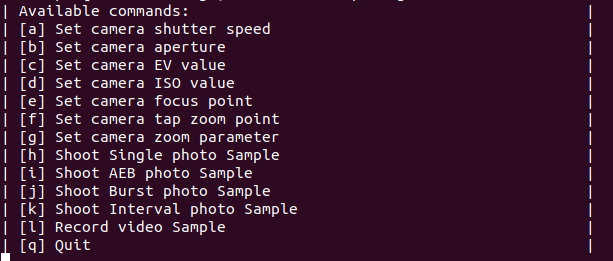

## Introduction
DJI cameras have many operational functions available for users to operate, such as taking photos/videos/tap zoom, etc.
This page is to introduce how to use a typical function of camera - tap zoom function, by using synchronous and asynchronous APIs of `CameraManager`.

Zoom capabilities include optical zoom, digital zoom, and Hybrid zoom, which, like conventional camera designs,
depending on the focal length of the lens, leaving resolution and image quality unchanged. Digital zoom reduces
the size of the original image, making it larger on the LCD screen, but it doesn't help to make details clearer.

This sample support Z30 in Matrice 210 V2 or Matrice 210 RTK V2. More details about Z30 please refer to [here](https://dl.djicdn.com/downloads/Z30/20190906/Z30_User_Manual_EN.pdf).

## Goals
Demonstrate a typical sample about how to execute tap zoom by using `CameraManager` synchronous and asynchronous APIs.

## Preparation
The devices which is used in this sample are as follows:<br>
Aircraft type: Matrice 210 V2 or Matrice 210 RTK V2<br>
Gimbal Connector II: Z30<br>
Onboard SDK Device: Manifold 2-G<br>

## Work Flow
#### Setup Flow
1. Please prepare your aircraft and camera according to the above preparation conditions. You can also connect the aircraft to
the mobile APP - DJI Pilot and observe the changing of aperture.

2. As to how to build the Onboard SDK project, please refer to [here](https://developer.dji.com/onboard-sdk/documentation/development-workflow/sample-setup.html).

3. After building your Onboard SDK project code, you will find two sample bin files
named `camera_manager_sync_sample` and `camera_manager_async_sample`.

4. Copy your UserConfig.txt file into the current path and run:
Run synchronous sample: `./camera_manager_sync_sample UserConfig.txt`
Run asynchronous sample: `./camera_manager_sync_sample UserConfig.txt`
If all the conditions are all right, you will see this log screen:
[](../../images/samples/camera_manager_sample_choice.png)

5. Enter `f` and then the aperture sample will begin to run.

Camera-Manager sample supports a new way to execute the sample. You can directly type your sample choice after
`./camera_manager_sync_sample UserConfig.txt` or `./camera_manager_async_sample UserConfig.txt`, just like:

`./camera_manager_sync_sample UserConfig.txt f` or

`./camera_manager_sync_sample UserConfig.txt f`

Then the sample will automatically run the sample f.

#### Code Flow
###### Here is the workflow of the setting aperture parameter sample by asynchronous APIs:
1. Set up the environment and components, activate the vehicle.
2. Initialize the camera modules for `CameraManager`.
3. Get the sample case choice and run the related sample case.
4. Passing `asyncSampleCallBack` as a callback to call `setTapZoomPointAsyncSample` to set the
tap zoom multiplier as 5 and tap zoom point as (0.3,0.3).
5. Callback `asyncSampleCallBack` will be called when the related ack was returned.
6. In `asyncSampleCallBack`, the result will be printed out to the console.
7. Passing `asyncSampleCallBack` as a callback to call `setTapZoomPointAsyncSample` to set the
tap zoom multiplier as 5 and tap zoom point as (0.8,0.7).
8. Callback `asyncSampleCallBack` will be called when the related ack was returned.
9. In `asyncSampleCallBack`, the result will be printed out to the console.

###### Here is the workflow of the setting aperture parameter sample by synchronous APIs:
1. Set up the environment and components, Activate Vehicle.
2. Initialize the camera modules for `CameraManager`.
3. Get the sample case choice and run the related sample case.
4. Call `setTapZoomPointSyncSample` to set the tap zoom multiplier as 5 and tap zoom point as (0.3,0.3).
The result will be printed out to the console after the related ack was returned or timeout.
4. Call `setTapZoomPointSyncSample` to set the tap zoom multiplier as 5 and tap zoom point as (0.8,0.7).
The result will be printed out to the console after the related ack was returned or timeout.

## Code Explain
#### Basic
```c++
  // Setup the OSDK: Read config file, create vehicle, activate.
  LinuxSetup linuxEnvironment(argc, argv);
  Vehicle *vehicle = linuxEnvironment.getVehicle();
  if (vehicle == NULL) {
    std::cout << "Vehicle not initialized, exiting. \n";
    return -1;
  }
  std::string sampleCase = linuxEnvironment.getEnvironment()->getSampleCase();
```
>First part of the sample, here it will initialize Onboard SDK environment.
>The main steps are as follows:
>* Read the environment parameters including baudrate/communication device, app id/app key/test case choice, etc.
>* Initialize the `vehicle` and related components.
>* Do activation for the aircraft with app id and app key.
>* Get the handler instance `vehicle`.


```c++
  /*! init camera modules for cameraManager */
  ErrorCode::ErrorCodeType ret = vehicle->cameraManager->initCameraModule(
      PAYLOAD_INDEX_0, "Sample_camera_1");
  if (ret != ErrorCode::SysCommonErr::Success) {
    DERROR("Init Camera module Sample_camera_1 failed.");
    ErrorCode::printErrorCodeMsg(ret);
  }

  ret = vehicle->cameraManager->initCameraModule(PAYLOAD_INDEX_1,
                                                 "Sample_camera_2");
  if (ret != ErrorCode::SysCommonErr::Success) {
    DERROR("Init Camera module Sample_camera_2 failed.");
    ErrorCode::printErrorCodeMsg(ret);
  }
```
>Initialize the camera module and register them in `vehicle->cameraManager`.
Here the initialization contains two camera modules, the index is PAYLOAD_INDEX_0 and PAYLOAD_INDEX_1.

```c++
  CameraManagerSyncSample *p = new CameraManagerSyncSample(vehicle);
```
>Create the instance of `CameraManagerAsyncSample`. And then developers can use this instance to get the asynchronous use sample of `CameraManager` quickly.

```c++
  case 'f':
    p->setTapZoomPointAsyncSample(
        PAYLOAD_INDEX_1, 5, 0.3, 0.3, asyncSampleCallBack,
        (UserData) "set tap zoom point (0.3, 0.3)");
    sleep(5);
    p->setTapZoomPointAsyncSample(
        PAYLOAD_INDEX_1, 5, 0.8, 0.7, asyncSampleCallBack,
        (UserData) "set tap zoom point (0.8, 0.7)");
    sleep(5);
    break;
```
>Passing `asyncSampleCallBack` as a callback to call `setTapZoomPointAsyncSample` to set the tap zoom multiplier as 5 and tap zoom point as (0.3,0.3).
Then callback `asyncSampleCallBack` will be called when the related ack was returned. The result will be printed out to the console Callback function `asyncSampleCallBack`.
>
>Do the sample operation again to the point (0.8,0.7).

```c++
  CameraManagerSyncSample *p = new CameraManagerSyncSample(vehicle);
```
>Create the instance of CameraManagerSyncSample. And then developers can use this instance to get the synchronous use sample of `CameraManager` quickly.

```c++
  case 'f':
    p->setTapZoomPointSyncSample(PAYLOAD_INDEX_1, 5, 0.3, 0.3);
    sleep(5);
    p->setTapZoomPointSyncSample(PAYLOAD_INDEX_1, 5, 0.8, 0.7);
    sleep(5);
    break;
```
>Call `setTapZoomPointSyncSample` to set the tap zoom multiplier as 5 and tap zoom point as (0.3,0.3).
The result will be printed out to the console after the related ack was returned or timeout.
Sleep for 5 seconds.
>
>Do the sample operation again to the point (0.8,0.7).


#### Advanced
```c++
  /*! @brief Sample to set tap-zoom point for camera, using async api
   *
   *  @note In this interface, tap-zoom function will be enable and the
   * multiplier will be set. Then the tap-zoom function will start with the
   * target tap-zoom point (x, y)
   *  @param index payload node index, input limit see enum
   * DJI::OSDK::PayloadIndexType
   *  @param multiplier the zoom multiplier of each tap zoom
   *  @param x the x value of target tap-zoom point, 0~1
   *  @param y the y value of target tap-zoom point, 0~1
   *  @return OSDK unitified error code
   */
  ErrorCode::ErrorCodeType setTapZoomPointSyncSample(PayloadIndexType index,
                                                     uint8_t multiplier,
                                                     float x, float y);
```
>`setTapZoomPointSyncSample` is a demonstration showing how to execute the tap zoom function of camera by the synchronous interface of `CameraManager`.
User can set the target zoom multiplier and tap zoom point in a blocking way, and the result will be returned when this API returned.
Users can observe the result on the screen of mobile APP.

```c++
  ErrorCode::ErrorCodeType CameraManagerSyncSample::setTapZoomPointSyncSample(
      PayloadIndexType index, uint8_t multiplier, float x, float y) {
    if (!vehicle || !vehicle->cameraManager) {
      DERROR("vehicle or cameraManager is a null value.");
      return ErrorCode::SysCommonErr::InstInitParamInvalid;
    }
    ErrorCode::ErrorCodeType retCode;
    CameraManager *pm = vehicle->cameraManager;

    /*!< set camera tap zoom enable parameter to be enable */
    DSTATUS("Set tap zoom enable  = %d", true);
    retCode = pm->setTapZoomEnabledSync(index, true, 1);
    if (retCode != ErrorCode::SysCommonErr::Success) {
      DERROR("Set tap zoom enable fail. Error code : 0x%lX", retCode);
      ErrorCode::printErrorCodeMsg(retCode);
      DERROR("It is only supported Z30 camera.");
      return retCode;
    }

    /*!< set camera tap zoom multiplier parameter */
    DSTATUS("Set tap zoom multiplier = %d", multiplier);
    retCode = pm->setTapZoomMultiplierSync(index, multiplier, 1);
    if (retCode != ErrorCode::SysCommonErr::Success) {
      DERROR("Set tap zoom multiplier fail. Error code : 0x%lX", retCode);
      ErrorCode::printErrorCodeMsg(retCode);
      DERROR("It is only supported Z30 camera.");
      return retCode;
    }

    /*!< set camera tap zoom multiplier target point */
    DSTATUS("Set tap zoom target point : (%f,%f)", x, y);
    retCode = pm->tapZoomAtTargetSync(index, {x, y}, 1);
    if (retCode != ErrorCode::SysCommonErr::Success) {
      DERROR("Set tap zoom target fail. Error code : 0x%lX", retCode);
      ErrorCode::printErrorCodeMsg(retCode);
      DERROR("It is only supported Z30 camera.");
      return retCode;
    } else {
      DSTATUS(
          "tap zoom at target (%0.2f, %0.2f) successfully, need several seconds "
          "to zoom.",
          x, y);
    }

    return retCode;
  }
```
>In the sample `setTapZoomPointSyncSample`, here are the main processes:
>* Check the validity of the handlers `vehicle` and `vehicle->cameraManager`.
>* Call the interface `setTapZoomEnabledSync` to set the tap zoom function to be enable.
>* Call the interface `setTapZoomMultiplierSync` to set the tap zoom multiplier to be target value `multiplier`.
>* Call the interface `tapZoomAtTargetSync` to set the tap zoom point to be the target point `(x, y)`.


```c++
  /*! @brief Sample to set tap-zoom point for camera, using async api
   *
   *  @note In this interface, tap-zoom function will be enable and the
   * multiplier will be set. Then the tap-zoom function will start with the
   * target tap-zoom point (x, y)
   *  @param index payload node index, input limit see enum
   * DJI::OSDK::PayloadIndexType
   *  @param multiplier the zoom multiplier of each tap zoom
   *  @param x the x value of target tap-zoom point, 0~1
   *  @param y the y value of target tap-zoom point, 0~1
   *  @param UserCallBack callback function defined by user
   *  @arg @b retCode is the OSDK unitified error code
   *  @arg @b userData the interface to trans userData in when the callback is
   * called
   *  @param userData when UserCallBack is called, used in UserCallBack
   */
  void setTapZoomPointAsyncSample(
      PayloadIndexType index, uint8_t multiplier, float x, float y,
      void (*UserCallBack)(ErrorCode::ErrorCodeType retCode, UserData userData),
      UserData userData);
```
>`setTapZoomPointAsyncSample` is a demonstration showing how to execute the tap zoom function of camera by the asynchronous interface of `CameraManager`.
Users can set the target zoom multiplier and tap zoom point in a non-blocking way, and the result will be announced by a callback which passed by the user.

```c++
  void CameraManagerAsyncSample::setTapZoomPointAsyncSample(
      PayloadIndexType index, uint8_t multiplier, float x, float y,
      void (*UserCallBack)(ErrorCode::ErrorCodeType retCode, UserData userData),
      UserData userData) {
    if (!vehicle || !vehicle->cameraManager) {
      DERROR("vehicle or cameraManager is a null value.");
      if (UserCallBack)
        UserCallBack(ErrorCode::SysCommonErr::InstInitParamInvalid, userData);
      return;
    }
    CameraManager *pm = vehicle->cameraManager;
    static AsyncSampleData uData;
    uData.index = index;
    uData.pm = pm;
    uData.userCallBack = (void *)UserCallBack;
    uData.userData = userData;
    CameraModule::TapZoomPosData tapZoomPos{x, y};
    memcpy(uData.dataTarget, &tapZoomPos, sizeof(tapZoomPos));

    /*!< set camera tap zoom multiplier parameter */
    DSTATUS("Set tap zoom multiplier = %d", multiplier);
    pm->setTapZoomMultiplierAsync(index, multiplier, setTapZoomMultiplierCb,
                                  &uData);
  }
```
>In the sample `setTapZoomPointAsyncSample`, here are the main processes:
>* Check the validity of the handlers `vehicle` and `vehicle->cameraManager`.
>* Call the interface `setTapZoomMultiplierAsync` to set the tap zoom multiplier.
>* `setTapZoomMultiplierCb` will be registered as a callback and complete the following tap zoom setting processes.

```c++
  void CameraManagerAsyncSample::setTapZoomMultiplierCb(
      ErrorCode::ErrorCodeType retCode, UserData userData) {
    AsyncSampleData *uData = (AsyncSampleData *)userData;

    DSTATUS("retCode : 0x%lX", retCode);
    if (!uData) {
      DERROR("User data is a null value.");
      return;
    }
    if (retCode == ErrorCode::SysCommonErr::Success) {
      DSTATUS("Set tap zoom multiplier successfully ");
      if (uData->pm) {
        /*! set tap zoom enable */
        uData->pm->setTapZoomEnabledAsync(uData->index, true, setTapZoomEnableCb,
                                          uData);
      }
    } else {
      DERROR("Set tap zoom multiplier error. Error code : 0x%lX", retCode);
      ErrorCode::printErrorCodeMsg(retCode);
      if (uData->userCallBack) {
        void (*cb)(ErrorCode::ErrorCodeType, UserData);
        cb = (void (*)(ErrorCode::ErrorCodeType, UserData))uData->userCallBack;
        cb(retCode, uData->userData);
      }
    }
  }
```
>* Callback function `setTapZoomMultiplierCb` will check the tap zoom multiplier is set successfully or not.
>* If fail, the user callback will return the error code.
>* If success then calling the interface `setTapZoomEnabledAsync` with callback `setTapZoomEnableCb` to set the tap zoom function as enable.

```c++
  void CameraManagerAsyncSample::setTapZoomEnableCb(
      ErrorCode::ErrorCodeType retCode, UserData userData) {
    AsyncSampleData *uData = (AsyncSampleData *)userData;

    DSTATUS("retCode : 0x%lX", retCode);
    if (!uData) {
      DERROR("User data is a null value.");
      return;
    }
    if (retCode == ErrorCode::SysCommonErr::Success) {
      DSTATUS("Set tap zoom enable successfully ");
      if (uData->pm) {
        /*! set tap zoom point */
        uData->pm->tapZoomAtTargetAsync(
            uData->index, *(CameraModule::TapZoomPosData *)uData->dataTarget,
            (void (*)(ErrorCode::ErrorCodeType, UserData))uData->userCallBack,
            uData->userData);
      }
    } else {
      DERROR("Tap zoom at enable error. Error code : 0x%lX", retCode);
      ErrorCode::printErrorCodeMsg(retCode);
      if (uData->userCallBack) {
        void (*cb)(ErrorCode::ErrorCodeType, UserData);
        cb = (void (*)(ErrorCode::ErrorCodeType, UserData))uData->userCallBack;
        cb(retCode, uData->userData);
      }
    }
  }
```
>* Callback function `setTapZoomEnableCb` will check the tap zoom function is enabled successfully or not.
>* If fail, the user callback will return the error code.
>* If success then calling the interface `tapZoomAtTargetAsync` with the user callback to set the tap zoom point.

## Result
The log of the camera manager async sample f is as shown below.
[](../../images/samples/sample_f_log.png)


## FAQ
##### What's the prerequisites of tap zoom?
The target payload index should match Z30 Camera.

##### Which camera can support operational functions by OSDK?
Please refer to the "Camera Functions Support List" in [what-is-CameraManager.html](./what-is-CameraManager.html)
