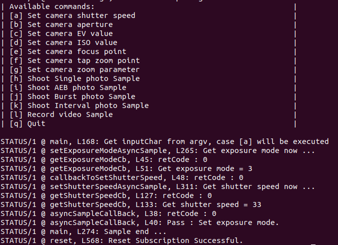

## Introduction
DJI cameras have many parameters available for users to modify, such as ISO/aperture/shutter/exposure values, etc.
This page is to introduce how to set a typical parameter of the camera - aperture parameter, by using synchronous and asynchronous APIs of `CameraManager`.

The camera aperture controls how large the window the sensor can see the world through.
Increasing the aperture will increase the amount of light incident on the camera, and therefore increase the exposure.

More details about camera parameter please refer to [here](https://developer.dji.com/onboard-sdk/documentation/guides/component-guide-camera-and-gimbal.html).

## Goals
Demonstrate a typical sample about how to set the aperture of the camera by using `CameraManager` synchronous and asynchronous APIs.

## Preparation
The devices which is used in this sample are as follows:<br>
Aircraft type: Matrice 210 V2 or Matrice 210 RTK V2<br>
Gimbal Connector I: X7/X5S/X4S<br>
Onboard SDK Device: Manifold 2-G<br>


## Work Flow
#### Setup Flow
1. Please prepare your aircraft and camera according to the above preparation conditions. You can also connect the aircraft to
the mobile APP - DJI Pilot and observe the changing of aperture.

2. As to how to build the Onboard SDK project, please refer to [here](https://developer.dji.com/onboard-sdk/documentation/development-workflow/sample-setup.html).

3. After building your Onboard SDK project code, you will find two sample bin files
named `camera_manager_sync_sample` and `camera_manager_async_sample`.

4. Copy your UserConfig.txt file into the current path and run sample like ways below:
Run synchronous sample: `./camera_manager_sync_sample UserConfig.txt`
Run asynchronous sample: `./camera_manager_sync_sample UserConfig.txt`
If all the conditions are all right, you will see this log screen:
[](../../images/samples/camera_manager_sample_choice.png)

5. Enter `b` and then the aperture sample will begin to run.

Actually, camera-manager sample supports a new way to execute the sample. You can directly type your sample choice after
`./camera_manager_sync_sample UserConfig.txt` or `./camera_manager_async_sample UserConfig.txt`, just like:<br>
`./camera_manager_sync_sample UserConfig.txt b` or<br>
`./camera_manager_sync_sample UserConfig.txt b`<br>

Then the sample will automatically run the sample b.


#### Code Flow
###### Here is the workflow of the setting aperture parameter sample by asynchronous APIs:
1. Set up the environment and components, Activate Vehicle.
2. Initialize the camera modules for `CameraManager`.
3. Get the sample case choice and run the related sample case.
4. Passing `callbackToSetAperture` as a callback to call `SetExposureModeAsyncSample` to set exposure mode as APERTURE_PRIORITY.
5. Callback `callbackToSetAperture` will be called after related ack was returned.
6. In `callbackToSetAperture`, set the aperture parameter as target value by asynchronous API, passing user callback and data as callback handler.
7. Call the user callback with result and user data after related ack was returned.

###### Here is the workflow of the setting aperture parameter sample by synchronous APIs:
1. Set up the environment and components, Activate Vehicle.
2. Initialize the camera modules for `CameraManager`.
3. Get the sample case choice and run the related sample case.
4. Call `SetExposureModeSyncSample` to set exposure mode as APERTURE_PRIORITY.
The result will be printed out to the console after the related ack was returned or timeout.
5. Call `setApertureSyncSample` to set the aperture parameter as target value by synchronous API.
The result will be printed out to the console after the related ack was returned or timeout.


## Code Explain
#### Basic
```c++
  // Setup the OSDK: Read config file, create vehicle, activate.
  LinuxSetup linuxEnvironment(argc, argv);
  Vehicle *vehicle = linuxEnvironment.getVehicle();
  if (vehicle == NULL) {
    std::cout << "Vehicle not initialized, exiting. \n";
    return -1;
  }
  std::string sampleCase = linuxEnvironment.getEnvironment()->getSampleCase();
```
>First part of the sample, here it will do a initialization for Onboard SDK environment, including:
>* Read the environment parameters including baudrate/communication device/app id/app key/test case choice, etc.
>* Initialize the `vehicle` and related components.
>* Do activation for the aircraft with app id and app key.
>* Get the handler instance `vehicle`.

```c++
  /*! init camera modules for cameraManager */
  ErrorCode::ErrorCodeType ret = vehicle->cameraManager->initCameraModule(
      PAYLOAD_INDEX_0, "Sample_camera_1");
  if (ret != ErrorCode::SysCommonErr::Success) {
    DERROR("Init Camera module Sample_camera_1 failed.");
    ErrorCode::printErrorCodeMsg(ret);
  }

  ret = vehicle->cameraManager->initCameraModule(PAYLOAD_INDEX_1,
                                                 "Sample_camera_2");
  if (ret != ErrorCode::SysCommonErr::Success) {
    DERROR("Init Camera module Sample_camera_2 failed.");
    ErrorCode::printErrorCodeMsg(ret);
  }
```
>Initialize the camera module and register them in `vehicle->cameraManager`.
Here initialization is including two camera modules, the index is PAYLOAD_INDEX_0 and PAYLOAD_INDEX_1.

```c++
  CameraManagerAsyncSample *p = new CameraManagerAsyncSample(vehicle);
```
>Create the instance of 'CameraManagerAsyncSample'. And then developers can use this instance to get the asynchronous use sample of `CameraManager` quickly.

```c++
  case 'b':
    p->setExposureModeAsyncSample(
        PAYLOAD_INDEX_0, CameraModule::ExposureMode::APERTURE_PRIORITY,
        callbackToSetAperture, (UserData)p);
    sleep(2);
    break;
```
>If you want to modify the aperature value, exposureMode must be in MANUAL or APERTURE_PRIORITY.
So here it calls the `setExposureModeAsyncSample` to set the exposure mode to be `APERTURE_PRIORITY`.
As a callback, `callbackToSetAperture` will be called after the exposure mode set successfully and do the following setting.

```c++
  void callbackToSetAperture(ErrorCode::ErrorCodeType retCode,
                             UserData userData) {
    DSTATUS("retCode : 0x%lX", retCode);
    if (retCode == ErrorCode::SysCommonErr::Success) {
      CameraManagerAsyncSample *p = (CameraManagerAsyncSample *)userData;
      if (p)
        p->setApertureAsyncSample(
            PAYLOAD_INDEX_0, CameraModule::Aperture::F_3_DOT_5,
            asyncSampleCallBack, (UserData) "Set camera aperture");
    } else {
      DERROR("Set exposure mode failure, Error code : 0x%lX", retCode);
      ErrorCode::printErrorCodeMsg(retCode);
    }
  }
```
>Here calls `setApertureAsyncSample` to finish setting the aperture value of camera.

```c++
  CameraManagerSyncSample *p = new CameraManagerSyncSample(vehicle);
```
>Create the instance of `CameraManagerSyncSample`. And then developer can use this instance to get the synchronous use sample of `CameraManager` quickly.

```c++
  case 'b':
    p->setExposureModeSyncSample(
        PAYLOAD_INDEX_0, CameraModule::ExposureMode::APERTURE_PRIORITY);
    p->setApertureSyncSample(PAYLOAD_INDEX_0,
                             CameraModule::Aperture::F_3_DOT_5);
    sleep(2);
    break;
```
>Here calls the `setExposureModeSyncSample` to set the exposure mode to be `APERTURE_PRIORITY`.
And then call the `setApertureSyncSample` to finish setting the aperture value of the camera.


#### Advanced
```c++
  /*! @brief Sample to set shutter aperture value for camera, using async api
   *
   *  @note In this interface, aperture value will be got then be set.
   *  @param index payload node index, input limit see enum
   * DJI::OSDK::PayloadIndexType
   *  @param dataTarget the target aperture value
   *  @return OSDK unitified error code
   */
  ErrorCode::ErrorCodeType setApertureSyncSample(
      PayloadIndexType index, CameraModule::Aperture dataTarget);
```
>`setApertureSyncSample` is a demonstration showing how to set the aperture of camera by the synchronous interface of `CameraManager`.
User can set the target aperture on the target camera in a blocking way, and the result will be returned when this API return.


```c++
  ErrorCode::ErrorCodeType CameraManagerSyncSample::setApertureSyncSample(
      PayloadIndexType index, CameraModule::Aperture dataTarget) {
    if (!vehicle || !vehicle->cameraManager) {
      DERROR("vehicle or cameraManager is a null value.");
      return ErrorCode::SysCommonErr::InstInitParamInvalid;
    }
    ErrorCode::ErrorCodeType retCode;
    CameraManager *pm = vehicle->cameraManager;
    CameraModule::Aperture apertureGet;

    retCode = pm->getApertureSync(index, apertureGet, 1);
    if (retCode == ErrorCode::SysCommonErr::Success) {
      DSTATUS("Get aperture = %d", apertureGet);
      if (dataTarget != apertureGet) {
        DSTATUS("Set aperture = %d", dataTarget);
        retCode = pm->setApertureSync(index, dataTarget, 1);
        if (retCode == ErrorCode::SysCommonErr::Success) {
          DSTATUS("Set aperture successfully");
        } else {
          DERROR("Set aperture parameter error. Error code : 0x%lX", retCode);
          ErrorCode::printErrorCodeMsg(retCode);
          DERROR(
              "In order to use this function, the exposure mode ExposureMode "
              "must be in MANUAL or APERTURE_PRIORITY. Supported only by the X5, "
              "X5R, X4S, X5S camera.");
        }
      } else {
        DSTATUS("The aperture is already %d.", dataTarget);
      }
    } else {
      DERROR("Get aperture error. Error code : 0x%lX", retCode);
      ErrorCode::printErrorCodeMsg(retCode);
    }

    return retCode;
  }
```
In the sample `setApertureSyncSample`, here are the main processes:
>* Check the validity of the handlers `vehicle` and `vehicle->cameraManager`.
>* Call the interface `getApertureSync` to get the current aperture parameter value.
>* Check the aperture parameter value is got successfully or not.
>* Compare the current aperture value to the target aperture value.
>* If the current aperture value is not equal to the target value, call the `CameraManager` API `setApertureSync` to set the aperture parameter value.


```c++
  /*! @brief Sample to set shutter aperture value for camera, using async api
   *
   *  @note In this interface, aperture value will be got then be set.
   *  @param index payload node index, input limit see enum
   * DJI::OSDK::PayloadIndexType
   *  @param dataTarget the target aperture value
   *  @param UserCallBack callback function defined by user
   *  @arg @b retCode is the OSDK unitified error code
   *  @arg @b userData the interface to trans userData in when the callback is
   * called
   *  @param userData when UserCallBack is called, used in UserCallBack
   */
  void setApertureAsyncSample(
      PayloadIndexType index, CameraModule::Aperture dataTarget,
      void (*UserCallBack)(ErrorCode::ErrorCodeType retCode, UserData userData),
      UserData userData);
```
>`setApertureAsyncSample` is a demonstration showing how to set the aperture of camera by the asynchronous interface of `CameraManager`.
Users can set the target aperture on the target camera in a non-blocking way, and the result will be announced by a callback which passed by users.


```c++
  void CameraManagerAsyncSample::setApertureAsyncSample(
      PayloadIndexType index, CameraModule::Aperture dataTarget,
      void (*UserCallBack)(ErrorCode::ErrorCodeType retCode, UserData userData),
      UserData userData) {
    if (!vehicle || !vehicle->cameraManager) {
      DERROR("vehicle or cameraManager is a null value.");
      if (UserCallBack)
        UserCallBack(ErrorCode::SysCommonErr::InstInitParamInvalid, userData);
      return;
    }
    CameraManager *pm = vehicle->cameraManager;
    static AsyncSampleData uData;
    uData.index = index;
    uData.pm = pm;
    uData.userCallBack = (void *)UserCallBack;
    uData.userData = userData;
    memcpy(uData.dataTarget, &dataTarget, sizeof(dataTarget));

    /*! get the value from camera */
    DSTATUS("Get aperture now ...");
    pm->getApertureAsync(index, getApertureCb, &uData);
  }
```
>In the sample `setApertureAsyncSample`, here are the main processes:
>* Check the validity of the handlers `vehicle` and `vehicle->cameraManager`.
>* Call the interface `getApertureAsync` to get the current aperture parameter value,
>* `getApertureCb` will be registered as a callback and complete the following aperture setting processes.


```c++
  void CameraManagerAsyncSample::getApertureCb(ErrorCode::ErrorCodeType retCode,
                                               CameraModule::Aperture apertureGet,
                                               UserData userData) {
    AsyncSampleData *uData = (AsyncSampleData *)userData;

    DSTATUS("retCode : 0x%lX", retCode);
    if (!uData) {
      DERROR("User data is a null value.");
      return;
    }
    if (retCode == ErrorCode::SysCommonErr::Success) {
      DSTATUS("Get aperture = %d", apertureGet);
      if (uData->pm) {
        /*! compare the aperture set and get */
        if (*(CameraModule::Aperture *)uData->dataTarget == apertureGet) {
          DSTATUS("The aperture value is already %d.", apertureGet);
          if (uData->userCallBack) {
            void (*cb)(ErrorCode::ErrorCodeType, UserData);
            cb =
                (void (*)(ErrorCode::ErrorCodeType, UserData))uData->userCallBack;
            cb(ErrorCode::SysCommonErr::Success, uData->userData);
          }
        } else {
          uData->pm->setApertureAsync(
              uData->index, *(CameraModule::Aperture *)uData->dataTarget,
              (void (*)(ErrorCode::ErrorCodeType, UserData))uData->userCallBack,
              uData->userData);
        }
      }

    } else {
      DERROR("Get aperture error. Error code : 0x%lX", retCode);
      ErrorCode::printErrorCodeMsg(retCode);
      if (uData->userCallBack) {
        void (*cb)(ErrorCode::ErrorCodeType, UserData);
        cb = (void (*)(ErrorCode::ErrorCodeType, UserData))uData->userCallBack;
        cb(retCode, uData->userData);
      }
    }
  }
```
>* In the callback `getApertureCb` will check the aperture parameter value is got successfully or not.
>* Compare the current aperture value to the target aperture value.
>* If the current aperture value is not equal to the target value, call the interface `setApertureAsync`
to set the aperture parameter value.
>* Finally, pass the user callback and userdata into the `CameraManager` API `setApertureAsync` to set the aperture value.


## Result
The log of the camera manager async sample a is as shown below.
[](../../images/samples/sample_a_log.png)


## FAQ
##### What's the prerequisites of setting aperture?
The target camera support aperture setting and the exposure mode must be in `MANUAL` or `APERTURE_PRIORITY`.

##### Which camera can support parameters setting and getting by OSDK?
Please refer to the "Camera Functions Support List" in [what-is-CameraManager.html](./what-is-CameraManager.html)
