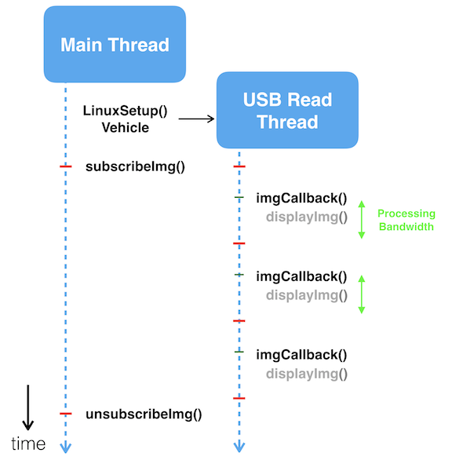
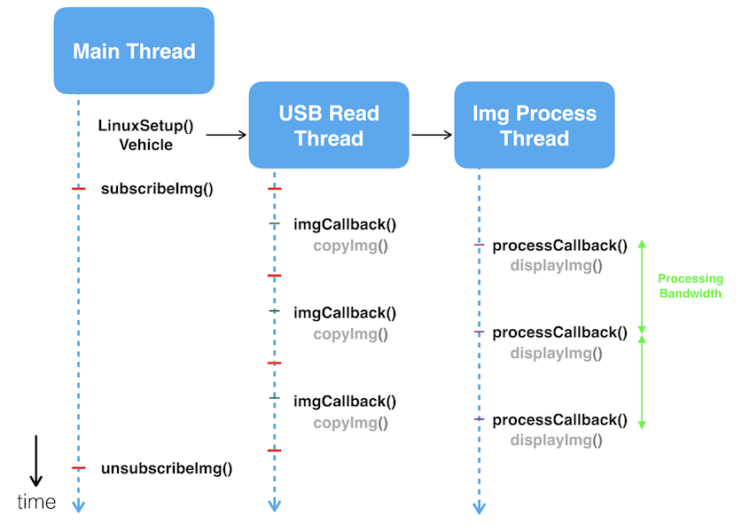

## Introduction
The Advanced Sensing - Stereo Image sample demonstrates how to subscribe 
and unsubscribe images and to provide a custom callback function to display them.
The CMakeLists of this sample will detect if developers have OpenCV installed 
in their system. If they do, the sample callback function will display the images.

For ROS developers, please use `ROS services` to subscribe the images and `image_view` to display them.

To build the samples, follow the steps in [Sample Setup](./sample-setup.html) to build with Advanced Sensing support.

## Workflow

Two samples are provided here for different use cases. 
In both samples, the main thread creates a vehicle object with one 
extra argument to enable this feature and calls an API to subscribe 
to the images depending on user's input.
The Advanced Sensing feature has a dedicated reading thread to receive
image data from the aircraft, developers will be able to access these 
data by passing a callback function. 
If developers would like to perform intense computation on the image data,
it is suggested to create a separate processing thread to avoid interference with the reading thread. 

#### Sample #1 Image Reading and Processing on the Same Thread

In this sample, one thread is instantiated to read image data from USB 
and one callback function is registered to the subscription API. This 
callback function will be invoked whenever image data is received from 
the reading thread. Depending on how many camera and the resolution 
and frequency of the image subscribed, the USB reading might occupied 
most of the bandwidth and remain little time for processing. 
Check out below table for benchmark result and refer to Sample #2
if you experience drop frame issue.

#### Sample #2 Image Reading and Processing on Different Threads

In the second sample, two threads are instantiated to read and to process images.
A class `ImageProcessContainer` is provided to store images on the reading 
thread and to process them on processing thread.
Two callback functions are registered for these two purposes. 
As shown below, an image callback is invoked whenever data is transferred from USB
to the onboard computer and a processing callback is invoked whenever image 
data is copied. This extra thread provides more bandwidth to process the images.
 

## Output

As shown below, an onboard computer is attached to M210 running this sample. Stereo images from both forward and 
downward stereo camera pairs are collected in QVGA resolution (240p) at 20 fps. 

#### Appendix. Benchmark Result of Libusb Reading Time

Depending on the resolution and the frequency of the images subscribed, the data flow could vary from 1.5 MB/s to 12 MB/s. 
This section presents a benchmark result of the libusb reading time when developer subscribes to front VGA images
at 20 fps (12 MB/s) on different computing platforms. 

Developers could use this table to decide whether multiple threads
are required for their applications. For example, developer subscribing to front VGA images at 20 fps on a DJI Manifold 
has roughly 15.31 ms (50-34.69) to process the image without dropping a frame in a single-thread framework.

|                                                                   | Intel i7   | DJI Manifold | Nvidia TX2  with JetPack OS | Nvidia TX1  with JetPack OS |
|-------------------------------------------------------------------|------------|--------------------------------|----------------------------------|----------------------------------|
| Libusb read    2 x VGA images  @ 20 fps  (unit: ms) | 36.96±1.06 | 34.69±1.27                     | 42.18±2.47                       | 41.69±2.74                       |
