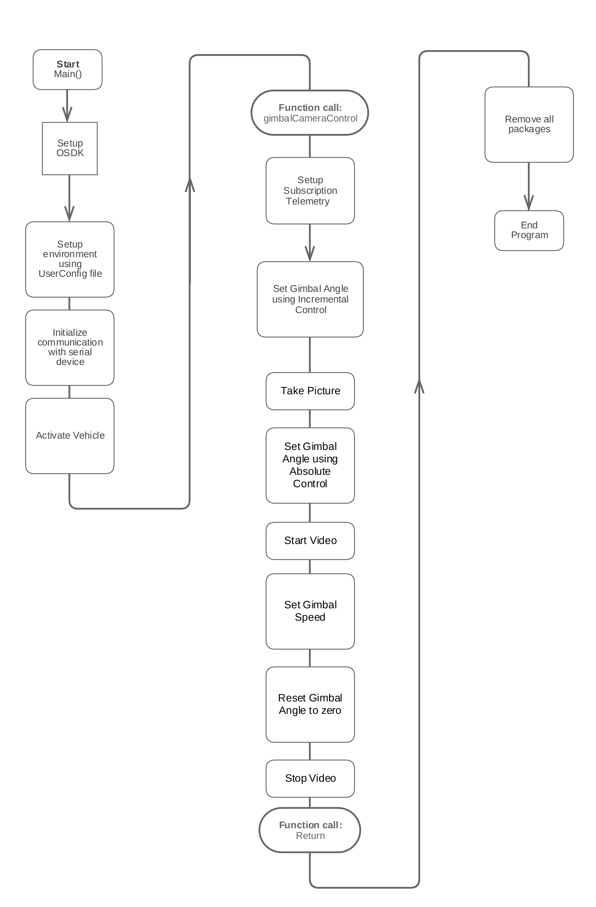

## Introduction

The Camera/Gimbal sample shows example usage of the available camera functions as well as the available gimbal functions. For more information on what Gimbal and Camera features are available through the OSDK, please consult the [camera/gimbal guide](../guides/component-guide-camera-and-gimbal.html).

## Goals

The sample has a single command-line option that cycles through the various commands related to camera and gimbal. The sample showcases the following features:

1. Take Photo
2. Start Video
3. Stop Video
4. Control Gimbal Angle
5. Control Gimbal Speed

Before you start, please ensure that you have an SD card plugged into your camera, and that a camera/gimbal is mounted on your aircraft or connected to your flight controller.

The camera/gimbal sample is available on Linux, ROS and STM32.

## Code work flow

## Output

The output of the camera gimabl sample should have the gimbal follow a trajectory similar to this:

