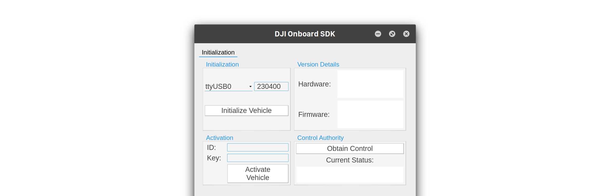
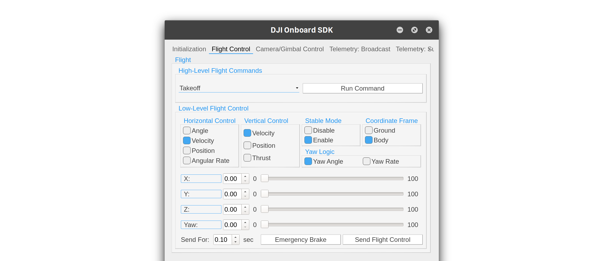
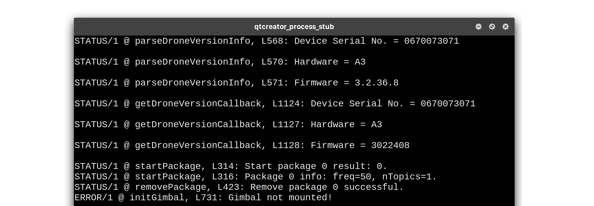

## Introduction

The new Qt sample app provides a cross-platform GUI to try out DJI OSDK functionality. The application supports Ubuntu Linux, MacOS and Windows platforms.

The application implements most functions from the following parts of the OSDK:

- Activation/Control Authority
- Flight Control
- Camera/Gimbal Control
- Waypoint Missions
- Hotpoint Missions
- MFIO Control
- Broadcast Telemetry
- Subscribe Telemetry

The application does not currently implement Mobile SDK communication and hardware sync functionality.

## Software Setup

#### Required Tools

- Qt [5.9 or newer](https://info.qt.io/download-qt-for-application-development) (You may choose the Open-Source option)
- Qt Creator 4.3 (Part of the download package above)
- MSVC2015/ MSVC2013/ MinGW 5.3 (Windows 10) *OR*
- Gcc 5.3.1 (Ubuntu Linux) *OR*
- Apple LLVM 7.0 or newer (MacOS)

The application may also work on other platforms/compilers but has not been tested with any combinations other than these.

#### DJI Hardware Compatibility

The Qt sample is compatible with all the platform/firmware [combinations](../appendix/versioning.html) OSDK 3.3.1 supports, except for M100.

#### Project Setup

- In Qt Creator, click on the `Open Project` button, and navigate to the `sample/Qt/djiosdk-qt-sample/` directory. Select the `djiosdk-qt-sample.pro` file.
- In the Configure Project dialog box, select the appropriate compiler and Qt version and click `Configure Project`.
- Next, click on the `Projects` tab in the left-hand panel and select the `Run` settings under the `Build and Run` heading on the left.
- Check the `Run in Terminal` checkbox. On Linux, you might need to direct Qt Creator to the pre-installed `XTerm` terminal rather than gnome-terminal; go to `Tools->Options->System` and change the path in the `Terminal` box to `/usr/bin/xterm -e`.

Following these steps, your project should be set up correctly. You can choose to enter your App ID and Key in the `UserConfig.txt` file in the root of the folder to avoid entering it each time inside the application.

#### Running the Application

Click the `Run` or `Debug` button in the bottom left corner to start up the application.

The startup screen should look like this:

- First, select the serial port and hit the `Initialize Vehicle` button. This sets up the `Vehicle` object, initializes all components and reads App ID and Key from the UserConfig.txt file.
- Next, you must activate the drone and optionally obtain control.
- From here on, explore the various components by clikcing on the tabs at the top. For example, here is a screenshot of the Flight Control page:

- The terminal is your source of debug and status information; here is a screenshot of what that looks like.
 

If you are using `XTerm` on a HiDPI display, the fonts might be too small to read. In that case, hold down the Ctrl key and Right-click with a mouse on the XTerm window, and select `TrueType Fonts`.

