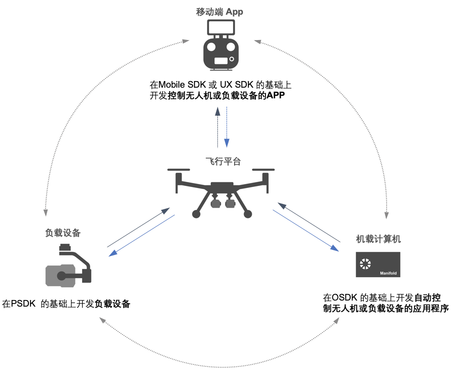

## 概述
基于DJI OSDK 开发的应用程序能够与基于MSDK 开发的移动端APP 和基于PSDK 开发的负载设备相互通信，如用户从基于MSDK 开发的移动端APP 向无人机发送控制指令，控制负载设备和机载计算机执行指定的任务；基于OSDK 开发的应用程序控制负载设备执行所需的动作，向基于MSDK 开发的移动端APP 发送状态信息；基于PSDK 开发的负载设备向基于MSDK 开发的移动端APP 和基于OSDK 开发的应用程序发送视频码流或文件等类型的数据，如 图1.SDK 互联互通 所示。    

<div>
<div style="text-align: center"><p>图1.SDK 互联互通 </p>
</div>
<div style="text-align: center"><p><span>
      </span></p>
</div></div>

使用SDK 互联互通功能，开发者能够：
* 按需动态创建所需使用的传输通道
* 根据业务需求，创建信道传输指定业务的数据
* 全双工通信，数据收发同步

## 基础概念
> **本文所指**
> * 客户端：根据指定的信道ID，发起信道连接的一端，如基于MSDK 开发的移动端APP。
> * 服务器端：根据用户的实际需求，创建信道并指定信道类型ID 的一端，如基于OSDK 开发的应用程序。

#### 传输方式
* 可靠传输
为确保基于不同SDK 开发的应用程序和设备间能够实现可靠传输，DJI SDK 为开发者提供可靠传输的传输方式，在该方式下，DJI SDK 内部采用了丢包重传、超时重发及错误检验等机制，确保不同SDK 间收发的数据准确可靠。
  * 数据可靠：以可靠传输的方式传输数据的双方，在发送和接收数据时需使用校验函数检验传输数据的正确性，同时DJI SDK 使用加密算法加密所传输的数据，确保传输数据的安全性。
  * 传输可靠：使用DJI SDK 的数据传输功能拥有计时器和ACK 机制，能够在数据传输超时后将重发该数据，确保对端能够正常接收所发送的数据，防止数据意外丢失；此外，以可靠传输的方式传输数据时，发送端将为所发送的数据编号，接收端依靠数据编号能够重排接收到的乱序数据，确保数据传输的可靠性。
* 不可靠传输
以不可靠的传输方式传输数据时，使用不同SDK 所开发的应用程序和设备间能够以更快的速度传输数据，但无法保证可靠地传输数据。

#### 对象指定
DJI SDK 的互联互通功能，通过设备类型和设备槽位能够准确指定无人机上所需通信的设备或模块。
* 设备类型：为方便开发者识别对端的身份和类型，更好地区分数据传输的对象，数据传输功能根据DJI SDK 提供了MSDK、OSDK和PSDK 三种设备类型。
> **说明：** 在SDK 互联互通功能中，仅基于OSDK 开发的应用程序和基于PSDK 开发的负载设备可对外开放信道供基于MSDK 开发的移动端APP 连接和使用，或相互连接以传输数据。

* 设备槽位：DJI 的无人机具有强大的扩展能力，开发者能够以多种拓展方式接入三台负载设备、双控以及机载计算机等设备，因此可使用不同的槽位区分移动端APP、负载设备和机载计算机当前所处的位置。

* 信道ID：为方便开发者选择和使用通信信道，区分同一个设备上的不同信道，DJI SDK 为互联互通功能提供了设置信道ID的功能，开发者创建信道时可为创建的信道指定ID。
> **说明** 
> * 仅基于OSDK 开发的应用程序和基于PSDK 开发的负载设备在使用数据传输功能时，需要为创建的信道指定信道ID。
> * 开发者可以根据实际的使用需求，在创建信道时，为所创建的信道指定信道ID，最大支持设置65535 个信道。

#### 信道管理
为方便开发者快速开发出功能强大且可靠的应用程序和设备，无需关注SDK 互联互通功能底层的工作逻辑，DJI SDK 为互联互通功能赋予了强大的通信管理能力：
* 链路管理：管理链路的接入、关闭、销毁、重连及拥塞管理等
* 数据管理：数据转发、数据读写、流量控制、数据校验、乱序重排及丢包重传等
> **说明：** 为方便开发者使用SDK 互联互通功能，与现有的接口区分，DJI MSDK 使用“Pipeline” 表示信道管理功能。

#### 信道带宽
* 可靠传输
  * MSDK 上行（向服务器端发送数据）为3KB/S；下行（从服务器端接收数据）为250KB/S 
  * OSDK 与PSDK 间的数据传输速率为500KB/S 
  
## 使用SDK 互联互通功能(MSDK 端)
使用MSDK 开发的移动端APP 使用SDK 互联互通功能时，能够根据用户的使用需求，与指定的信道建立连接，实现数据的接收和发送；无需使用SDK 互联互通功能时，可断开已连接的信道。

> **说明：** 基于MSDK 开发的移动端APP 仅能作为客户端，通过信道ID 与指定的信道建立连接。

#### 1. 信道连接
信道连接时，请使用如下接口指定信道传输方式和所需连接的信道ID 与指定的信道建立连接，并以阻塞回调的方式接收传输的数据。     

* iOS
```c
- (void)connect:(uint16_t)Id pipelineType:(DJITransmissionControlType)transferType withCompletion:(void (^_Nullable)(DJIPipeline *_Nullable pipeline, NSError *_Nullable error))completion;
```

* Java
```java
    void connect(int id, @NonNull TransmissionControlType transmissionType, @Nullable CommonCallbacks.CompletionCallback<PipelineError> callback);
```

#### 2. 数据接收
信道建立连接后，基于MSDK 开发的移动端APP 使用如下接口接收对端发送数据。     

* iOS
```c
- (NSData *)readData:(uint32_t)readLength error:(NSError **)error;
```

* Java
```java
int readData(byte[] buff, int length);
```

#### 3. 数据发送
信道建立连接后，基于MSDK 开发的移动端APP 使用如下接口向对端发送数据。  
>**说明：** 为实现良好的数据传输效果，建议每次传输的数据不超过1KB。
* iOS
```c
- (int32_t)writeData:(NSData *)data error:(NSError **)error;
```
* Java
```java
int writeData(byte[] data);
```

#### 4. 关闭信道
通信结束后，请使用如下接口断开已连接的信道。
> **说明** 
> * 执行信道关闭的操作后，基于MSDK 开发的移动端APP 将清除本地的缓存信息。
> * 信道关闭后，DJI SDK 将自动销毁已创建的信道，释放信道所占用的系统资源。

* iOS
```c
- (void)disconnect:(uint16_t)Id withCompletion:(DJICompletionBlock)completion;
```

* Java
```java
    void disconnect(int id, @Nullable CommonCallbacks.CompletionCallback<PipelineError> callback);
```

## 使用SDK 互联互通功能(OSDK 端)
仅使用Linux 平台的机载计算机支持开发者基于OSDK 开发互联互通功能。       
基于OSDK 开发的应用程序既能作为客户端，也可作为服务器端：
* 作为客户端时，用户可通过信道ID 与指定的信道建立连接。
* 作为服务端时，基于OSDK 开发的应用程序可根据用户的使用需求创建信道并指定信道ID，仅当服务器端与客户端建立连接后，服务器端方可读写数据。


#### 1. 初始化
基于OSDK 开发的应用程序如需使用SDK 互联互通功能，需要先初始化SDK 互联互通模块。

##### 作为客户端
当基于OSDK 开发的应用程序作为客户端时，可将该机载计算机视为无人机的负载设备，因此，请使用DJI Payload SDK 中的PSDKManager 类初始化SDK 互联互通功能。

```c
ErrorCode::ErrorCodeType ret = vehicle->psdkManager->initPSDKModule(
    PAYLOAD_INDEX_0, "Main_psdk_device");
if (ret != ErrorCode::SysCommonErr::Success) {
  DERROR("Init PSDK module Main_psdk_device failed.");
  ErrorCode::printErrorCodeMsg(ret);
}
```

##### 作为服务器端
当基于OSDK 开发的应用程序作为服务器端时，需要先初始化Vehicle 类，并通过调用vehicle->mopServer 中的accept 接口阻塞指定的信道ID。

```c
#define TEST_MO_PIPELINE_ID 20

......
  if (vehicle->mopServer->accept((PipelineID)TEST_MO_PIPELINE_ID, UNRELIABLE, MO_Pipeline) != MOP_PASSED) {
    DERROR("MOP Pipeline accept failed");
    return -1;
  } else {
    DSTATUS("Accept to mop pipeline id(%d) successfully", TEST_MO_PIPELINE_ID);
  }
......
```

#### 2. 获取客户端对象的指针
**仅当基于OSDK 开发的应用程序作为客户端时**，需获取使用SDK 互联互通功能客户端的指针，并通过该指针创建数据传输的信道或读写所需传输的数据。
      
```c
MopClient *mopClient = NULL;
ret = vehicle->psdkManager->getMopClient(PAYLOAD_INDEX_0, mopClient);
if (ret != ErrorCode::SysCommonErr::Success) {
  DERROR("Get MOP client object for_psdk_device failed.");
  ErrorCode::printErrorCodeMsg(ret);
  return NULL;
}
 
if (!mopClient) {
  DERROR("Get MOP client object is a null value.");
  return NULL;
}
```

#### 3. 信道连接
**仅当基于OSDK 开发的应用程序作为客户端时**，需指定所需连接的信道ID 和信道类型，与指定的信道建立连接。

```c
#define TEST_OP_PIPELINE_ID 15

MopPipeline *OP_Pipeline = NULL;
if ((mopClient->connect(TEST_OP_PIPELINE_ID, RELIABLE, OP_Pipeline)
    != MOP_PASSED) || (OP_Pipeline == NULL)) {
  DERROR("MOP Pipeline connect failed");
  return NULL;
} else {
  DSTATUS("Connect to mop pipeline id(%d) successfully", TEST_OP_PIPELINE_ID);
}
```

#### 4. 数据接收
创建信道后，开发者可在该信道上以阻塞回调（同步回调）的方式接收对端传输的数据。

##### 客户端接收数据
仅当基于OSDK 开发的应用程序作为客户端时，请使用如下接口接收服务器端发送的数据。

```c
MopErrCode mopRet;
......
uint8_t recvBuf[1024];
MopPipeline::DataPackType readPack = {recvBuf, 1024};
mopRet = OP_Pipeline->recvData(readPack, &readPack.length);
......
```

##### 服务器端接收数据
仅当基于OSDK 开发的应用程序作为服务器端时，请使用如下接口读取客户端发送的数据。

```c
MopErrCode mopRet;
......
uint8_t recvBuf[1024];
MopPipeline::DataPackType readPack = {recvBuf, 1024};
mopRet = MO_Pipeline->recvData(readPack, &readPack.length);
......

```

#### 5. 数据发送
创建信道后，开发者可在该信道上向对端发送数据。

##### 客户端发送数据
仅当基于OSDK 开发的应用程序作为客户端时，请使用如下接口向服务器端发送数据。

```c
MopErrCode mopRet;
uint8_t sendBuf[1024];
......
MopPipeline::DataPackType reqPack = {sendBuf, 1024};
mopRet = OP_Pipeline->sendData(reqPack, &reqPack.length);
......
```

##### 服务器端发送数据
仅当基于OSDK 开发的应用程序作为服务器端时，请使用如下接口向客户端发送数据。

```c
MopErrCode mopRet;
uint8_t sendBuf[1024];
......
MopPipeline::DataPackType reqPack = {sendBuf, 1024};
mopRet = MO_Pipeline->sendData(reqPack, &reqPack.length);
......
```

#### 6. 关闭信道
通信结束后，请使用如下接口断开与指定信道的连接，释放信道占用的系统资源。

##### 客户端关闭信道
仅当基于OSDK 开发的应用程序作为客户端时，请使用如下接口关闭已创建的信道。

```c
if (mopClient->disconnect(TEST_OP_PIPELINE_ID) != MOP_PASSED) {
  DERROR("MOP Pipeline disconnect pipeline(%d) failed", TEST_OP_PIPELINE_ID);
} else {
  DSTATUS("Disconnect mop pipeline id(%d) successfully", TEST_OP_PIPELINE_ID);
}
```
##### 服务器端关闭信道
仅当基于OSDK 开发的应用程序作为服务器端时，请使用如下接口关闭已创建的信道。
```c
if (vehicle->mopServer->close(TEST_MO_PIPELINE_ID) != MOP_PASSED) {
  DERROR("MOP Pipeline disconnect pipeline(%d) failed", TEST_MO_PIPELINE_ID);
} else {
  DSTATUS("Disconnect mop pipeline id(%d) successfully", TEST_MO_PIPELINE_ID);
}
```

## 使用SDK 互联互通功能(PSDK 端)
仅使用Linux 平台开发的负载设备支持开发者基于PSDK 开发互联互通功能。       
基于PSDK 开发的应用程序只可作为服务器端，可根据用户的使用需求创建信道并指定信道ID，仅当与客户端创建连接后，方可读写数据。

#### 1. SDK 互联互通功能初始化
基于PSDK 开发的负载设备如需使用SDK 互联互通功能，需要先初始化SDK 互联互通模块。

```c
T_PsdkReturnCode PsdkMopChannel_Init(void);
```

#### 2. 创建信道
基于PSDK 开发的负载设备根据用户指定的需求，创建相应的信道类型：可靠传输和不可靠传输。
      
```c
T_PsdkReturnCode PsdkMopChannel_Create(T_PsdkMopChannelHandle *channelHandle, E_PsdkMopChannelTransType trans);
```

#### 3. 信道连接
基于PSDK 开发的负载设备作为服务器端，在与对端建立连接时，需指定信道的ID，供客户端绑定；为方便同时与多个客户端建立连接，PSDK 提供了outChannelHandle 句柄。    
1. 信道绑定    
基于PSDK 开发的负载设备通过指定的ID 与客户端通信。        
```c
T_PsdkReturnCode PsdkMopChannel_Bind(T_PsdkMopChannelHandle channelHandle, uint16_t channelId);
```
2. 接受连接        
基于PSDK 开发的负载设备通过如下接口，接受对端发送的连接请求。  
```c
T_PsdkReturnCode PsdkMopChannel_Accept(T_PsdkMopChannelHandle channelHandle, T_PsdkMopChannelHandle *outChannelHandle);
```
> **说明：** 该接口为阻塞式的接口，当基于PSDK 的负载设备作为服务器端时，为能够同时与多个客户端建立连接，请在单独的线程中调用该接口。

#### 4. 数据接收
创建信道后，开发者可在该信道上接收对端传输的数据。
```c
T_PsdkReturnCode PsdkMopChannel_RecvData(T_PsdkMopChannelHandle channelHandle, uint8_t *data,  uint32_t len,  uint32_t *realLen);
```

#### 5. 数据发送
创建信道后，开发者可在该信道上向对端发送数据。

```c
T_PsdkReturnCode PsdkMopChannel_SendData(T_PsdkMopChannelHandle channelHandle, uint8_t *data, uint32_t len, uint32_t *realLen);
```

#### 6. 关闭信道
通信结束后，请使用如下接口断开与指定信道的连接，释放信道占用的系统资源。

* 关闭信道
调用如下接口关闭已创建的信道，关闭后，该信道将无法收发数据，但可使与其他信道重新建立连接。

```c
T_PsdkReturnCode PsdkMopChannel_Close(T_PsdkMopChannelHandle channelHandle);
```

* 销毁信道
调用如下接口销毁指定的信道。
```c
T_PsdkReturnCode PsdkMopChannel_Destroy(T_PsdkMopChannelHandle channelHandle);
```
