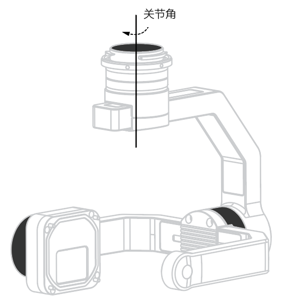
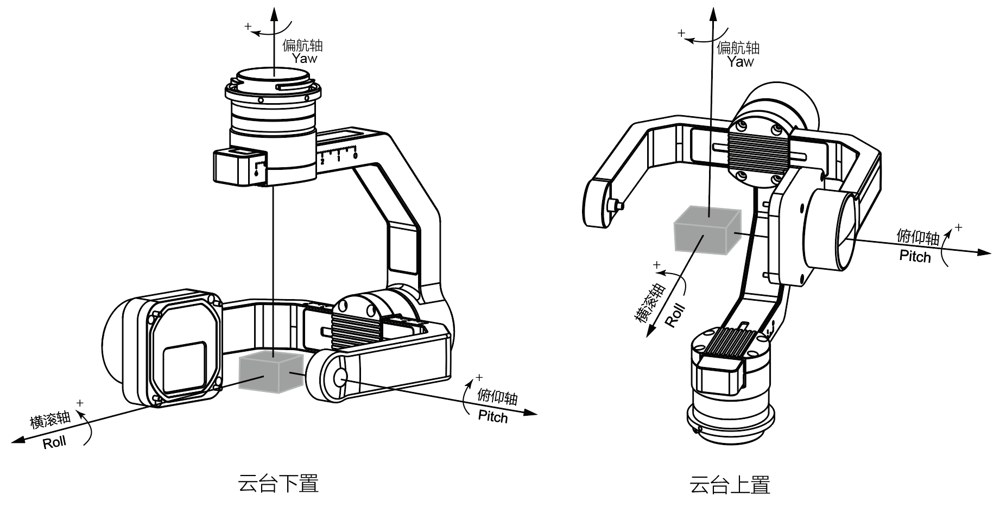

## 概述
使用OSDK开发的应用程序能够在**无人机飞行的过程中**，按照指定的逻辑控制云台的角度。

## 基础概念
### 云台角度
#### 云台关节与云台关节角  
云台的关节如图1.云台关节 所示，云台关节是云台上带动负载设备转动的结构件：云台电机，云台关节角即云台电机转动的角度。本教程使用机体坐标系描述云台的关节角。    

<div>
<div style="text-align: center"><p>图1.云台关节 </p>
</div>
<div style="text-align: center"><p><span>
      </span></p>
</div></div>
  
#### 云台姿态与云台姿态角
云台的姿态如 图2.云台姿态 所示，根据用户的控制指令，云台能够调整姿态；云台姿态角即使用大地坐标系（NED，北东地坐标系）描述云台上**负载设备**的角度，该角度也称为欧拉角。

<div>
<div style="text-align: center"><p>图2.云台姿态  </p>
</div>
<div style="text-align: center"><p><span>
      </span></p>
</div></div>
   

### 云台控制
* 控制方式
  * 绝对角度控制：使用OSDK 开发的云台根据用户的指令，在规定的时间内，从**当前的位置**转动到指定的位置。
  * 速度控制：用户可控制使用OSDK 开发的云台的转动速度。  
  
  > **说明** 
  > * 在角度控制模式下，云台转动的时间受云台最大旋转速度和最大加速度限制，实际的转动角度受云台限位角度的限制。   
  > * 在速度控制模式下，云台根据用户指定的速度转动0.5s，当云台转动到限位角时，将会停止转动。   

* 云台模式：目前OSDK 的云台控制功能**仅支持**自由模式，在该模式下，当无人机的姿态改变时，云台将不会转动。

### 云台状态信息
使用OSDK 开发的应用程序能够获取指定云台当前的信息，详细信息请参见**OSDK API 文档**。

## 使用云台管理功能

#### 1. 云台控制功能模块初始化
使用“云台控制”功能前，需要调用云台控制功能的类`GimbalManagerSyncSample`，创建云台控制功能的对象并初始化指定的云台。

```c++
GimbalManagerSyncSample *g = new GimbalManagerSyncSample(vehicle);
ret = vehicle->gimbalManager->initGimbalModule(PAYLOAD_INDEX_0,
                                                "Sample_gimbal_1");

if (ret != ErrorCode::SysCommonErr::Success)
{
  DERROR("Init Camera module Sample_gimbal_1 failed.");
  ErrorCode::printErrorCodeMsg(ret);
}
ret = vehicle->gimbalManager->initGimbalModule(PAYLOAD_INDEX_1,
                                                "Sample_gimbal_2");
```

#### 2. 获取云台的状态信息
创建云台控制功能的对象并初始化指定的云台后，即可获取用户指定的云台的信息。

```c++
DSTATUS("Current gimbal %d angle (p,r,y) = (%0.2f°, %0.2f°, %0.2f°)", PAYLOAD_INDEX_0,
      g->getGimbalData(PAYLOAD_INDEX_0).pitch,
      g->getGimbalData(PAYLOAD_INDEX_0).roll,
      g->getGimbalData(PAYLOAD_INDEX_0).yaw);
```

### 3. 控制云台转动
通过`GimbalManagerSyncSample`中指定的接口控制云台的姿态。

```c++
GimbalModule::Rotation rotation;
        rotation.roll = 0.0f;
        rotation.pitch = 25.0f;
        rotation.yaw = 90.0f;
        rotation.rotationMode = 0; 
        rotation.time = 0.5;
        g->rotateSyncSample(PAYLOAD_INDEX_0, rotation);
```

### 4. 云台回中
使用OSDK 开发的应用程序支持将云台的俯仰轴和偏航轴转动至中位。

```c++
g->resetSyncSample(PAYLOAD_INDEX_0);
```


