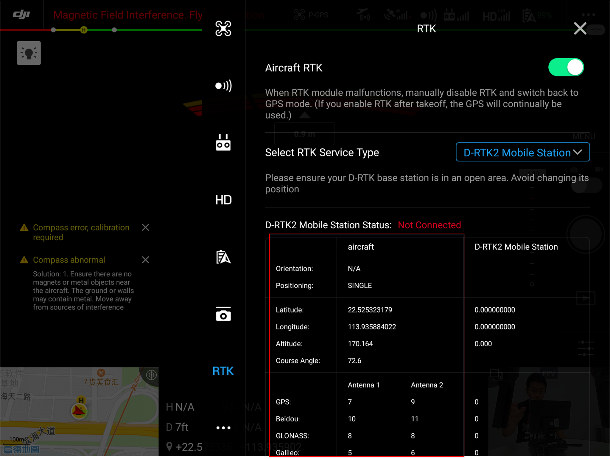
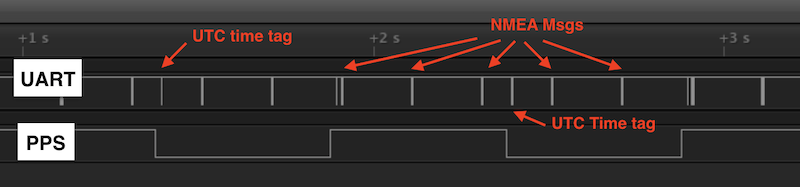

## 概述
OSDK 提供了时间同步功能，方便开发者通过使用基于OSDK 开发的应用程序同步传感器、记载计算机及无人机上的时间，实现传感器数据融合等功能；还支持同步无人机与GPS 系统的时间，实现精准定位等功能。

>**说明** 
> * 仅**具有RTK 功能的无人机**支持使用时间同步功能。
> * 使用时间同步功能前，请通过移动端APP 确认无人机与RTK 或GPS 卫星间保持良好的通信状态，该移动端APP 可为DJI 发布的APP，如DJI Pilot，也可为基于MSDK 开发的移动端APP，如 图1.查看卫星通信状态 所示，若无人机与RTK 或GPS 卫星间的通信状态较差，基于OSDK 开发的应用程序将无法实现时间同步功能。  
<div>
<div style="text-align: center"><p>图1.查看卫星通信状态 </p>
</div>
<div style="text-align: center"><p><span>
      </span></p>
</div></div>

## 时间同步
时间同步是一种使用PPS 信号，通过与**GPS 卫星**通信，实现**无人机与GPS 系统时间同步**的功能；具有“时间同步”功能的应用程序，不仅方便用户快速分析传感器采样的数据，还能提高相机曝光时间的精准度，以及实现获取精准定位信息等高级功能；时间同步功能支持以1Hz 的频率获取RTK 数据，支持以5Hz 的频率获取GPS 数据。     

OSDK 时间同步的流程如下所示：    
1. 无人机通过指定的硬件接口发送PPS 信号，用于同步机载计算机和传感器上的时间，同时发送UTC 时间戳；
2. 无人机与RTK 或GPS 卫星在通信状态良好的情况下，无人机将以1Hz 的频率发送RTK 数据包，以5Hz 的频率发送GPS 数据包，其中包含NMEA 数据。

> **说明：** 无人机脉冲在上升沿处（从0V上升到3.3V）产生UTC 时间戳。

## 使用时间同步功能
#### 以异步的方式实现时间同步功能
* 获取NMEA 信息
```c++
void subscribeNMEAMsgs(VehicleCallBack cb, void *userData);
void unsubscribeNMEAMsgs();
```

* 获取UTC 时间戳

```c++
void subscribeUTCTime(VehicleCallBack cb, void *userData);
void unsubscribeUTCTime();
```

* 获取无人机上的时间
```c++
void subscribeFCTimeInUTCRef(VehicleCallBack cb, void *userData);
void unsubscribeFCTimeInUTCRef();
```

* 获取无人机的PPS 信息
```c++
void subscribePPSSource(VehicleCallBack cb, void *userData);
void unsubscribePPSSource();
```

#### 以同步的方式实现时间同步功能 
* 获取NMEA 信息
```c++
bool getNMEAMsg(NMEAType type, NMEAData &nmea);
```

* 获取UTC 时间戳
```c++
bool getUTCTime(NMEAData &utc);
```

* 获取无人机上的时间
```c++
bool getFCTimeInUTCRef(DJI::OSDK::ACK::FCTimeInUTC &fcTimeInUTC);
```

* 获取无人机的PPS 信息
```c++
bool getPPSSource(PPSSource &source);
```

实现无人机、传感器与机载计算机的时间同步后，无人机所输出的PPS 硬件脉冲，如 图2.时间同步信号 所示。

<div>
<div style="text-align: center"><p>图2.时间同步信号</p>
</div>
<div style="text-align: center"><p><span>
      </span></p>
</div></div>
      
