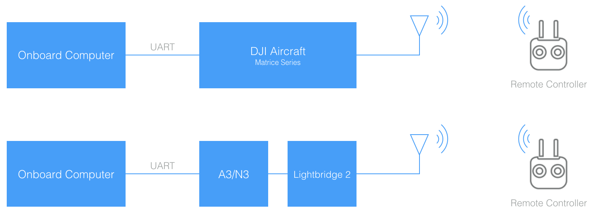
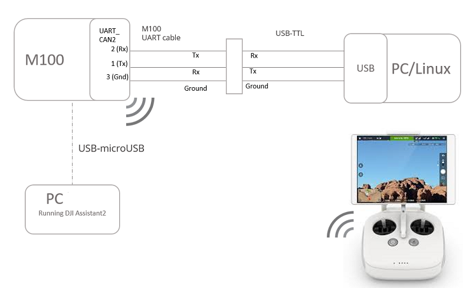
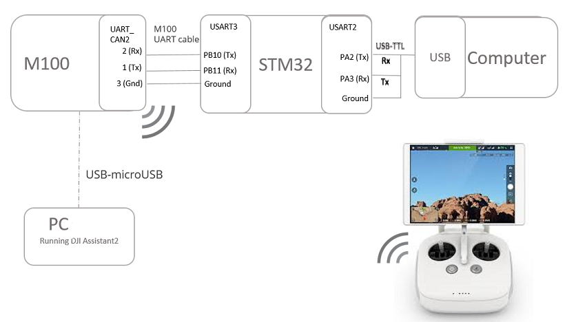
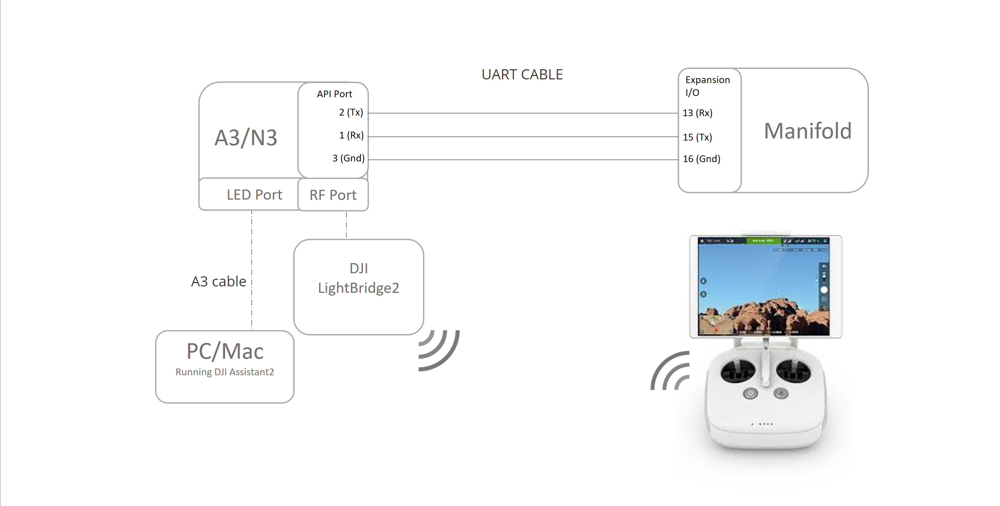
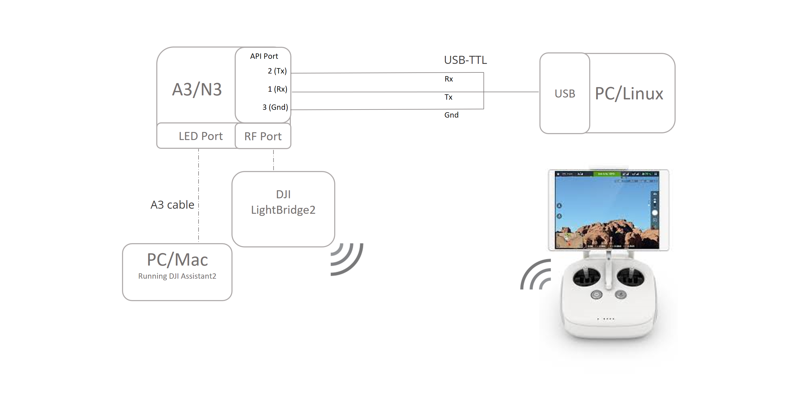
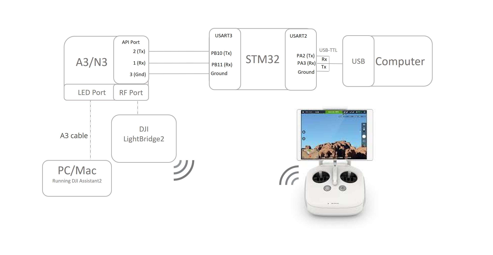

This guide will help you connect your onboard embedded system (OES) with the M100 vehicle, M600 vehicle, A3 or N3 flight controller. You may need to build or buy your own cable to connect your OES to a DJI product. Reference the M100 or A3/N3 UART connector diagrams below to build a cable to interface with your OES UART port. The M600 uses an A3 flight controller, which is accessable through the top cover.  See the M600 user manual for details.

## Interface Details
- The M100/600/A3/N3 UART electrical interface is 3.3 volt TTL.
- You must ensure that your OES UART port is compatible to avoid damaging the flight controller. For example, RS-232 ports will need a level-shifting circuit.
- The UART interface does not require power from the OES

## General Setup Instructions
- If you are using an M100, M210 or M600 vehicle, you should assemble and familiarize yourself with flying the vehicle before attempting to proceed with OSDK development.
- If you are using an A3/N3 flight controller with Lightbridge 2 and your own vehicle, then you should familiarize yourself with flying your vehicle before attempting to proceed with OSDK development.
- Generically, you will be working with one of the setups in the following diagram:

## Connecting Your Onboard Embedded System (OES)

- If you are using one of our supported platforms, we provide detailed instructions in our [Hardware Setup Guide](../hardware-setup/index.html).
- The [Hardware Setup Guide](../hardware-setup/index.html) also lists the pin diagram for the API port on the [M100](../hardware-setup/index.html#M100-UART-Connector), the [A3/N3/M600](../hardware-setup/index.html#A3-UART-Connector) and the [M210](@todo) so that you may build your own cable compatible with your OES.
- A3 flight controller can be accessed on the M600 (or M600 Pro) by pulling off the top-cover.
- You can power your OES from your own battery or if you are using an M100/M600/M210, you can pull power from the vehicle bus. See your aircraft manual for details.
- Secure your OES to the vehicle near the center of mass. Ensure that the total vehicle weight is within the maximum takeoff weight specificed for your vehicle.

## UART Connectors

#### M100

 

#### A3/N3/M600 UART Connector

 

**Note: Do NOT use the Vcc pin to power your own devices. You might damage your OES, A3/N3 or both.**

## Connecting to your OES

#### M100 + Manifold

The diagram below shows the hardware connection between an M100 and Manifold. Note that: 
- UART cable is provided with the Manifold. 
- M100 to PC connection can be used to run DJI Assistant 2. 
- With DJI Assistant you can enable API, set baudrate and/or run the Simulator.

#### M100 + PC/Linux machine

The diagram below shows the hardware connection between an M100 and a PC or Linux machine. Note that: 
- M100 UART cable is provided in the box and is also [sold](http://store.dji.com/product/matrice-100-uart-cable) separately. 
- USB to TTL cable can be purchased on [Amazon](https://www.amazon.com/ADAFRUIT-INDUSTRIES-954-SERIAL-RASPBERRY/dp/B00DJUHGHI/ref=sr_1_5?s=electronics&ie=UTF8&qid=1466208644&sr=1-5&keywords=usb+to+ttl).
- The two cables need to be connected on the TTL end to establish communication between M100 and PC/Linux. 
- M100 to PC connection is used to run DJI Assistant 2. 
- With DJI Assistant you can enable API, set baudrate and/or run the Simulator.

#### M100 + STM32

The diagram below shows the hardware connection between an M100 and STM32. Note that: 
- M100 UART cable is provided in the box and is also [sold](http://store.dji.com/product/matrice-100-uart-cable) separately. 
- USB to TTL cable can be purchased on [Amazon](https://www.amazon.com/ADAFRUIT-INDUSTRIES-954-SERIAL-RASPBERRY/dp/B00DJUHGHI/ref=sr_1_5?s=electronics&ie=UTF8&qid=1466208644&sr=1-5&keywords=usb+to+ttl).
- M100 UART cable connects to USART3 connector on STM32. 
- USB-TTL cable connects to USART2 connector on STM32. 
- PC is used for STM32 development. 
- In the STM32 sample App, users can send commands and receive feedback on a Computer. 

#### A3/N3/M600 + Manifold

The diagram below shows the hardware connection between an A3/N3 and Manifold. Note that:
- UART cable referenced in the image is a cable with 0.1 inch female headers on both sides going from Tx port on A3/N3 to Rx port on Manifold and vice-versa.
- Tx pin on Expansion I/O of the Manifold is pin 15. 
- Rx pin on Expansion I/O of the Manifold is pin 13. 
- Ground pin on Expansion I/O of the Manifold is pin 16. 
- A3/N3 to PC connection is used to run DJI Assistant 2.
- With DJI Assistant you can enable API, set baudrate and/or run the Simulator.

#### A3/N3/M600 + PC/Linux machine

The diagram below shows the hardware connection between an A3/N3 and a PC or Linux machine. Note that:
- USB to TTL cable can be purchased on [Amazon](https://www.amazon.com/ADAFRUIT-INDUSTRIES-954-SERIAL-RASPBERRY/dp/B00DJUHGHI/ref=sr_1_5?s=electronics&ie=UTF8&qid=1466208644&sr=1-5&keywords=usb+to+ttl).
- A3/N3 to PC connection is used to run DJI Assistant 2.
- With DJI Assistant you can enable API, set baudrate and/or run the Simulator. 

#### A3/N3/M600 + STM32

The diagram below shows the hardware connection between an A3/N3 and STM32. Note that:
- UART cable referenced in the image is a cable with 0.1 inch female headers on both sides going from Tx port on A3/N3 to Rx port on the STM32 and vice-versa.
- USB to TTL cable can be purchased on [Amazon](https://www.amazon.com/ADAFRUIT-INDUSTRIES-954-SERIAL-RASPBERRY/dp/B00DJUHGHI/ref=sr_1_5?s=electronics&ie=UTF8&qid=1466208644&sr=1-5&keywords=usb+to+ttl).
- UART cable betweenn A3/N3 and STM32 connects to USART3 connector on STM32.
- USB-TTL cable connects to USART2 connector on STM32. 
- PC is used for STM32 development. 
- In the STM32 sample App, users can send commands and receive feedback on a Computer.

