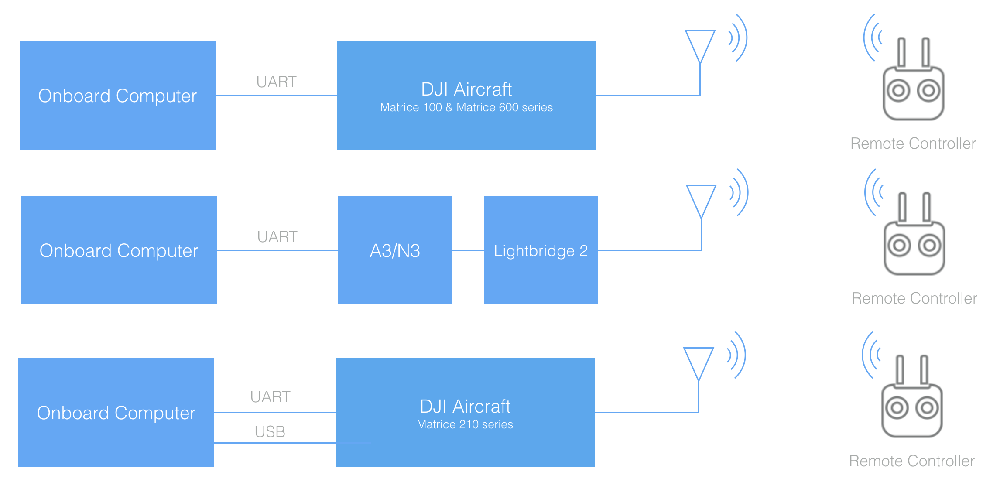

This guide will help you connect your Onboard Computer with the DJI aircraft (M100, M600, M600 Pro), or flight controller (A3, N3). 

## General Setup

### Data
The onboard computer communicates to the flight controller or DJI aircraft through a UART interface. Generally, you will be working with one of the setups in the below diagram:

> Note the M600 and M600 Pro have an A3 flight controller underneath the top cover.

The next section details the UART specifications for different DJI products, and gives examples of how the onboard compute can be connected.

### Power 

Power can be drawn directly from the power rail on DJI aircraft. It's possible a DC-DC regulator will also be required to convert the voltage to the onboard computer's power input.

If using a stand alone flight controller product, or if power is needed not just when the aircraft is on, then an external battery (with appropriate regulator) can be used.

## UART 

### Interface Details
- The UART electrical interface for all OSDK compatible DJI aircraft and flight controllers is 3.3 volt TTL.
- You must ensure that your onboard computer UART port operates at the same voltage to avoid damaging the flight controller. For example, RS-232 ports will need a level-shifting circuit.
- The UART interface does not require power from the onboard computer.

### Connector Pinout

#### M100

 

#### A3/N3/M600 UART Connector

 

**Note: Do NOT use the Vcc pin to power your own devices. You might damage your onboard computer, A3/N3 or both.**

## Connecting to your Onboard Computer

#### M100 + Manifold

The diagram below shows the hardware connection between an M100 and Manifold. Note that: 

- UART cable is provided with the Manifold. 
- M100 to PC connection can be used to run DJI Assistant 2. 
- With DJI Assistant you can enable the OSDK API, set baud rate and/or run the Simulator.

#### M100 + PC/Linux machine

The diagram below shows the hardware connection between an M100 and a PC or Linux machine. Note that: 

- M100 UART cable is provided in the box and is also [sold](http://store.dji.com/product/matrice-100-uart-cable) separately. 
- USB to TTL cable can be purchased on [Amazon](https://www.amazon.com/ADAFRUIT-INDUSTRIES-954-SERIAL-RASPBERRY/dp/B00DJUHGHI/ref=sr_1_5?s=electronics&ie=UTF8&qid=1466208644&sr=1-5&keywords=usb+to+ttl).
- The two cables need to be connected on the TTL end to establish communication between M100 and PC/Linux. 
- M100 to PC connection is used to run DJI Assistant 2. 
- With DJI Assistant you can enable the OSDK API, set baud rate and/or run the Simulator.

#### M100 + STM32

The diagram below shows the hardware connection between an M100 and STM32. Note that: 

- M100 UART cable is provided in the box and is also [sold](http://store.dji.com/product/matrice-100-uart-cable) separately. 
- USB to TTL cable can be purchased on [Amazon](https://www.amazon.com/ADAFRUIT-INDUSTRIES-954-SERIAL-RASPBERRY/dp/B00DJUHGHI/ref=sr_1_5?s=electronics&ie=UTF8&qid=1466208644&sr=1-5&keywords=usb+to+ttl).
- M100 UART cable connects to USART3 connector on STM32. 
- USB-TTL cable connects to USART2 connector on STM32. 
- PC is used for STM32 development. 
- In the STM32 sample App, users can send commands and receive feedback on the PC. 

#### A3/N3/M600 + Manifold

The diagram below shows the hardware connection between an A3/N3 and Manifold. Note that:

- UART cable can be made using 0.1 inch female headers on both sides going from Tx port on A3/N3 to Rx port on Manifold and vice-versa.
- Tx pin on Expansion I/O of the Manifold is pin 15. 
- Rx pin on Expansion I/O of the Manifold is pin 13. 
- Ground pin on Expansion I/O of the Manifold is pin 16. 
- A3/N3 to PC connection is used to run DJI Assistant 2.
- With DJI Assistant you can enable OSDK API, set baud rate and/or run the Simulator.

#### A3/N3/M600 + PC/Linux machine

The diagram below shows the hardware connection between an A3/N3 and a PC or Linux machine. Note that:

- USB to TTL cable can be purchased on [Amazon](https://www.amazon.com/ADAFRUIT-INDUSTRIES-954-SERIAL-RASPBERRY/dp/B00DJUHGHI/ref=sr_1_5?s=electronics&ie=UTF8&qid=1466208644&sr=1-5&keywords=usb+to+ttl).
- A3/N3 to PC connection is used to run DJI Assistant 2.
- With DJI Assistant you can enable OSDK API, set baud rate and/or run the Simulator. 

#### A3/N3/M600 + STM32

The diagram below shows the hardware connection between an A3/N3 and STM32. Note that:

- UART cable can be made using 0.1 inch female headers on both sides going from Tx port on A3/N3 to Rx port on the STM32 and vice-versa.
- USB to TTL cable can be purchased on [Amazon](https://www.amazon.com/ADAFRUIT-INDUSTRIES-954-SERIAL-RASPBERRY/dp/B00DJUHGHI/ref=sr_1_5?s=electronics&ie=UTF8&qid=1466208644&sr=1-5&keywords=usb+to+ttl).
- UART cable betweenn A3/N3 and STM32 connects to USART3 connector on STM32.
- USB-TTL cable connects to USART2 connector on STM32. 
- PC is used for STM32 development. 
- In the STM32 sample App, users can send commands and receive feedback on a Computer.

