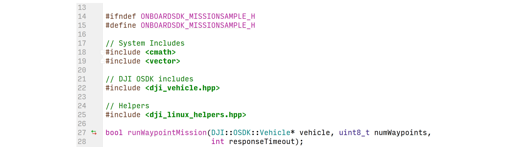
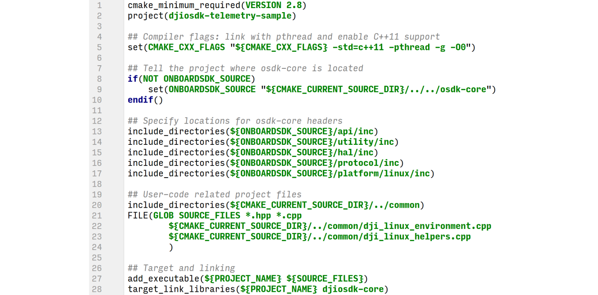

## Application Structure

The diagram below demonstrates what would typically be included in an application that uses the Onboard SDK.

In addition to the OSDK Core Library, and any application specific third party libraries, the application will also need to include a platform specific threading library. OSDK uses threading handle user requests, callbacks and UART communication simultaneously. 

The application links to OSDK Core and the platform threading library at run-time.

## Including DJI OSDK Headers in Your Code

The [hierarchy diagram](../introduction/sdk-architectural-overview.html#hierarchy) in the SDK Architectural Overview shows that the Vehicle class contains references to all components available through the OSDK.
Thus, `Vehicle` acts as an entry point for user code.

Let's take an example - `mission_sample` provided as part of the Linux samples. Here is a snippet of `mission_sample.hpp`:

- **L17-19**:   Includes that your application needs for the code you are writing
- **L22**:      DJI OSDK Include. This is the only DJI OSDK header you need to include in your application.
- **L25**:      Helper functions that read User Configuration files on the Linux platform, and execute activation of the drone.
                You may re-use these functions in your code if you are developing standalone applications for a Linux platform.

## Setting Up Dependencies

This section assumes you are using the CMake build system on Linux; the steps however are general enough to be
conceptually reused with different platforms/build systems.

- **L5**:       Making sure you enable C++11 support, and linking against other third-party libraries
- **L8-17**:    Telling the build system where to find `osdk-core` include files. If you install `osdk-core` to system,
                your includes will be in `/usr/local/include`, so in this example you would set `ONBOARDSDK_SOURCE` to be that directory.
- **L20-27**:   Telling your build system about your own code, and what executable to generate
- **L28**:      Linking your executable against `djiosdk-core`.

## Calling OSDK APIs

Every API that communicates with the flight controller has two overloads in the OSDK:

#### Blocking Overload API

Blocking APIs wait until the aircraft returns an acknowledgement. Blocking calls pass that acknowledgement, along with some metadata, to the caller as a return value for the API itself.
Most blocking APIs return an [ACK::ErrorCode](/onboard-api-reference/structDJI_1_1OSDK_1_1ACK_1_1ErrorCode.html); this allows querying of errors through the [ACK::getError](/onboard-api-reference/classDJI_1_1OSDK_1_1ACK.html#aa6a80877d41e0bffd3e44de1af585e09) and [ACK::getErrorCodeMessage](/onboard-api-reference/classDJI_1_1OSDK_1_1ACK.html#a140b7c908f55e5f6b7b9f32056828af1) APIs. Some blocking APIs have some additional information, and have specific return types.

One example of calling a blocking API and using the acknowledgement is shown in the image here, from the MFIO sample.

#### Non-blocking Overload API

Non-blocking APIs will return immediately after the request is sent to the aircraft, and developers are expected to implement and supply a callback function to a non-blocking API to deal with the acknowledgement from the aircraft. Use these in an asynchronous program - where the handling of acknowledgements is not essential to the correct operation of the main flow of logic in the program.

The image shows a non-blocking API being called, and its associated callback implementation that executes the exact same functionality as the blocking call shown above:

## The OSDK Threading Model

On systems that support threading (all platforms except the STM32), the OSDK runs three threads:

1. **Main** thread: The main flow of execution of the program happens here. Typically, all commands sent to the aircraft/FC are executed on this thread.
2. **Serial Read** thread: Telemetry data coming from the aircraft/FC is handled on the serial read thread, and acknowledgements/return types are populated here. Blocking calls will block the main thread until the read thread finishes processing its acknowledgement. Some callbacks are handled on this thread - those registered for asynchronous "push data" coming from the aircraft (this can be enabled through DJI Assistant 2's SDK page).
3. **USB Read** thread: A separate thread is created if [Advanced Sensing](../guides/component-guide-advanced-sensing-stereo-camera.html) feature on M210 is enabled. This feature works in subscription mechanism, once the images are subscribed, push data will keep coming through USB. This thread only provides reading functionality. If developers would like to run intense computation on the image data, it is suggested to create a separate thread. 
4. **Callback** thread: All callbacks that handle acknowedgements for commands sent to the aircraft/FC are executed on the callback thread.

Some things to note:
- Do not make blocking API calls in push data callbacks, since this will create a deadlock on your read thread and all subsequent calls will fail.
- On ROS, this threading model exists alongside ROS' own thread pool and the two do not directly interact.

Before you run your application, see the [Running your Application](run-application.html) page.
