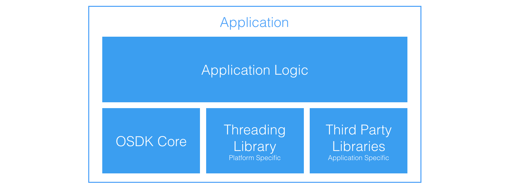

## Project Structure

This diagram shows the structure of the SDK in the context of writing apps:

## Including DJI OSDK Headers in Your Code

The [hierarchy diagram](../introduction/sdk-architectural-overview.html#hierarchy) in the SDK Architectural Overview shows that the Vehicle class contains references to all components available through the OSDK.
Thus, `Vehicle` acts as an entry point for user code.

Let's take an example - `mission_sample` provided as part of the Linux samples. Here is a snippet of `mission_sample.hpp`:

- **L17-19**:   Includes that your application needs for the code you are writing
- **L22**:      DJI OSDK Include. This is the only DJI OSDK header you need to include in your application.
- **L25**:      Helper functions that read User Configuration files on the Linux platform, and execute activation of the drone.
                You may re-use these functions in your code if you are developing standalone applications for a Linux platform.

## Setting Up Dependencies

This section assumes you are using the CMake build system on Linux; the steps however are general enough to be
conceptually reused with different platforms/build systems.

- **L5**:       Making sure you enable C++11 support, and linking against other third-party libraries
- **L8-17**:    Telling the build system where to find `osdk-core` include files. If you install `osdk-core` to system,
                your includes will be in `/usr/local/include`, so in this example you would set `ONBOARDSDK_SOURCE` to be that directory.
- **L20-27**:   Telling your build system about your own code, and what executable to generate
- **L28**:      Linking your executable against `djiosdk-core`.

Before you run your application, see the [Running your Application](run-application.html) page.
