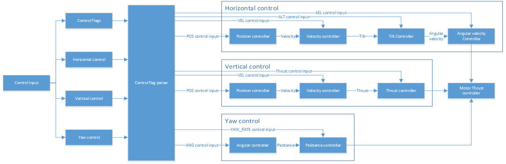

# Intorduction
## cascade controller model

## Dynamic saturation

### upper saturation

### lower saturation

## control model
Because each drone's motor dynamical model are different, DJI OSDK cannot provide a accurcy controler model gengrally.
You need to do the model identification by yourself if necessary.

## Control feedback

Flight controller cannot achive the required controller configuration input from control flags every time,
because the upper controller need more high leveled control feedback, which the flight controller may cannot collect them sometimes.

# Basic cascade controller

## Horizontal controller
### Position controller

Feedback input: GPS position or RTK position

### Velocity ocntroller

### Tilt controller

### Angular velocity controller

## Vertical controller
### Position controller

Feedback input: GPS position or RTK position

### Velocity controller

### Thrust controller

## Yaw controller

# feedforward controller
## speed feedforward controller

# construct your outter loop controller

