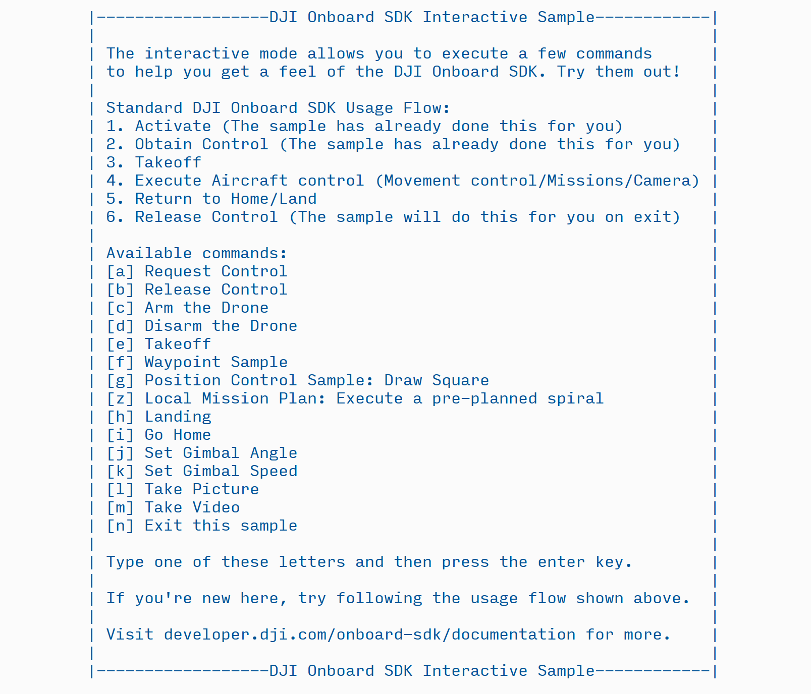

  > All-new Non-Blocking calls, LiDAR integration, Camera samples and Precision Trajectories for DJI Onboard SDK v3.1.9!

## Introduction

The C++ Linux example is meant to showcase recommended application-layer usage of the DJI Onboard API.

This example eases a new developer into the world of programming for drones - many API functions have been wrapped in easy-to-use implementations and a feedback mechanism is implemented so the developer always knows the result of his/her commands. Packaged with the new example is a new pthread-based threading implementation as well as an efficient serial device driver that implements many checks (on x86 systems) to ensure reliable communication between your Onboard Embeddeed System (OES) and your drone.   

With 3.1.9, the Linux example app comes in two flavors - synchronous (Blocking) and asynchronous (Nonblocking).

#### Synchronous Linux Example App
The following user-facing functionality is available in the Linux sample: 

* Activation
* Obtain/Release Flight Control 
* Take Off 
* Landing 
* Go Home
* Still Image Capture
* Video Capture
* Gimbal Movement Control  
* Movement Control - Position/Attitude/Velocity control modes
* Waypoint Functionality
* Compatible with DJI iOS Mobile OSDK App
* Sample Waypoint Mission implementation
* Sample Position Control implementation
* Sample Gimbal and Camera Control implementation
* Precision Trajectory Mission Plans

This sample also implements an optional LiDAR Logging example that uses the vlp16lidar-driver library documented [here](../../sensor-integration-guides/velodyne/readme.html). This example gives you the option to log LiDAR data from a Velodyne PUCK or a Simulator to log data in pcap format and LAS format. 

The following user-facing functionality is available with the LiDAR logging sample: 

* Start LiDAR Logging
* Stop LiDAR Logging

This functionality can be enabled by building the top-level cmake with the argument. 
```c
-DLIDAR_LOGGING=ON
```

#### Asynchronous Linux Example App
Apart from the Blocking Linux sample, we also support a reduced feature set Non-Blocking sample for this release. This allows the callbacks to run on a different thread, allowing the send commands to run independent from the callbacks. 

The following user-facing functionality is available in the new Non-Blocking Linux sample:

* Activation
* Obtain/Release Flight Control 
* Take Off 
* Landing 
* Compatible with iOS DJI Mobile OSDK App

The examples are extensible - if you want to build additional functionality, it is easy to do so within the framework of these examples. 

---
## Setup

##### 1. Hardware

The [Hardware Setup](../../hardware-setup/index.html) guide talks about setting up your OES of choice. Make sure your setup matches that in the document before proceeding further. 

##### 2. Software

**Toolchain**

To build either Linux example, you need:

* A supported C++ compiler (Tested with gcc 4.8.1/5.3.1)
* A bash shell
* CMake
* Ubuntu 16.04 on x86_64 OR Ubuntu 14.04 on ARM (DJI Manifold)

**Compilation**

* From Onboard SDK 3.1.9, CMake is the default build system. To build all the libraries and sample apps, we provide a simple build script.
* At the top level, run the build script with the syntax `./scripts/build —build-type Debug —clean true`. This should download dependencies and build all libraries and executables.
* To run the example app, go to `./build/bin` and run `djiosdk-linux-sample` or `djiosdk-linux-sample-nonblock` with options described elsewhere in this document.

To access the serial port, add your username to the dialout group by typing `sudo usermod -a -G dialout $USER` (you do not need to replace $USER with your username). **Then logout and login again.**  

**Using the Simulator**

* Connect your M100/A3 to a PC through USB.
* Open up DJI Assistant 2. Click on the DJI M100/A3 button. If this button doesn't show up, try disconnecting and reconnecting the USB.
* Click on the Simulator tab, and then click on the 'Open' button. A separate window should pop up in a few seconds.

* In the main window, click on 'Start Emulating'.


---
## Activation

The first time a drone/OES combination is used, it needs to be activated. Activation requires an App ID and a key got from the DJI website, and requires an internet connection and an RC connected to a mobile device running DJI GO. The image below shows the flow of information during activation:


1. [Enable API control](../../quick-start/index.html#3-Enable-Flight-Controller-API-control) and [get an app ID and key](../../quick-start/index.html#5-Onboard-Application-Registration).
2. Navigate to `sample/Linux/UserConfig.txt` and enter your App ID and Key in place of the defaults in that file.
3. Proceed to the instructions under [Operation](#Operation)

---
## Operation

To run the Linux Blocking sample, follow these steps:

* Navigate to `sample/Linux/Blocking/UserConfig.txt` and enter your serial port in the `DeviceName` and baud rate in the `BaudRate` field.  
    * The default baudrate is `230400`. If you change this, remember to also change it in DJI Assistant 2.  
    * The default port is `/dev/ttyUSB0`. This should be correct if you are using a USB-Serial adapter. On Manifold, you will be using `/dev/ttyTHSx` (x = 0,1,2) - refer to the [Hardware Setup Guide](../../hardware-setup/index.html) for more information.   
* In the `sample/Linux/Blocking` folder, assuming you have already executed `make`, run `bin/onboardSDK mode_of_operation` where `mode_of_operation` can be (more information about the modes [here](#modes-of-operation)):  
    * `-interactive` : Recommended mode for new developers. Shows a basic terminal UI and users can execute single commands with key presses.  
    * `-mobile` : Use with the brand new Mobile OSDK App. Useful for mobile-based triggering of OSDK commands with keys on iOS device.  
    * `-programmatic` : Use for automated execution. By default, the sample will first takeoff, then execute a waypoint mission, then automatically land and exit.
* Proceed to run the sample in one of these modes. Before the sample enters one of the three modes, it will attempt to activate the drone and obtain control. If everything goes well, you should see the following information on the terminal:

    

* You may follow the same instructions to run the Non-Blocking Linux sample. The Non-Blocking Linux sample supports a reduced feature set for '-interactive' and '-mobile' modes and does not support '-programmatic' mode.

> Note that the activation step is necessary each time. After the first time, the activation command merely performs a local activation check and you are not required to be connected to the internet.  
The sample will attempt automatic activation each time it is started.

#### Workflow


## Modes of Operation  

##### Interactive Mode 

The interactive mode is meant to give you a taste of the kinds of things you can do with the DJI Onboard SDK. The UI looks similar to the old [Commandline](../commandline/README.html) sample, but is easier to operate. The UI looks like this:



As the UI tells us, the sample has already activated and taken control on our behalf. Let's try the takeoff command - to do so, press `e` and then hit the enter key.


Once you have taken off, you may try some of the flight control functionality. After you have landed, type the exit letter - `n` - to let the sample clean up before exiting.


##### Mobile Mode 

The mobile mode is especially useful when you want to test out functionality on the Onboard SDK in a staged or interactive manner - simply make your code poll for commands from the companion mobile app and execute your mission/task/commands based on the mobile command sent. The mobile link is set up with a companion iOS [app](../MobileOnboardSDK/Mobile-OSDK.html).  

When you run the program in mobile mode, you can see a simple message after the standard initialization: 


The mobile mode listens to mobile commands for ~150 minutes before exiting.

##### Programmatic Mode

This is the most powerful mode of the new Linux sample - you can implement a complex, custom mission involving local navigation, trajectory following and waypoints using the programmatic mode. Together with [core API calls](../../application-development-guides/programming-guide.html), you can add hotpoint missions, automated picture and video to your automated program in this mode.

By default, the programmatic mode starts with automated, monitored takeoff (checks to see if takeoff actually executed, as well as how stable the takeoff is). Users can enter their own core API calls or Linux-sample calls after the takeoff returns and before landing is called. Here is the relevant code in `main.cpp`:

   

Line `108` is an example of an application layer function called within the programmatic mode. 

The result of this code is something like this:


## Examples

The Linux Blocking Application comes with two examples you can call through Interactive, Mobile or Programmatic mode:  

#### 1. Waypoint Mission Example

This example takes your current position (lat, lon, alt) and traces out a square of side 20 m. It will go north, then east, then south, and then west; if you are unaware of where your aircraft is pointing then **make sure to leave a clearing of 20m in all directions** when you try this example.

To try out the sample:   
* In interactive mode, first takeoff with the `e` key and then try the waypoint sample with the `f` key.
* In mobile mode, first takeoff from the `Core Functions` tab. Then go to the `Custom Missions` tab and choose `Waypoint Mission Test`.
* In programmatic mode, call `wayPointMissionExample` after calling `monitoredTakeoff`. 

The output looks like this (takeoff - waypoint test - landing):


#### 2. Draw a Square : Position Control Example.

The Position control example shows how to execute custom trajectories in local coordinates, useful for planning in a local space, executing complex trajectories and for use in GPS denied environments (with [DJI Guidance](http://www.dji.com/product/guidance) or [Velodyne Puck](http://velodynelidar.com/vlp-16-lite.html), for example) This example builds on the movement control functionality offered by the core API and adds a very simple receding setpoint algorithm to maintain constant speed. This sample will draw a square of side 10m and then proceed to draw two diagonals. First, the drone ascends 10 m from its current location. Then, it first moves right, then forward, then left, and backwards to its starting point. Then it will draw a diagonal at +45 degrees, go left along the side of the square, and draw the other diagonal at -45 degrees. **Leave a clearing of 20m around the drone before trying this example.**

The implementation of this example in `LinuxFlight.cpp` can serve as a great reference for any custom patterns you might want to draw.

To try out the sample:
* In interactive mode, first takeoff with the `e` key and then try the Draw a Square sample with the `g` key.
* In mobile mode, first takeoff from the `Core Functions` tab. Then go to the `Custom Missions` tab and choose `Draw a Square`.  
* In programmatic mode, call `drawSqrPosCtrlSample` after calling `monitoredTakeoff`. 

The output looks like this (takeoff - draw a square - landing):


#### 3. Camera And Gimbal Controls

X3 and X5 camera fixed to an aircraft will record images that pitch and roll with the aircraft as it moves. Multi rotor aircraft need to pitch and roll simply to move horizontally, and so getting a stable horizontal shot is not possible. A gimbal is used to keep a camera or sensor horizontal when its mount (e.g. aircraft) is moving. The gimbal has three motors controlling rotation in orthogonal axes. The gimbal feeds gyroscope information back to the motor controllers to compensate for rotational movement of the mount.

In addition to stabilization, the three motors can be used to control the direction the camera is pointing, and can be used to smoothly track a target, or pan a shot. The three axes of rotation are referred to as Pitch, Roll and Yaw, and the gimbal orientation is referred to as its attitude. Explanations of these axes can be found in the [Flight Control Concepts](https://developer.dji.com/mobile-sdk/documentation/introduction/flightController_concepts.html) section of the Mobile SDK.

Gimbals have mechanical limits (or stops) to their rotation around each axis. When a sensor is mounted on a gimbal, many data and control lines are required to go from mount to sensor. These control lines are usually bundled in a cable assembly or flex circuit, both of which will limit the available rotation of the gimbal. Additionally, gimbals will also limit rotation so cameras cannot see landing gear or the product itself.

##### Moving the Gimbal

- Move to an angle over a duration
- Move at a speed in a direction

When using angle mode to rotate the gimbal's pitch, roll and yaw, the rotation angle of the gimbal can be defined as either Absolute(relative to the aircraft heading), or Relative (relative to its current angle). When using speed to rotate the gimbal's pitch, roll and yaw, the direction can either be set to clockwise or counter-clockwise. The gimbal can be reset by setting its pitch, roll and yaw to 0 degrees. The reset position is pointing horizontally and being in the same direction as product heading. Gimbals will be automatically calibrated on power up. During calibration, the product should be stationary (not flying, or being held) and horizontal. For gimbal with adjustable payloads, the payload should be present and balanced before doing a calibration. At the moment, there is no option to calibrate the Gimbal through Onboard SDK APIs.

Implementation of this example is in `LinuxCamera.cpp` can be great reference for any Camera and Gimbal controls supported by DJI Onboard SDK.

To try out the sample in interactive mode:
* Press `j` to set Gimbal rotation angle (input range is 360 degrees)
* Press `k` to set Gimbal rotation speed
* Press `l` to perform still image capture
* Press `m` to perform video capture (5 seconds of video recording)

Sample output for setting Gimbal rotation angle:

```
Gimbal Angles Description [roll, pitch, yaw]:

Roll angle: unit 0.1º, input range [-350,350]
Pitch angle: unit 0.1º, input range [-900,300]
Yaw angle: unit 0.1º, input range [-3200,3200]

(NOTE: Yaw output rotation angle represented in [-π, π] range (see simulator output))

Waiting for Gimbal to sync rotation angle...

Initial Gimbal rotation angle: [0, 0, -0.3]

Setting new Gimbal rotation angle to [0,20,200] using incremental control:
New Gimbal rotation angle is [0 19 -160 ], with precision error: [0 1 0 ]

Setting new Gimbal rotation angle to [0,-50,-200] using absolute control:
New Gimbal rotation angle is [0 -50 159 ], with precision error: [0 0 1 ]

Setting new Gimbal rotation angle to [25,0,150] using absolute control:
New Gimbal rotation angle is [24 0 149 ], with precision error: [1 0 1 ]

Setting new Gimbal rotation angle to [5,0,100] using incremental control:
New Gimbal rotation angle is [29 0 -110 ], with precision error: [0 0 1 ]
```


NOTE: 
1. Please make sure you have SD card inserted into the Gimbal

Known Issues:
1. If set Gimbal rotation angle without simulator, initial Yaw Axis will report 120 however, it will not affect accuracy. For questions please refer to our forum.
 
