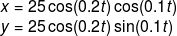
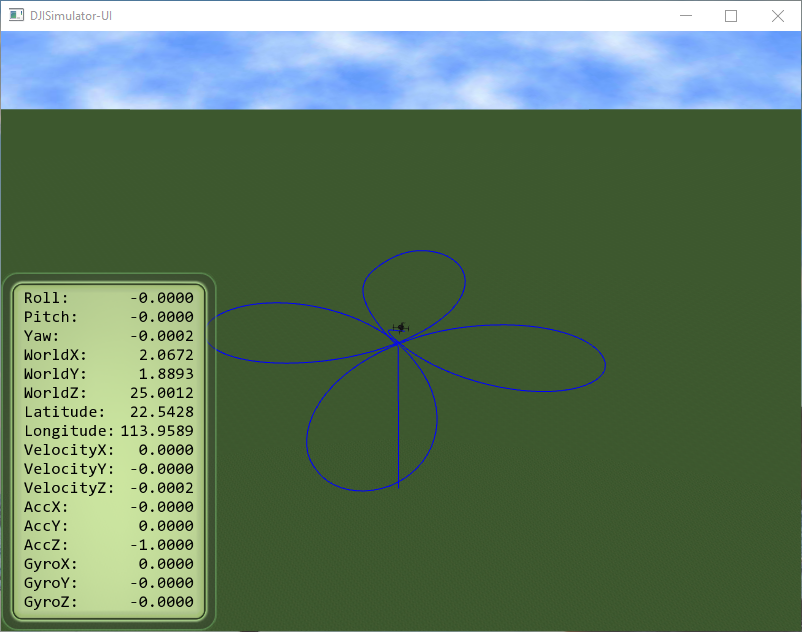

## Introduction

This example onboard App is built upon the <a href="http://www.st.com/content/st_com/en/products/evaluation-tools/product-evaluation-tools/mcu-eval-tools/stm32-mcu-eval-tools/stm32-mcu-discovery-kits/stm32f4discovery.html" target="_blank">STM32F407 Discovery</a> development kit (referred to as "STM32" later) with <a href="http://www2.keil.com/mdk5/" target="_blank">MDK-ARM</a> (Keil uVision) toolchain. The purpose is to demonstrate how to use the APIs provided by the Onboard SDK in a "bare-metal" embedded system.

The system has the following setup:


The user sends commands to the USART2 port of the STM32 from a serial terminal. Based on the commands received, the App communicates with the M100 connected to the USART3 port through the Onboard SDK and prints feedback/debug information to the user. Since version 3.1.8, an [iPhone/iPad App](../MobileOnboardSDK/Mobile-OSDK.html) named `Mobile OSDK` is created for the user to send some commands to the OES from a mobile device.

Before using this example App, make sure you have followed the [Quick Start](../../quick-start/index.html) and have valid APP KEY and APP ID.

> Update 01 Mar 17: Please update your Keil MDK compiler to the latest version (> 5.22) to successfully build the app.

## Setup

### Hardware Installation


Connect the USB-TTL cable to USART2 port of the STM32 (`PA2`，`PA3` are the TX and RX of the STM32 side, respectively). Connect USART3 port of the STM32 to the `UART_CAN2` port of the M100: the TX pin (`PB10`) of STM32 should be connected to the RX pin of M100, and the RX pin (`PB11`) of STM32 to the TX pin of M100. Refer to [Hardware Setup Guide](../../hardware-setup/index.html).

You'll need to use the <a href="http://developer.dji.com/onboard-sdk/downloads/" target="_blank">DJI Assistant 2 software</a> to set the baud rate of the M100's `UART_CAN2` port to **230400**, which is the one we use to configure USART3 in the example App.

To download (flash) the App binary to the STM32 board, connect the PC to the STM32's "mini-USB" port. To set the baud rate of the M100 or to run the simulator, connect the PC to the M100's "micro-USB" port.

### Toolchain Setup

The example App is developed and tested with MDK-ARM Version 5.22 or later. In order for Keil to build code for the target board, you need to use Keil's `Pack Installer` to install the latest STM32F4xx_DFP.2.x.x pack, as shown below. (Alternatively, you can download manually from <a href="http://www.keil.com/dd2/Pack/" target="_blank">http://www.keil.com/dd2/Pack/</a> and import the downloaded file from Pack Installer.)


### Build the example APP

First, clone the source code of the example app with its submodules using git:
> git clone --recursive https://github.com/dji-sdk/Onboard-SDK.git

Open the project located in `sample/OnBoardSDK_STM32/Project/OnBoardSDK_STM23.uvprojx` in Keil uVision IDE. To build the code, developers need to input the correct APP KEY and APP ID obtained from DJI Developer site in `OnboardSDK_STM32/User/Activate.cpp` file.

Use the menu item `Project->Build Target` and `Flash->Download` to build the project and flash to the STM32 board.

### Configure the serial terminal software

Set the baud rate of your serial terminal software (here we use the open-source <a href="http://realterm.sourceforge.net" target="_blank"> RealTerm </a>) to be **115200**, which is the one we use to configure USART2 in the example App. Configure the serial terminal to display the received information in Ascii mode and send commands in Hex mode.


## Activation

In order for the onboard App to obtain control of the drone, it needs to send an "Activation" command to the drone. Activation  tells the M100 that your onboard App is legitimate to control the drone. Make sure you have [Enabled API Control](../../quick-start/index.html#enable-api-control) using the DJI Assistant 2 software.

Starting from OSDK 3.2.1, the following two-step process is used for activation.

First, send the getDroneVersion command with the serial terminal.

> 0xFA 0xFB 0x00 0xFE

Next, send the activation command with serial terminal

> 0xFA 0xFB 0x01 0xFE


Note that the first activation requires internet connection (STM32 <==> M100 <==> Remote Control <==> DJI GO APP <==> Internet), since it needs to verify that the APP ID and APP KEY used in the onboard APP are valid. After the first activation, internet connection is not mandatory.

## Operation

This example App defines a very simple command protocol. Users send commands to the STM32 from a serial terminal. An example command sequence is given below:


### Command Format

Each command frame consists of frame header, command code, data (optional) and frame footer.

```
|<--Header->|<--Code-->|<--Data (Optional)-->|<-Footer->|
| 0xFA 0xFB |  2 bytes |    variable size    |   0xFE   |
```

When the STM32 receives a "0xFE" it will execute the command immediately.  

The following commands has been implemented in the App. Developers can add more commands as they need based on the open protocol.

|Function          | Terminal Command Code             | Mobile OSDK App support |
|:----------------|:------------------|:------------------|  
|Get current version   | 0xFA 0xFB 0x00 0xFE | No |
|Activate | 0xFA 0xFB 0x01 0xFE | Yes |
|Obtain control   		|0xFA 0xFB 0x02 0x01 0xFE| Yes |
|Release control   	 	|0xFA 0xFB 0x02 0x00 0xFE | Yes |
|Arm    		 	|0xFA 0xFB 0x03 0x01 0xFE| Yes |
|Disarm 		 	|0xFA 0xFB 0x03 0x00 0xFE| Yes |
|Movement Control   |0xFA 0xFB 0x04 0x01 Flag x_H  x_L  y_H  y_L  z_H  z_L  yaw_H yaw_L 0xFE| No |
|Movement Control (dry-run)   |0xFA 0xFB 0x04 0x02 Flag  x_H  x_L  y_H  y_L  z_H  z_L  yaw_H yaw_L 0xFE| No |
|Return to home(RTH)|0xFA 0xFB 0x05 0x01 0xFE|   Yes |
|Auto take off  	|0xFA 0xFB 0x05 0x02 0xFE|  Yes |
|Auto landing  		|0xFA 0xFB 0x05 0x03 0xFE|  Yes |
|Virtual RC on(mode A) |0xFA 0xFB 0x06 0x01 0xFE  | No |
|Virtual RC on(mode F) |0xFA 0xFB 0x06 0x02 0xFE  | No |
|Virtual Rc off 	 	|0xFA 0xFB 0x06 0x00 0xFE | No |
|Start HotPoint 	 	|0xFA 0xFB 0x07 0x00 Altitude Angular_Speed Radius 0xFE| No |
|Stop HotPoint          |0xFA 0xFB 0x07 0x01 0xFE | No |
|Get Broadcast Data     |0xFA 0xFB 0x08 0x00 0xFE | No |
|Start Local Nav Example|0xFA 0xFB 0x09 0x01 0xFE | Yes |
|Stop Local Nav Example|0xFA 0xFB 0x09 0x00 0xFE | No |

## Examples

### Movement Control

> This example is only meant to help the user understand how to use the movement control Api. **It should be tested only in the simulator, not on a real drone in the field.**

The onboard SDK provides flexible ways to the developers to control the movement of the drone. Movement control command must not be sent before taking off. The movement control command in the above table requires the following data:
+ Control Mode Flag
+ X-axis control value (higher and lower bytes)
+ Y-axis control value (higher and lower bytes)
+ Z-axis control value (higher and lower bytes)
+ Yaw control value (higher and lower bytes)

The Control Model Flag determines how each component (X, Y, Z, Yaw) of the control data is interpreted by M100. A complete list of available control modes can be found in the [Open Protocol Documentation](../../appendix/index.html#control-mode-byte).

Here is an example of Movement Control Command:
> 0xFA 0xFB 0x04 0x01 **0x48 0x00 0x64 0x00 0xC8 0x00 0x64 0x00 0x05** 0xFE

The Control Model Flag 0x48 (0b 0100 1000) sets the command values to be X, Y, Z velocities in ground frame and Yaw rate.

The STM32 example app assembles the higher byte and lower byte of each channel to an integer, and *then divide it by 100*. So in the above example, the X (North) velocity is set to 1 m/s, the Y (East) velocity is set to 2 m/s, the Z velocity is set to 1 m/s and the Yaw rate is set to 0.05 rad/s.

The above command, with an auto taking-off before which and an auto landing after, will generate the following result in simulator:


Note that, as described in the [Onboard SDK Programming Guide](../../application-development-guides/programming-guide.html#movement-control), movement control commands need to be sent to the drone continuously (recommended at 50Hz). In the STM32 example app, after users send one movement control command, a timer will be set to send the same command to the drone automatically at 50Hz frequency. To stop this automatic sending, users need to send any valid command in the above table other than the Movement Control Command, and the drone will stop and hover.

To facilitate the debug and make sure the control value bytes (higher and lower) you send generates the expected value (e.g., the X velocity), the STM32 example app provides a "dry-run" mode. For example, the following command

> 0xFA 0xFB 0x04 **0x02** 0x48 0x00 0x64 0x00 0xC8 0x00 0x64 0x00 0x05 0xFE

will print the assembled X, Y, Z, Yaw values without actually sending the data to the drone.

### Hot Point

Try this function in the simulator first. **To test it on a real drone in the field, make sure there is enough open space.**

In Hot Point mode, the drone will start to orbit around the current position with specified altitude (m), angular speed (degree/s), and radius(m). For convenience, the example app takes the 3 1-byte parameters as integers. The following command set the drone to orbit with altitude 10m, angular speed 15 deg/s and radius 20m.

> 0xFA 0xFB 0x07 0x00 0x0a 0x0F 0x14 0xFE


### Local Navigation

Try this function in the simulator first. **To test it on a real drone in the field, make sure there is enough open space.**

While the position given by the GPS is in terms of latitude and longitude, it is more convenient and intuitive to do navigation in local Cartesian coordinate. We provide a local navigation example here. In this example, we create an north-east-up local frame and set the arm and take off position to be the origin. Under this frame, we command the drone to follow a 4-petal [rose shaped curve](https://en.wikipedia.org/wiki/Rose_(mathematics)) at an height of 25m with equation given by


To run this example, the user need to **first activate, obtain control, take off**, and then start the local navigation example with terminal command
> 0xFA 0xFB 0x09 0x01 0xFE

or use the custom mission command `Local Navigation Test` (command ID 66) in the mobile-OSDK iOS App. The drone will stop and hover after a full rose curve.



### Get Broadcastdata

To get broadcast data sent back from the UAV, send command

> 0xFA 0xFB 0x08 0x00 0xFE

The example App only prints timestamp and remaining battery capacity. For a complete list of fields of the broadcast data, see [Flight Data](../../appendix/index.html#flight-data).
