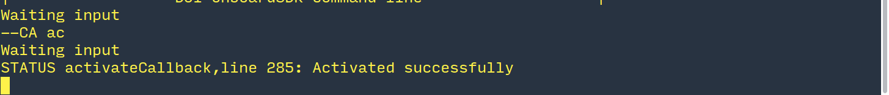
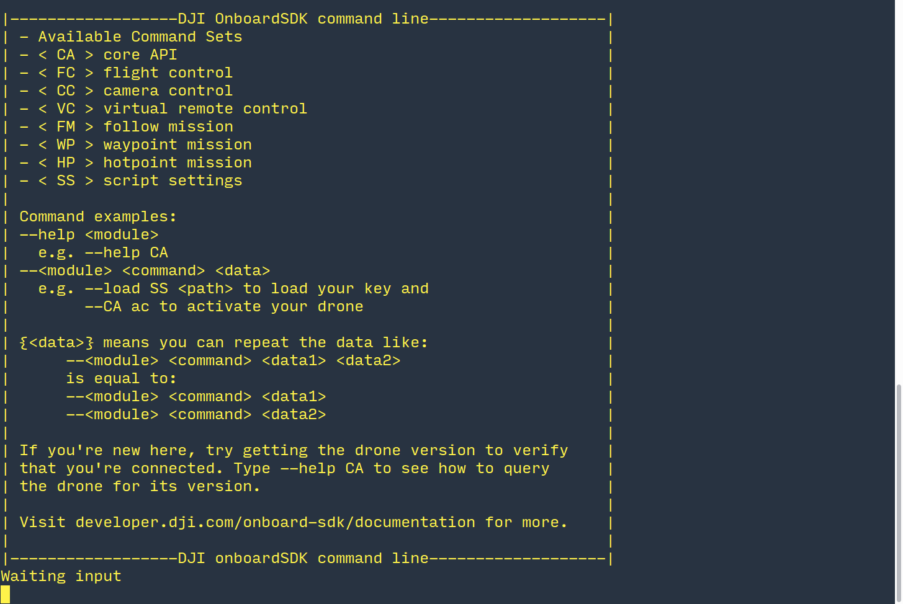

## Introduction

This command line example is a frontend for the DJI Script C++ implementation of the Onboard API. DJI Script implements all the functionality exposed by the OPEN protocol in the form of callable *commands* that are designed to operate on strings passed at the command line. The script creates a linked list with *tasks* received from the commandline frontend, and securely implements the send functionality of the API. 

The command line example also implements threading and a hardware driver for the Onboard Embedded System (OES) of choice (currently any linux computer with a serial port).

With it you can run the following commands:

* Activation
* Obtain/Release Flight Control 
* Take Off 
* Landing 
* Go Home 
* Movement Control - Position/Attitude/Velocity
* Gimbal Control
* Camera Control
* Waypoint Task
* Hotpoint Task
* Follow Me Task

 > Note: The Command line example is currently undergoing a major revamp. We expect to have a new version very soon which fixes many longstanding bugs and makes operation simpler and more reliable. Some of these instructions may not work with the current release and are meant for the newer version.

## Setup

### 1. Hardware

The [Hardware Setup](../../hardware-setup/index.html) guide talks about setting up your OES of choice. Make sure your setup matches that in the document before proceeding further. 

### 2. Software

**Toolchain**

To build the command line example, you need:

1. A supported C++ compiler (currently, only gcc/g++ 4.8.1 or older.*)
2. A bash shell
3. GNU Make

All of these should be available with an installation of Ubuntu 14.04.

**Newer versions of gcc/g++ generate compilation warnings which can safely be ignored. Future releases will correct this problem.*

**Compilation**

1. Set your serial port and baud rate in main.cpp inside the `sample/Linux/conboardsdk` directory.
2. Open up a terminal inside the `sample/Linux` directory and type `make` at the command prompt.
3. To access the serial port, add your username to the dialout group by typing `sudo usermod -a -G dialout $USER`. Then logout and login again.

**Using the Simulator**

1. Connect your M100 to a PC through USB.
2. Open up DJI Assistant 2. Click on the DJI M100 button. If this button doesn't show up, try disconnecting and reconnecting the USB.
3. Click on the Simulator tab, and then click on the 'Open' button. A separate window should pop up in a few seconds.

4. In the main window, click on 'Start Emulating'.

## Activation

The first time a drone/OES combination is used, it needs to be activated. Activation requires an App ID and a key got from the DJI website, and requires an internet connection and an RC connected to a mobile device running DJI GO. The image below shows the flow of information during activation:

1. [Enable API control](../../quick-start/index.html#3-Enable-Flight-Controller-API-control) and [get an app ID and key](../../quick-start/index.html#5-Onboard-Application-Registration).
2. Navigate to `sample/Linux/key.txt` and enter your App ID and Key in place of the defaults in that file.
3. Navigate to the `sample/Linux/bin` folder and run the commandline example. 
4. Once the example is running, type `--SS load ../key.txt`. Your App ID and Key should be displayed on the terminal.

5. Next, type `--CA ac`. You should receive some feedback on the terminal. If the message says 'Activation Successfully' (sic), you are done. Else, follow the error message to debug.

## Operation

Operating the Commandline example is a lot like the activation process you just went through. Here is a sample workflow for running some common tasks:

Note that loading your key and performing the activation step is necessary each time. After the first time, the activation command merely performs a local activation check and you are not required to be connected to the internet.

## Examples

#### Hotpoint Mission

Let us go through this workflow for a sample task of operating a hotpoint mission in simulation. Before you follow this example, make sure that (1) Your RC is powered on and (2) You are in simulation mode.

#### 1. Welcome Screen
In general, for running any single task you are presented with a screen that looks like this:
 

#### 2. Activation

Let us load the key and activate the device as in the activation section.

#### 3. Obtain flight control.

We type `--CA ct 1` to obtain control and `--CA ct 0` to release control. I this case, since we want to obtain control, we type `--CA ct 1`.

#### 4. Takeoff.

Once we have successfully obtained control, we proceed to takeoff. You should see the following message indicating that we have succeeded in taking off. 

The vehicle should hover at 1m in the simulation.

#### 5. Execute a hotpoint mission

Type `--help HP` to see syntax. Note that Lat, Lon are to be input in radians. In this exampe, we simply convert the Lat/Lon displayed in the simulator to radians and input that as location.

The aircraft should now be executing a hotpoint mission in simulation. When the mission is done, type `--HP stop` to exit hotpoint mode.

#### 6. Return to home and land

Similar to takeoff, type `--FC tk 1` to return home. `--FC tk 6` executes landing.

#### 7. Release Control

The `--CA ct 0` command will now allow you to release control.

> There are known bugs with some functions in the commandline example. We expect to have a fully functional commandline version very soon. 
