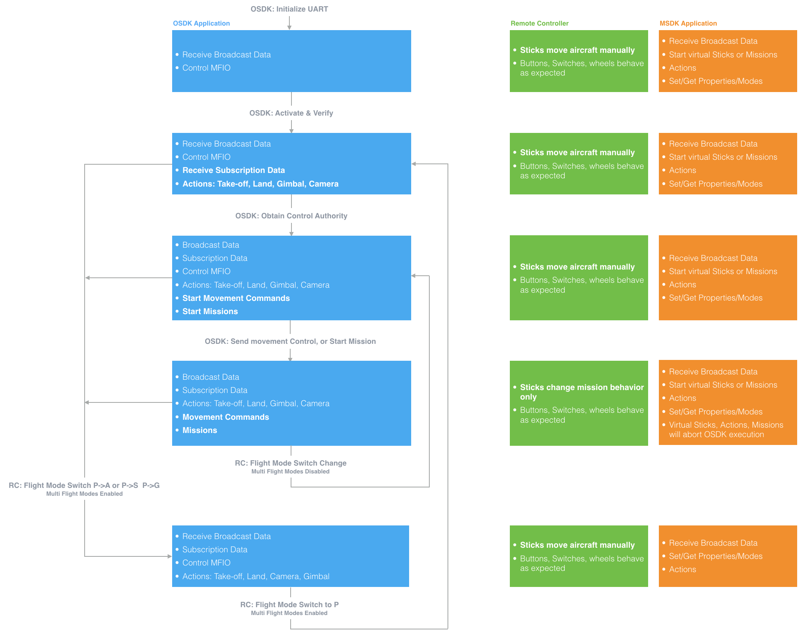

## Introduction

In a typical Onboard SDK application, there are several potential sources of aircraft control. The aircraft's flight controller arbitrates which source is in control at any one time. The different sources of control, and their control priority from highest to lowest is:

1. Remote Controller
2. Mobile Device (with a DJI Mobile SDK based application, connected to the Remote Controller)
3. Onboard Computer (with a DJI Onboard SDK based application, connected directly to the aircraft)

This guide describes how to transfer control between different control sources, and what functionality is available to the Onboard Computer in these scenarios.

## Remote Controller

The remote controller has the highest priority for control authority, and can regain control from the mobile device or onboard computer at any time.

This is always done by switching the Flight Mode Switch on the remote controller. 

The Flight Mode Switch can represent 6 possible modes:

* **P** - Positioning mode. GNSS and Vision Positioning Systems are used for positioning if they are available. For products without F mode, intelligent functions such as SDK control can be performed in P-mode.
* **F** - Function mode. Performs the same as Positioning mode with intelligent functions such as SDK control.
* **A** - Attitude mode. The GNSS and Vision Positioning Systems are not used for positioning. The aircraft only uses the barometer to maintain altitude. If receiving a GNSS signal, the aircraft can automatically return home if the Remote Controller signal is lost and if the Home Point has been recorded successfully.
* **S** - Sport mode. The maximum flight speed and responsiveness of the aircraft is increased in this mode.
* **G** - Gentle mode. The sensitivity and speed of aircraft will be substantially decreased in gentle mode.
* **M** - Manual mode. The aircraft will not stabilize its altitude nor attitude in manual mode. This mode is for advanced pilots only, and should only be used when the pilot understands the risk of operating in this mode. Any damage to the product when operating in this mode will not be covered under warranty. It is supported by stand-alone A3 and N3 and can be enabled in DJI Assistant 2.

On all products, SDK control is possible in either P or F mode. Other modes can be used to regain control for the remote controller.

#### A3, N3
A3 and N3 stand alone flight controllers can be setup in DJI assistant to either have various combinations of flight modes map to the remote controller flight mode switch position, or have all positions map to P mode. This selection is done with the **Multiple Flight Modes** option:

* **Enabled**: Flight mode switch on the remote controller represents a selection of 3 modes including P, A, S, G and/or M modes. All modes other than P are used to regain control for the remote controller.
* **Disabled**: All flight mode switch positions on the remote controller represent P mode. The flight mode switch just needs to be changed for the remote controller to regain control. Control is only temporarily regained, and logic in the onboard computer should monitor the remote controller flight mode switch and stop sending commands to the flight controller if the user needs to use the switch to permanently regain control.

#### M600, M600 Pro

When a remote controller is used with M600 or M600 Pro, all flight mode switch positions are P mode always. Similar to Multiple Flight Modes disabled for A3/N3, the switch position only needs to be changed to regain control with the remote controller. Control is only temporarily regained, and logic in the onboard computer should monitor the remote controller flight mode switch and stop sending commands to the aircraft if the user needs to use the switch to permanently regain control.

#### M100

M100 has P, A and F modes on the remote controller flight mode switch. Only F mode enables SDK control, while P and A disable it.

## Mobile SDK

The Mobile SDK will have control authority whenever:

* Remote controller flight mode switch is in the position that enables SDK automation
* The Mobile SDK is sending a command to execute a flight maneuver (e.g. executing a mission, or using virtual sticks).

Whenever the Mobile SDK is not executing a flight maneuver, the remote controller will have control authority. 

> **Note 1**: If the flight mode switch is in the wrong position for control authority, the Mobile SDK will still be able to receive state information, and perform some actions like take-off, land and controlling the camera and gimbal.
> 
> **Note 2**: If the Onboard SDK is executing a movement command, and the Mobile SDK sends virtual stick or mission commands, then the Mobile SDK will get control priority and the flight controller will ignore further Onboard SDK commands.

## Onboard SDK

Several prerequisites are required to enable control authority for the Onboard SDK:

* Flight mode switch must be in correct position (P mode for A3, N3, M600, M600 Pro and F mode for M100)
* Onboard computer application must have activated the Onboard SDK
* Onboard computer application must request and receive control authority

Control authority simply means the onboard computer can command the aircraft to move either through movement commands or missions. If all prerequisites are not met, the onboard computer can still receive state information, read from and write to the MFIO pins (if available) and perform some actions such as taking off and landing.

The state diagram below shows what is available to the onboard computer and when during the various stages of running an Onboard SDK application. In addition, the authority of the remote controller and Mobile SDK is also shown for each onboard SDK application state.

>**Note**: While the Mobile SDK is sending virtual stick commands, or a mission is executing, then movement commands from the Onboard SDK will be ignored. Once the Mobile SDK commands complete, then the Onboard SDK will be in the same state as it was before the Mobile SDK commands started.

The remote controller sticks can manually control aircraft flight for all states except for when the movement control commands are being sent from the onboard computer, or a mission has started. If missions are executing, the sticks will change the mission behavior:

* Waypoint Mission: Sticks will control mission speed and aircraft yaw
* Hotpoint Mission: Sticks will control mission speed, hotpoint radius, direction of travel and aircraft yaw

