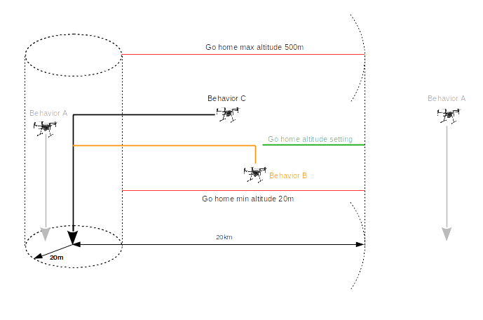
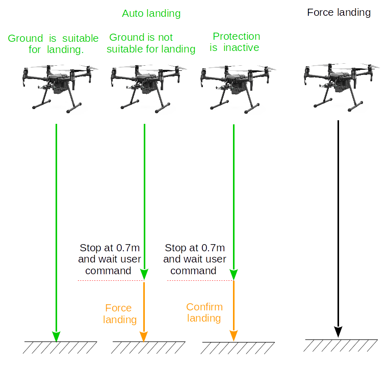

## Introduction

The flight controller is an onboard computer that combines control information from the pilot with sensor information to adjust the thrust at each propellor and fly the aircraft as desired.

The flight controller is responsible for:

* Flight control, motor control, manual as well as pre-programmed flight
* Aircraft telemetry assistance for attitude, position, velocity and sensor data
* Sensor sub components such as compasses, IMUs, and positioning systems
* Aircraft sub components such as the landing gear
* Flight limitation systems such as No Fly Zones and the GEO System
* Aircraft flight simulation for testing and debugging

A general description of fundamental flight control concepts can be found [here](http://developer.dji.com/mobile-sdk/documentation/introduction/flightController_concepts.html).

## Telemetry Assistance

The flight controller provides detailed real-time state information at up to 200 Hz including:
 
* Aircraft status, position, velocity and altitude
* Remaining battery capacity information
* Sensor information (Compass, IMU, Satellite positioning)
* Return home status 

## Flying

##### Motor Control

Motors can be turned on and off through APIs in the DJI Onboard SDK. Motors can only be turned off when the aircraft is not flying. Motors will not turn on if there are [IMU](#IMU-Inertial-Measurement-Unit) or Compass calibration errors, or if the IMU is still pre-heating.

##### Beginning and Ending Flights

Aircraft take-off and landing can be automated through APIs in the DJI Onboard SDK. Takeoff is considered complete when the aircraft is hovering 1.2 meters (4 feet) above the ground. Automatic take-off can only be initiated when the motors are off.

When a automated land command is sent, the aircraft will descend at it's current position and land.

##### Flight Control

Aircraft flight can be controlled in several ways:

* **Manually**: While Onboard SDK used to program flight missions, manual control is also possible via remote controller to manipulate limited features of the flight 
* **[Missions](./component-guide-missions.html)**: Simple high level flight automation via Mission Manager
* **[Flight Control](#flight-control)**: Flight control commands can be sent using DJI Onboard SDK APIs

##### Flight Orientation Modes

The remote controller control sticks can be used to move the aircraft forward, backwards, left and right. However, if the direction of the aircraft isn't obvious, it can be difficult to control the aircraft predictably from pilot's perspective on the ground.

Several flight orientation modes are available to make flying easier:

* **Course Lock**: The aircraft moves relative to a locked course heading.
* **Home Lock**: The aircraft moves relative radially to the Home Point.
* **Aircraft Heading**: The aircraft moves relative to the front of the aircraft.

More details are described in [Flight Control Concepts](https://developer.dji.com/mobile-sdk/documentation/introduction/flightController_concepts.html#ioc-intelligent-orientation-control).

## Geospatial Environment Online (GEO)

The <a href="http://www.dji.com/flysafe/geo-system" target="_blank">GEO system</a> is a best-in-class geospatial information system that provides drone operators with information that will help them make smart decisions about where and when to fly. It combines up-to-date airspace information, a warning and flight-restriction system, a mechanism for <a href="http://www.dji.com/flysafe/geo-system/unlock" target="_blank"> unlocking </a> (self-authorizing) drone flights in locations where flight is permitted under certain conditions, and a minimally-invasive accountability mechanism for these decisions.

## Sensors

The Flight controller manages several sub components of the aircraft including sensors and landing gear.

##### Compass

The compass measures magnetic field direction and is used to determine the heading of the aircraft relative to North. The compass must be calibrated first time you turn on an aircraft as well as periodically if flying near magnetic interference.

Compass calibration can be done manually or programmatically:

* **Manual**: require the user to rotate the aircraft vertically and horizontally through the azimuth. Products with multiple compasses (like the Phantom 4) will have their compass state fused into one compass class for simplicity.

##### IMU - Inertial Measurement Unit

The IMU contains an accelerometer and gyroscope to measure linear acceleration and angular velocity. The IMU is a sensitive system that is dependent on temperature and sometimes requires recalibration. Preheating is done automatically by the aircraft, and its status can be monitored in the flight controller state data. Calibration can be initiated by Assistant Software when required.

Some products have more than one IMU for redundancy. The Phantom 4 has two IMUs, while the M600 can accommodate up to three.

##### RTK Positioning System

DJI Products come with built-in consumer satellite positioning systems that use GPS and GLONASS satellite constellations. Consumer grade satellite positioning can have position errors of several meters.

The DJI DRTK positioning system is an accessory compatible with the M600 and A3 flight controller that allows centimeter level positioning. DRTK is a real time kinetic satellite positioning system that uses GPS+GLONASS or GPS+Beidou constellations (depending on DRTK model).

The system requires both a base station and mobile station receiver, which are connected together through a wireless link. The base station receiver is deployed at a known location on the ground, while the mobile station is deployed on the aircraft. Both base station and mobile station will experience similar satellite signal errors at the same time. As the base station is at a known location, it can send real time correction information to the mobile station, resulting in centimeter accurate positing information for the mobile station relative to the base station.

The mobile station comes with two antennas which can be deployed on opposite sides of the aircraft. As the position of both antennas can be combined into a heading vector that can often be more accurate than compass heading in the environments with high magnetic field interference (like near large metal structures, or high voltage lines).

## Vision System and Telemetry Assistance

Cameras can be used to detect obstacles and accurately determine relative position and velocity. These cameras are typically mounted on the product facing downward for positioning and forward for obstacle detection. They are separate from the main camera used to capture photos and videos.

##### Obstacle Avoidance

Some products have pairs of cameras that use stereo vision to determine the depth of an environment. For instance, the Mavic Pro has a pair of cameras facing to the front of the aircraft, while the Phantom 4 Professional has two pair of cameras facing to the front and rear. This vision system allows the aircraft to either stop in front of or go around obstacles in its flight path. 

The vision system enables users to fly with increased comfort as there is lower probability they will make a mistake and impact an object. However, limitations of the system still need to be understood to fly safely. Objects that are difficult to detect are those that are small, very narrow, too plain in appearance (visual features can't be extracted), not in the field of view of both cameras, or too close or too far from the product (see <a href="http://www.dji.com/product/phantom-4/info#specs" target="_blank"> product page </a>) for specifications). 

What is passive collision avoidance?
 If obstacle is on the flight route, aircraft will brake and stop in front of the obstacle , and if the obstacle is moving toward to aircraft, the aircraft will not actively fly away from it.
Turn on/off collision avoidance's method is as follows:
|Flight Mode                                        |Passive Collision Avoidance Switch Status              |Description        |
|---------------------------------------------------|-------------------------------------------------------|-------------------|
|Auto landing, Force landing, Sport, Attitude, Watch|Disable                                                |                   |
|SDK API MODE                                       |Determine by OSDK's collision avoidance switch            |Set by OSDK's api  |
|Position, Tracking                                 |Determine by APP's collision avoidance switch          |Set by APP         |
|Go home                                            |Determine by APP's go home collision avoidance switch  |Set by APP         |

##### Positioning

Downward facing cameras can help determine relative position and velocity more accurately than consumer satellite positioning systems. They can also be used to hover in GPS denied environments such as inside buildings.

##### Telemetry Assistance

The DJI Onboard SDK provides Telemetry assistance that provides access to state information of the aircraft and its sensors.

## Landing Gear

Some products have moveable landing gear that are deployed when landing to protect the camera, but can be raised (retracted) when flying to not impede the camera view. 

Landing gear can be deployed or retracted programmatically or automatically. When automatic, the flight controller will determine when to deploy the landing gear and when to retract it. In situations where a fast landing is required, it is better to programmatically deploy the landing gear so the aircraft doesn't have to pause at a height close to the ground to trigger the automatic process.

##### Transport mode

In transport mode, the landing gear will be in the same geometric plane as the aircraft body so it can be easily transported. 

## Flight Time and Battery Thresholds

Aircraft flight time is determined by total aircraft mass, the available stored (battery) energy on the aircraft, the environment the aircraft is flying in, and how the aircraft is being flown. Flying fast against strong wind with a heavy payload will have a shorter flight time than hovering in no wind with a light payload.

During a flight, the flight controller and smart battery will work together to estimate the remaining time of the current flight based on data collected during the flight. It will also provide estimates for the the battery percentage required to return home from the current location, or land immediately.

In addition, two manual battery thresholds can be set in DJI Assistant 2 that will automate aircraft behavior when the battery is running low. 

* **Return to home**: The threshold is usually set between 25% and 50%, and will automatically initiate a return to home warning if the threshold is crossed. If no action is taken within 10s, then the aircraft will automatically return home. The return home can be cancelled by pressing the **Return Home** button on the remote controller.
* **Land in place**: The threshold is usually set between 10% and 25%, and will immediately land the aircraft if crossed.

## Returning Home and landing
##### Set home location
Before returning home, the aircraft must record a position(include latitude and longitude) as home location. Setters like Aircraft, SDK, RC, APP  have the authority to set the home location. The conditions of setting home location by aircraft and SDK are as follows:
|Setter  |Method to set home location                              |Set condition |Remarks  |
|--------|---------------------------------------------------------|--------------|---------|
|Aircraft|Record initial aircraft home location                    |The GPS level of aircraft >=4   |1. Aircraft will record home location automatically when first takeoff after power on. 2. Home location could be refreshed after restarted.|
|SDK     |Record the current position of aircraft as home location |1. Aircraft has recorded initial home location. 2. The GPS level of aircraft>=4|Home location could be refreshed after restarted.|
|SDK     |Record customized position as home location              |1. Aircraft has recorded initial home location. 2. Distance between new home location and last home location is less than 20km.|Home location could be refreshed after restarted.|

##### Return home behavior

According to different aircraft altitude and distance to home location, there are three kinds of return home behavior.
|Behavior A                                              |Behavior B                                            |Behavior C                                               |
|--------------------------------------------------------|------------------------------------------------------|---------------------------------------------------------|
|Step 1: Switch to auto landing mode. Step 2: Landing with aircraft current position and current altitude (won't climb)|step 1: Climb to setting of go home altitude. step 2:Go home by setting of go home altitude. step 3:Landing with home location setting.|step 1: Go home by aircraft current altitude  step 2:Landing with home location setting.|

At the combination of aircraft altitude and distance to home location, the behavior is as follows:
|Distance between aircraft current position and home location|Aircraft current altitude<=Setting of go home altitude|Aircraft current altitude>Setting of go home altitude|
|--------------------------------------------------------|------------------------------------------------------|---------------------------------------------------------|
|0m~20m                                                  |Behavior A                                            |Behavior A                                               |
|20m~20km                                                |Behavior B  After reaching the home position, aircraft will land automatically |Behavior C   After reaching the home position, aircraft will land automatically|
|>20km                                                   |Behavior A                                            |Behavior A                                               |
##### Landing behavior
There are two kinds of landing named auto-landing and forced landing. 
* **Auto-landing**
 Landing protection will activate during auto-landing. 
1. Landing protection determines whether the ground is suitable for landing. If so, the aircraft will land smoothly. 
2. If landing protection determines that the ground is not suitable for landing, the aircraft will hover and wait for pilot confirmation. 
The aircraft will hover if it detects the ground is not appropriate for landing even with a critically low battery warning. 
Only when the battery level decreases to 0% will the aircraft land. Users retain control of aircraft flight orientation.
3. If landing protection is inactive, the DJI Pilot app will display a landing prompt when the aircraft descends below 0.7 meters. 
Tap to confirm or pull down the control stick for 2 seconds to land when the environment is appropriate for landing. 
   **NOTE**: Landing Protection will not be active in the following circumstances:
   a. When the user is controlling the pitch/roll/throttle sticks (Landing Protection will re-activate when the control sticks are not in use)
   b. When the positioning system is not fully functional (e.g. drift position error)
   c. When the downward vision system needs re-calibration
   d. When light conditions are not sufficient for the downward vision system 
   e. If an obstacle is within one meter of the aircraft, the aircraft will descend to 0.7m above the ground and hover.
* **Force landing**
 Force landing has no landing protection process, aircraft will land directly by fast speed and may make aircraft crash.

Users could use RC throttle’s down command(keep 2 seconds), APP's confirm landing command and SDKs confirm landing API to confirm. Conversely, RC throttle’s up command,
APP cancel landing or switch flight mode will exit the landing mode(auto-landing and forced landing). 
##### Return home style
The aircraft can automatically return-to-home (RTH) in a number of scenarios:

* **Smart RTH**: Commanded to by the pilot through the application or the remote controller
* **Failsafe RTH**: If the wireless link is lost between the remote controller and aircraft
* **Low Battery RTH**: If the battery drops below a threshold that is enough to get home, but not enough to require immediate emergency landing
**Note:** If the GPS signal is not sufficient during take-off to record a home location, the home point will be recorded when the GPS signal is strong enough. When taking off in poor satellite signal environments, developers should ensure the home point being set is within the user's expectations.

**Smart RTH**:

Press the **Return Home** button on the remote controller to initiate Smart RTH. The aircraft will then automatically return to the last recorded Home Point. 

The remote controller's control sticks can be used to change the aircraft's position to avoid a collision during the Smart RTH process. Press and hold the button once to start the process, and press the button again to terminate the procedure and regain full control of the aircraft.

Smart RTH can also be initiated and canceled through the DJI Mobile SDK.

**Failsafe RTH**

If the Home Point was successfully recorded and the compass is functioning normally, Failsafe RTH will be automatically activated if the remote controller signal is lost for more than three seconds. The RTH process may be interrupted and the operator may regain control of the aircraft if the remote controller signal connection is re-established.

In some missions, it is not desirable to immediately return home when signal connection is lost. Failsafe behavior can be configured using DJI Assistant 2.

**Low Battery RTH**

When the battery drops below a certain threshold (typically 25% to 50%), the aircraft will not initiate a mission or a single flight. At the same time the remote controller will start beeping.

The RTH procedure can be cancelled by either pressing the home button on the remote controller, or sending a cancel command through the application using the SDK.

**Loss of Wireless Link**

The wireless connection between the remote controller and aircraft can sometimes be lost when the distance is too great, or obstacles impede the link.

If the link is lost for 3 seconds, the aircraft will start performing a failsafe behavior. Behavior options include:

* Automatically returning home (see [Returning Home](#returning-home))
* Hovering in position
* Landing in position

## Coordinate System

Description of aircraft movement is dependent on the location and orientation of coordinate axes that make a coordinate system (or frame of reference). Many coordinate systems exist, but the two used in the DJI SDK are relative to the aircraft body (body frame), and relative to the ground (world frame).

##### Roll Pitch Control Mode

The horizontal movement of the aircraft can either be set with X/Y velocities, or roll/pitch angles. Larger roll and pitch angles result in larger Y and X velocities respectively. Roll and pitch angles are always relative to the horizontal. Roll and pitch directions are dependent on the coordinate system, and can be confusing. For convenience a table detailing how the aircraft moves depending on coordinate system and roll pitch control mode is given below. These can all be calculated using the definition of the coordinate systems.

<table id="t01">
  <thead>
    <tr>
      <th>Coordinate</th>
      <th>RollPitch Control Mode</th>
      <th>Aircraft Heading</th>
      <th>FlightControl Data.Pitch (Positive)</th>
      <th>FlightControl Data.Pitch (Negative)</th>
      <th>FlightControl Data.Roll (Positive)</th>
      <th>FlightControl Data.Roll (Negative)</th>
    </tr>
  </thead>
  <tbody>
    <tr>
      <td rowspan="2">Ground</th>
      <td>Angle</td>
      <td>North</td>        
      <td>Go South</td>
      <td>Go North</td>
      <td>Go East</td>        
      <td>Go West</td>
    </tr>
    <tr>
      <td>Angle</td>
      <td>East</td>        
      <td>Go South</td>
      <td>Go North</td>
      <td>Go East</td>        
      <td>Go West</td>
    </tr>
    <tr>
      <td rowspan="2">Ground</th>
      <td>Velocity</td>
      <td>North</td>        
      <td>Go East</td>
      <td>Go West</td>
      <td>Go North</td>        
      <td>Go South</td>
    </tr>
    <tr>
      <td>Velocity</td>
      <td>East</td>        
      <td>Go East</td>
      <td>Go West</td>
      <td>Go North</td>        
      <td>Go South</td>
    </tr>
    <tr>
      <td rowspan="2">Body</th>
      <td>Angle</td>
      <td>North</td>        
      <td>Go South</td>
      <td>Go North</td>
      <td>Go East</td>        
      <td>Go West</td>
    </tr>
    <tr>
      <td>Angle</td>
      <td>East</td>        
      <td>Go West</td>
      <td>Go East</td>
      <td>Go South</td>        
      <td>Go North</td>
    </tr>
    <tr>
      <td rowspan="2">Body</th>
      <td>Velocity</td>
      <td>North</td>        
      <td>Go East</td>
      <td>Go West</td>
      <td>Go North</td>        
      <td>Go South</td>
    </tr>
    <tr>
      <td> Velocity </td>
      <td>East</td>        
      <td>Go South</td>
      <td>Go North</td>
      <td>Go East</td>        
      <td>Go West</td>
    </tr>
  </tbody>
</table>

##### Yaw Control Mode 

Yaw can be changed by either angle or velocity. Yaw settings are independent of the coordinate system. Positive yaw velocity will always rotate clockwise, and yaw angle is always relative to North.

>**Note** : If the drone ever searched for satellites after startup, yaw angle's reference is the geographic north for the magnetic declination is automatically calculated. Otherwise, the yaw angle's reference will be geomagnetic north.
##### Vertical Throttle Control Mode: 

Vertical movement can be achieved either using velocity or position. Position is an altitude relative to the take-off location. Velocity is always relative to the aircraft, and does not follow typical coordinate system convention (positive vertical velocity results in the aircraft ascending). 

