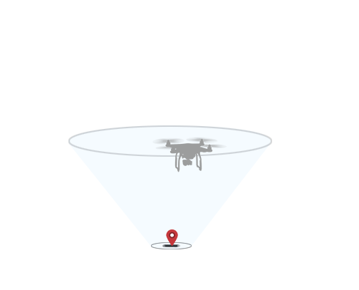

## Introduction

Missions can be used to easily automate flight. There are many different mission types that offer different product behavior. Some missions can be uploaded to and managed by the aircraft, while other missions are managed from the mobile device.

Missions run from the mobile device can offer more complex or customizable behavior, however if the wireless link between remote controller and aircraft is lost then they can be interrupted. In comparison, missions run from the aircraft will be less customizable and be limited by aircraft memory, but be able to continue when there is a loss in the wireless link.

## Waypoint Mission

A waypoint mission is a series of pre-defined locations (waypoints) the aircraft will fly to. A location is a latitude, longitude and altitude. Aircraft heading and altitude between waypoints can change either gradually or at the waypoint itself. A series of actions (such as take photo) can be executed at each waypoint.

During the mission, the mission can be manually adjusted using the remote controller control sticks. The mission speed can be sped up, slowed down or even executed in reverse. 

A Waypoint Mission is uploaded to and executed by the aircraft, but is limited by the amount of storage in the flight controller. Accordingly only 99 waypoints can be executed per mission. Custom Mission can be used to easily queue waypoint missions, in applications that require more than 99 points.

## Hot Point Mission

In a Hot Point Mission, the aircraft will repeatedly fly circles of a constant radius around a specified point called a Hot Point (also known as Point of Interest). Altitude, velocity, the Hot Point location, aircraft heading and flight direction can all be defined as part of the mission.

Altitude, heading and radius can also be adjusted manually using the remote controller control sticks during the mission.

