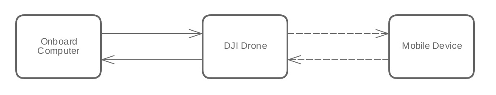

## Introduction

Mobile API allows developers to monitor and control the UAV from a mobile device running iOS or Android with the remote controller connected. Onboard API allows developers to monitor and control the UAV from any system directly connected to the UAV through a serial(UART) port interface.

The Mobile - Onboard SDK communication pipeline was developed to combine the ease of use and flexibility of the Mobile SDK along with the real time nature and computing power of the Onboard SDK. By establishing a connection between a Mobile Device and the Onboard Computer, developers are able to send any data from their Mobile Device to the Onboard Computer and vice versa.
 
The current upstream (Mobile to Onboard Computer) bandwidth is around _1KB/s_ while the downstream (Onboard to Mobile Device) bandwidth is around _8KB/s_

## Sample Implementation 

This implementation provides an alternative way to run/test your OnboardSDK code with an aircraft in the real world that makes use of the Mobile - Onboard SDK communication. Commands are sent from the iOS app to the Onboard Computer, data is read from the Onboard SDK code, respective functions are executed and an ACK is returned back to the mobile device. You can read more about the sample [here](./../sample-doc/msdk-comm.html)

## Communication

The image below shows commands being sent from Mobile to Onboard SDK.  

The image below shows the ACK being returned to mobile. 

In short, the Mobile Onboard SDK communication serves as a linkage between Mobile API and Onboard API, granting developers a better flexibility in creating their own flight APPs.

