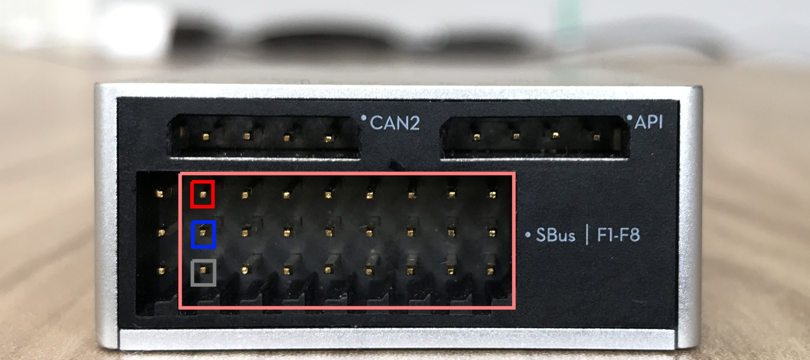

## Introduction

The Multi Function IO feature of the A3 and N3 Flight Controller supports reading and writing PWM signals, Analog to Digital Conversion and General Purpose Input Output. These new feature are being introduced
  in order to avoid having to arrange additional circuitry or microcontrollers for the mentioned low level functionalities. 
 
### PWM

Pulse Width Modulation allows the control of power supplied to electrical devices such as motors or LEDs. Pulse Width Modulation allows us to vary how much time the signal is high in an analog fashion. 
 
 The A3 and N3 Flight Controller supports sending PWM signals. PWM signals can be written to a user defined pin to control the brightness of an LED, the speed of a motor etc. 

### Analog to Digital Converter 

An Analog to Digital Converter allows conversion of analog signal such as voltage or current to a digital number proportional to the input. 
The A3 and N3 Flight controller supports reading Analog signals and converting to Digital data.  

### GPIO 

A General Purpose Input Output pin are digital lines to read and write data. 

## Onboard SDK MFIO 

 

