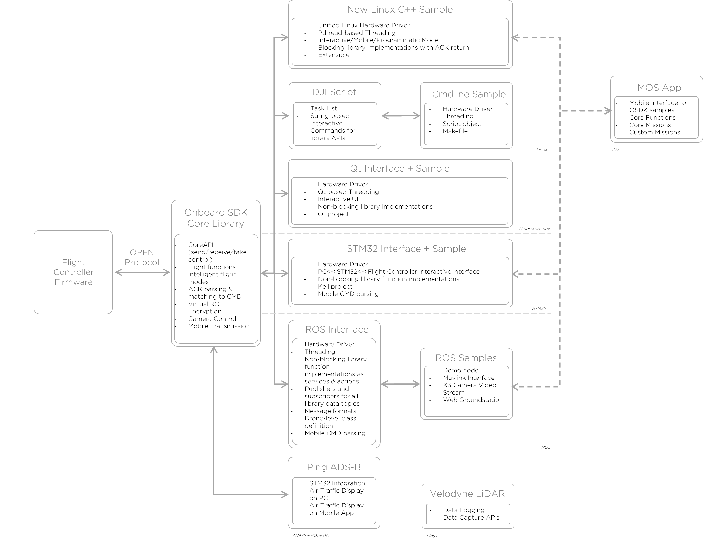

## Introduction

Onboard SDK offers many features for building powerful, robust applications on top of DJI drones. It can get a little overwhelming to explore all the features at once - this document guides you through the typical usage patterns for Onboard SDK and familiarizes you with some conventions.

*Note: If you haven't read the [Quick Start](../quick-start/index.html) guide yet, please do so first.*

## Architecture 

This diagram provides a high-level overview of the different components of the onboard SDK.

If you need more detail on the architecture of the various functions implemented in the onboard SDK, there is a [more detailed diagram](../appendix/index.html#Detailed-Architecture) available in the Appendix.  

## Choosing the Right Platform

### 1. Custom Applications on Linux/Windows

The core of the Onboard SDK is the SDK library - a fully featured API for communicating with the flight controller through the OPEN protocol. 

As a developer, you can write applications with zero overhead by using the DJI API as a starting point. The Onboard SDK provides three sample applications built using the DJI API, two for a Linux target (GUI-based sample built using Qt/ commandline sample built using a Makefile) or for a Windows target (GUI-based sample built using Qt). Do note that the sample apps were not designed to be extended - best practices would be to take inspiration, not code, from the samples.

**Use When:**
- Your application has a specific focus and you want the least possible overhead in implementation 
- Your application needs to run on a constrained computation/memory budget
- You are integrating your application into a larger codebase

**Do not use if:**
- You would rather have communication and reliability handled by an abstraction layer

### 2. High-Level Applications on ROS/Linux

Because many of our users would prefer having an interface which takes care of itself for low-level tasks, we also offer a ROS implementation with feature parity. ROS is a flexible communication middleware with excellent community support. The ROS flavor of Onboard SDK publishes all the drone data to a set of topics using standardized message formats. Integrating the DJI Onboard SDK into larger ROS projects is extremely straightforward. 

**Use When:**
- You are familiar with ROS and want to take advantage of existing ROS packages
- You want a high-level implementation that requires very little housekeeping
- Your Onboard Embedded System (OES) is not the only computer in your project

**Do not use if:**
- You do not want ROS overhead in your application
- You are concerned about latency and frequency of data transmission
- You are running the application on a low-power OES 

### 3. Applications on Embedded Systems

DJI's Onboard SDK also provides an implementation for the [STM32F407 Discovery](http://www.st.com/content/st_com/en/products/evaluation-tools/product-evaluation-tools/mcu-eval-tools/stm32-mcu-eval-tools/stm32-mcu-discovery-kits/stm32f4discovery.html), a low-cost, powerful embedded system suitable for real-time applications. This implementation has feature parity with the Linux version as well, and is an excellent choice for constrained implementations. The current implementation builds using the Keil toolchain.

**Use When:**
- You need to have direct, low-level access to system components for your project
- You are interested in leveraging the real-time nature of MCUs such as the STM32
- You are operating on a highly constrained memory/processing budget

**Do not use if:**
- You plan to have additional processing (e.g. computer vision) in your application
- You don't want to worry about registers and counters
- Your application doesn't demand the use of an MCU over a conventional single board computer 

## Next Steps

At this point, you probably know what platform you want to work on. Review the [Things to Know](things-to-know.html) document before you head over to the [official github repository](https://github.com/dji-sdk/Onboard-SDK)!
