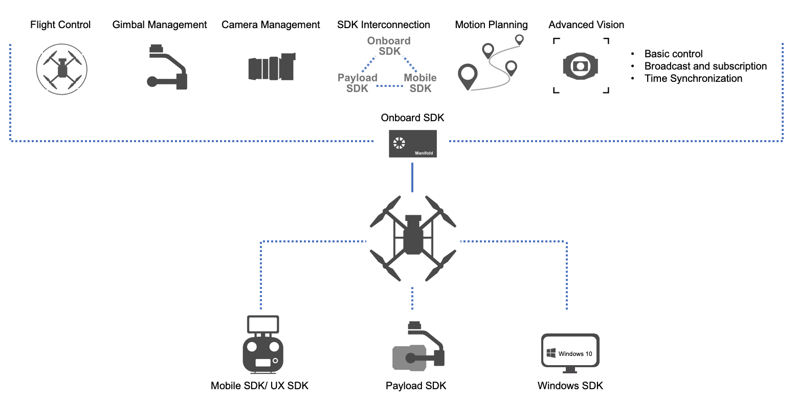

> **NOTE** 
> * This article is **Machine-Translated**. If you have any questions about this article, please send an <a href="mailto:dev@dji.com">E-mail </a>to DJI, we will correct it in time. DJI appreciates your support and attention.
> * This series of documentation introduces the functions of **OSDK V4.0.0**, as well as the steps and methods of developing program using OSDK V4.0.0. If you are still using OSDK V3.9.x, please download the documentation of [OSDK V3.9.x](https://terra-1-g.djicdn.com/71a7d383e71a4fb8887a310eb746b47f/osdk/OSDK-3.9.0.zip).

OSDK is a development toolkit for developing applications, which could run on the onboard computer(such as Manifold 2). Developers can obtain the information from the drone by calling the interface specified in OSDK. According to the software logic and algorithm framework designed by the developer, users could control the drone perform actions they need, such as **Automated Flight**, **Payload Control** And **Video Image Analysis**,etc.
        

 
 
        

## Advantages
* **High Compatible**
Applications developed using OSDK can run on mainstream embedded hardware platforms, such as STM32, etc., and can also run on mainstream embedded operating systems and software architectures, such as Linux, ROS, and RTOS. Developers follow [Porting](../quickstart/porting.html) in the tutorial, after that developers could run the applications on the different hardware and software platforms.

* **Easy Control**
Calling the OSDK open interface, the drone can implement application functions such as Autonomous Flight, Object Recognition, and Image Perception in extreme environments according to the specified logic.

* **Multi Expansion**   
OSDK provide interfaces to help developers use Third-Party Applications, Algorithm Frameworks technology such as Image Recognition, Autonomous Cruise and SLAM to develop the professional application. In addition, it also facilitates developers to access third-party sensors, cameras,etc. to collect the information.

## Typical Features

* <a href="../tutorial/gimbal-manager.html"> <b> Gimbal Management </b> </a>
* <a href="../tutorial/camera-manager.html"> <b> Camera Management </b> </a>
* <a href="../tutorial/SDK-mop.html"> <b> SDK Interconnection </b> </a>
* <a href="../tutorial/motion-planning.html"> <b> Motion Planning </b> </a>
* <a href="../tutorial/advanced-sensing.html"> <b> Advanced Vision </b> </a>

## Usage Scenarios   
The application developed based on OSDK, could control the drone to perform complex flight tasks, such as autonomous flight, and using the payload developed based on the PSDK, the perception camera and algorithm framework could achieve Object Recognition and Obstacle Avoidance and Cloud collaboration.

#### [DJI Drone(See Details)](https://www.dji.com/cn/products/compare-m200-series?site=brandsite&from=nav)
DJI's drone condense DJI's reliable control technology and advanced application algorithms, it is widely compatible with third-party development platforms, carrying the payload and onboard computer that developers need to use, help developers to complete the tasks they need to achieve smoothly and efficiently.

#### [Onboard Computer (See Details)](https://www.dji.com/cn/manifold-2)
To help developers control DJI's drones to perform flight missions automatically and process data information generated by drones and paylaod, DJI provides a high-performance onboard computer Manifold 2:
* Manifold 2-G: equipped with NVIDIA Jetson TX2, 128GB SATA-SSD, suitable for Artificial Intelligence, Object Recognition and Motion Planning.
* Manifold 2-C: equipped with Intel Core i7-8550U, SATA-SSD is 256GB, suitable for High-Performance data processing, Machine Control and Station Applications.

## Disclaimer
Before using the application developed by OSDK, please check the laws and regulations of the region where the flight is located. **The safety issues or legal disputes caused by the use of OSDK are not related to DJI. DJI does not assume any responsibility for any use of OSDK Legal risks and responsibilities**.

