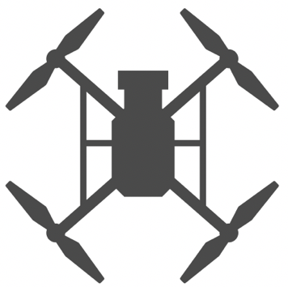
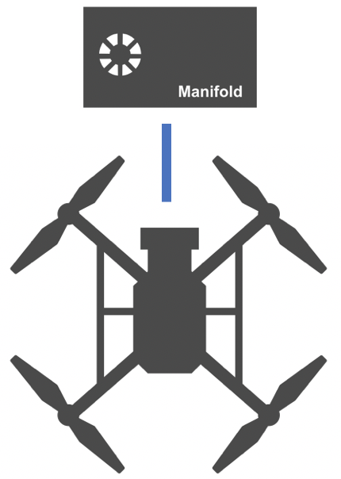

> **NOTE** 
> * This article is **Machine-Translated**. If you have any questions about this article, please send an <a href="mailto:dev@dji.com">E-mail </a>to DJI, we will correct it in time. DJI appreciates your support and attention.
> * This series of documentation introduces the functions of **OSDK V4.0.0**, as well as the steps and methods of developing program using OSDK V4.0.0. If you are still using OSDK V3.9.x, please download the documentation of [OSDK V3.9.x](https://terra-1-g.djicdn.com/71a7d383e71a4fb8887a310eb746b47f/osdk/OSDK-3.9.0.zip).

Before using OSDK to develop the application, developers need to register a account; when using OSDK to develop the application, developers need to purchase a drone and an onboard computer. It is recommended that you learn the **Basic Knowledge** of the drone before using OSDK to develop the application, understand the **Attention** for developing the application, and use **Practice Tutorials and API Documentation** to develop the application.

<table>
<tbody>
  <tr>
   <td style="border-right: none; border-left: none;"> 
 
 
        
 
 </td> </td>
       <td style="border-right: none; border-left: none;"> 
 
 
        
 
 </td> </td>
        <td style="border-right: none; border-left: none;"> 
 
 
        
 
 </td> </td>
         <td style="border-right: none; border-left: none;"> 
 
 
        
 
 </td> </td>
         <td style="border-right: none; border-left: none;"> 
 
 
        
 
 </td> </td>
         <td style="border-right: none; border-left: none;"> 
 
 
        
 
 </td> </td>
  </tr>
  <tr>
   <td style="text-align: center"> <a href="https://account.dji.com/register?appId=dji_sdk&backUrl=https%3A%2F%2Fdeveloper.dji.com%2Fuser&locale=en_US" target="_ blank">1.Sign Up</a> </td>
   <td style="text-align: center"> <a href="https://www.dji.com/cn/products/compare-m200-series?site=brandsite&from=nav" target="_blank">2.Purchase Drones </a> </td>
   <td style="text-align: center"> <a href="../purchaseguide/hardware.html"> 3.Purchase Hardware Platform </a> </td>
   <td style="text-align: center"> <a href="https://developer.dji.com/user/apps/#allhtml">4.Register Application</a> </td>
   <td style="text-align: center"> <a href="../quickstart/run-the-sample.html"> 5.Run the sample </a> </td>
   <td style="text-align: center"> <a href="https://www.dji.com/downloads/softwares/assistant-dji-2-for-matrice">6.Simulation and Debugging </a> </td>
  </tr>
</tbody>
</table>

## 1. Sign Up

* <a href="https://account.dji.com/register?appId=dji_sdk&backUrl=https%3A%2F%2Fdeveloper.dji.com%2Fuser&locale=en_US" target="_blank"> Sign up </a> to be a DJI developer, make sure that you have read the <a href="https://developer.dji.com/cn/policies/privacy/"> Protocol, Terms and Policies </a> carefully .
* In order to get more services, please fill in the registration information correctly.

## 2. Purchase

* [Development Hardware](../purchaseguide/hardware.html)
* [Development Platform](../purchaseguide/development-platform.html)

## 3. Develop The Application
#### Preparation
Before using OSDK to develop the application, it is recommended to learn the basic knowledge, understand the features of OSDK, purchase the drone and onboard computer according to actual development needs, select the appropriate development platform.

* Learn the basic knowledge and control principles of drones: such as pitch, yaw, roll and lift
* Understand [Features](./feature-list.html) supported by OSDK
* Purchase [Drone](../purchaseguide/hardware.html) and [Onboard Computer](../purchaseguide/hardware.html)
* Select [Development Platform](../purchaseguide/development-platform.html)

#### Start Develop The Application
When using OSDK to develop the application, please connect the drone, onboard computer and third-party sensing equipment, configure the application development environment, and compile Programs, learn how to use OSDK to develop the application.

* Before using OSDK to develop the application, please read the contents of [Attention](../quickstart/attention.html) avoid improper operation Damage the drone or onboard computer;
* [Connection](../quickstart/device-connection.html) drone, onboard computer, third-party sensing equipment and computer;
* [Install](../quickstart/development-environment.html) software, prepare related tool chains and libraries;
* [Porting](../quickstart/porting.html)(Optional) the application developed based on OSDK to different hardware and software platforms.
* [Compile](../quickstart/run-the-sample.html) sample code, running the sample to learn how to use various features provided by OSDK.

According to the documents in [Development Guide](../quickstart/integrateOSDK.html) to know the working principle and interface calling method of OSDK, quickly realize the application functions.

#### Develop The Application

* Develop the application according to the [Tutorials](../tutorial/basic-control.html) and OSDK API Documentation.
* Use [DJI Assistant 2](https://www.dji.com/cn/downloads) and other tools to debug the application.

## Support Services
Self Service:
* <a href="https://developer.dji.com/payload-sdk/documentation/faq/index.html"> FAQ </a>
* <a href="https://forum.dji.com/forum-139-1.html?from=developer"> DJI Technical Forum </a>

Support Service:
* Use the <a href="https://formcrafts.com/a/dji-developer-feedback-en"> Question Feedback </a> form.
* Send an <a href="mailto:dev@dji.com"> E-mail </a> to the DJI SDK team.
