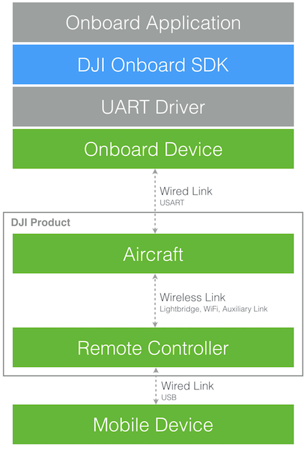

The DJI Onboard SDK is an open source software library that enables computers to communicate directly with a selection of DJI aircraft and flight controllers over a serial interface. The SDK gives access to aircraft telemetry, flight control and other aircraft functions, meaning a developer can use the SDK to attach their own computing device onboard an aircraft and use it to control flight. 

The SDK includes:

* an open source C++ library that can be used to control DJI aircraft over a serial interface - with support for Linux, ARM and STM32
* fully featured ROS wrapper compatible with ROS standards
* an aircraft simulator and visualization tool
* sample code and tutorials
* this developer guide and API documentation

## Comparison with Mobile SDK

DJI offers a Mobile SDK and an Onboard SDK.

Both SDKs allow applications to control DJI aircraft, but are optimized for different compute platforms and applications. The Mobile SDK is designed for Mobile Devices (such as Android and iOS) that connect to the aircraft wirelessly through the remote controller. The Onboard SDK is designed for Linux Devices (and the STM32), and connects directly to the flight controller over a serial interface. 

The table below compares the two SDKs.

<html><table class="table-osdk-msdk-comparison">
  <thead>
    <tr>
      <th colspan="3">Comparison of Onboard and Mobile SDKs</th>
    </tr>
    <tr>
      <th>Category</th>
      <th>Onboard SDK</th>
      <th>Mobile SDK</th>
    </tr>
  </thead>
  <tbody>
  <tr>
    <td>Platform</td>
    <td>Linux, STM32</td>
    <td>Android, iOS</td>
  </tr>
  <tr>
    <td>Language Support</td>
    <td>C++</td>
    <td>Java, Objective C, Swift</td>
  </tr>
   <tr>
    <td>DJI Product Support</td>
    <td>M100, M600, M210, M210-RTK, A3, N3 
Note: M200 is not supported
</td>
    <td>Phantom Series, Inspire Series, Osmo Series, Mavic Pro, Matrice Series, A3, N3</td>
  </tr>
  <tr>
    <td>Connection to Aircraft</td>
    <td>Wired 
Serial
</td>
    <td>Wireless
Mobile Device <-> USB <-> Remote Controller <-> Wireless <-> Aircraft
</td>
  </tr>
  <tr>
    <td>Flight Control - Low Level</td>
    <td>200 Hz</td>
    <td>10 Hz</td>
  </tr>
  <tr>
    <td>Flight Control - Missions</td>
    <td>Waypoint, Hotpoint</td>
    <td>Waypoint, Hotpoint, Follow Me, ActiveTrack, TapFly, Timeline</td>
  </tr>
  <tr>
    <td>Telemetry Updates</td>
    <td>200 Hz</td>
    <td>10 Hz</td>
  </tr>
    <tr>
    <td>Remote Controller Needed</td>
    <td>No</td>
    <td>Yes</td>
  </tr>
  <tr>
    <td>Gimbal Control</td>
    <td>Yes</td>
    <td>Yes</td>
  </tr>
  <tr>
    <td>Camera Control</td>
    <td>Limited 
Shoot Photo, Start/Stop Video
</td>
    <td>Full 
Shoot Photo, Start/Stop Video, Exposure Control, Camera Settings, Playback, Media
</td>
  </tr>
  <tr>
    <td>Other features 
Obstacle Avoidance, GEO
</td>
    <td>Limited</td>
    <td>Full</td>
  </tr>
  </tbody>
</table>
</html>

As the Mobile SDK is for ground based applications, and the Onboard SDK for aircraft based applications, both SDKs can be used simultaneously in a solution. Both SDKs have APIs that allow communication through the aircraft's wireless link and therefore data can be sent between the mobile and onboard devices.

### When to use the Onboard SDK
The reasons you should consider using the Onboard SDK are if you want to:

* Execute precise trajectories
* Fly without a remote controller (e.g. beyond line of sight)
* Integrate third party sensors, actuators and communication systems with flight control, or the mobile application connected to the remote controller. 

Some examples of where the OSDK might be used is:

  * Inspection missions using custom sensors
  * Delivery missions with custom actuators
  * Collision avoidance with custom LiDAR
  * Real-time mapping and navigation
  * Navigation in environments that are difficult to pre-plan (dynamic or geometrically complex)
  * Fly in GPS denied environments

## Feature Overview

Many of DJI's product features and capabilities are accessible to developers through the Onboard SDK. Developers can automate flight, control the camera and gimbal, and monitor state of other components.

##### Flight Control

The DJI Onboard SDK allows several ways to control aircraft flight:

* **Attitude Control**: Low level control with attitude commands. 
* **Velocity Control**: Low level control with velocity commands. 
* **Position Control**: Low level control with position commands. 
* **Missions**: Convenient, easy to implement high level control of the aircraft. For example, defined flight paths can be executed with a Waypoint mission.

##### Camera and Gimbal Control

The Onboard SDK allows control of both camera and gimbal. Note that the Mobile SDK based applications should be used for full control of camera exposure, settings and media.

* **Camera**: Video and still image capture
* **Gimbal**: Position and Velocity control modes

##### Hardware Synchronization Control

TODO ...

##### MFIO Control

TODO ...

##### Aircraft Telemetry

Rich sensor and aircraft state data is available through the SDK at up to 200 Hz:

Inertial Sensor Data

* **GPS**  
* **RTK** 
* **Compass** 
* **Barometer** 

Aircraft Status Data

* **Flight Velocity** 
* **Flight Altitude** 
* **Gimbal Status** 
* **Battery Status** 
* **Quaternion** 
* **Linear Acceleration** 
* **Angular Rate** 

## Connection to User Application and Aircraft

The following diagram illustrates how the DJI Onboard SDK fits into an application, and how it is connected to a DJI aircraft.

